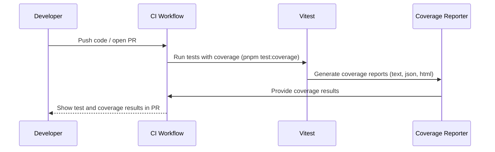

PR #19 Comments Snapshot — 2025-08-10 07:58:19Z

Repo: https://github.com/rollercoaster-dev/openbadges-system
PR:   https://github.com/rollercoaster-dev/openbadges-system/pull/19

## Issue Comments
### coderabbitai[bot] — 2025-08-09T21:35:57Z
URL: https://github.com/rollercoaster-dev/openbadges-system/pull/19#issuecomment-3172111814

<!-- This is an auto-generated comment: summarize by coderabbit.ai -->
<!-- walkthrough_start -->

## Walkthrough

The changes introduce code coverage reporting for tests, update test commands in CI to use coverage, and enforce coverage thresholds. Additional test mocks and improved header handling are added to server endpoint tests. A new pull request template is provided, and a coverage provider dependency is added to the project configuration.

## Changes

| Cohort / File(s)                                      | Change Summary |
|-------------------------------------------------------|---------------|
| **CI Workflow Update**<br>`.github/workflows/ci.yml`  | Modified the test job to run `pnpm test:coverage` instead of `pnpm test:run`, enabling coverage reporting during CI test execution. |
| **Pull Request Template**<br>`create-pr.md`           | Added a markdown file with a detailed pull request template and instructions for contributors. |
| **Coverage Dependency**<br>`package.json`             | Added `@vitest/coverage-v8` as a devDependency for coverage reporting. |
| **Server Endpoint Tests**<br>`src/server/__tests__/endpoints.test.ts` | Enhanced test suite with more comprehensive mocks, improved request header handling, authorization enforcement, and refined error handling. |
| **Vitest Configuration**<br>`vitest.config.ts`        | Added coverage configuration to use the V8 provider, specify reporters, set thresholds, and define include/exclude patterns for coverage analysis. |

## Sequence Diagram(s)



## Estimated code review effort

🎯 3 (Moderate) | ⏱️ ~15–20 minutes

## Poem

> In the warren, tests now run with care,  
> Coverage reports sprout everywhere!  
> Mocked services hop in, headers checked anew,  
> A template for PRs, clear for the crew.  
> With V8 and Vitest, our code is robust—  
> This bunny’s review brings confidence and trust. 🐇✨

<!-- walkthrough_end -->

<!-- announcements_start -->

> [!NOTE]
> <details open="true">
> <summary>🔌 MCP (Model Context Protocol) integration is now available in Early Access!</summary>
> 
> Pro users can now connect to remote MCP servers under the Integrations page to get reviews and chat conversations that understand additional development context.
> 
> </details>

<!-- announcements_end -->
<!-- internal state start -->


<!-- DwQgtGAEAqAWCWBnSTIEMB26CuAXA9mAOYCmGJATmriQCaQDG+Ats2bgFyQAOFk+AIwBWJBrngA3EsgEBPRvlqU0AgfFwA6NPEgQAfACgjoCEYDEZyAAUASpETZWaCrKNwSPbABsvkCiQBHbGlcSHFcLzpIACIAMRJqbH8AehIAD25MekRKKT4aRFxkJjy0UmjIOUhsHL4hfFEAL2dIAApbSDMARgBOAEp0eGZkAkgyWEwGD1xYD1q8sJD7bHUPLJRmXnwpBVLSMYwAM3wKKbYMUIB3dQQsGY8mC/gMbHwalAuSIipxfCxWgDCAEkBtx4NwSF5niQNDBZtVuLRqB5jgwatJ+Fg0JBmM8hmhfOtEMxnKE0NwtmgGLAwvhFoVnkQADQ8CjwE7qeCNRmVGrQxDICQE4LoDD0EnPXDaDAqeBQ3DybaUeyzZUSfBeRwefCHelFDRGADSJHkSihpQEkWQzwYmqUHCMUAAgj5PK7/EElh6Vv5zkVIBMdgISGQcSRNAYoABRMXcfCSvXIQMeYOh7AYRAAa3BEPoRKlaihjToLOuM0gXQAbImFEd4BQ2PRLidsxgiAaoAA5EiXaoYdQ1458ChvAoBtBBkNY2hKWgs44+fDXNvoHF4kmEsWQVHo7K4H5fWQdyBAz7fajsu4hZBDsLw5Lk+DJARoWikZBbNLyMi0OMJy6UGsXj+K+8jPDwXhUmsW6+tKuyAbQx7uJAwI8OCkLQuOMhTrWhzwEQSRRKMZBDlMq4lMo+wzP4iCwBq9A6ugoSRGghSQAAHAADAApAaBjIeSlLUn40jeDQ9DgT07E8KxiA8gURSlggwmoNi/i0NgYiXvwuqCSOaT4jQXjyJWPEKJszhEXS2K8CQEjsjUxn8HkYAKVEeRyX8kBljSVY9ImsJwKg6mab8WJDCMdJDFsOwShc0qyvK8g+aO9hUmyeEMDyVJTNwUoYGRDBsjQbLYiczmUGAZBENClDyfCCnLKsfHQKIsD9gwBIbNwkR+hefzWgVdoPCwtmzBmkgeMw+AMK2RA6ZASgQmKZBZRiDjCaxvIYBwiABPKJAsvM8BTIgLLrAAUgA6tA51eH880+ay+AQnwaB4ON4idWF45ilCK7gQpiCwgCSpUFR+AajyEzYaGOShNg3DVHJK4AAL2QpyQUeDJBgBI7HnVu9woUCaEQv9Hgw5UOGI0i4noAwTAULQjJOcRRwnIVYNlHM+VIszwNuPC3DeL43pLMFCS0PIt7+PZPZ8foxjgFAP4Le9BDEGQyj00wrDsFwvD8MIojiFIMjyEwShUKo6haDoSsmFAQXWsgmA4JrpDkAe9B636XBUL2DhOC4lSW4oyi25o2i6GAhjK6YBgaDVMzYAIyTNhQmaHPdlyIFj8AaLIzBeA60TlwYFiQE6QJa97yLZI4JKh4x1KYO+QseAA4uoAASafV1pA3eS2OdLtu5XE9ECkVPUAjeVt00s3hVmMBMbbTA1SzpKIeDaX7WSBfChQkEjtn2W8iBOTKjYxDY6aJhUFDpv2K4AAbcBg3DMHqHDPxgb8F7IH8D1KCTYbirhPkjG+URoj3yvIUZAT1sY8yfi/HkH8v4/wUhwFBpA35H1QG3DeCI6YYmJo1A+RM6R/E3tQVkokSSWnkP/EY15vIQLwR4EBJxxArjICoSIiE4TcKWIxYmmds65xZDaO0PIlo/lWmBDMUofD9SxFuLhCJ7qvhZLBZ4yB0zENIIhIw5hLAuhKuoyKd4PBKFtM4axC10hxgoPTcqItLQnQOOEeA0gjCdloXxKMDISS6wjiJeWvYSCHCHJwSAABZOg8BHAGHLtER0icioJBoGAXgGhmC0DLhXKuNc646yiMHZuipdTGP8QYJ0kByC9mbpmWgS4sB4UiJAN+2TkR5IoAU2ggDLhbVfLOWsUo8QrmxEoKZQjFibEgjQUUEkVHPyHhmCefA+l8PmjZUWIlPSFFhECUIsjsBKDdpAIIJ1MyQH+vc0YxMOgCCoAVGketMhskQF5LyPdcD93nusbEhQNm4EIvQDoVyirgh+qMJg3B5DrEyCfI+djpCwryvvMGIx4QdHCJEc6ywQ41NsWvdu0gWRM1Ebc307BkBsFwCyGg1IOpdWir1dg6jFrhm0F4M6eoRIOC8IpPw6iCQoknlvBkMyKQjipLAeccoMRL3gCvOc8Ecb2H3MiIgshCb0AUjyUcetpCnLJAKukiAIRZRXjId5KkOYNh5RclmK5flJCmCy5wpBmWrJ1YkYGIjJnsAnmiHIyAvIuKyDyeYyogYBq0U9bEuJ+wbnQPK/AiqWRzP5fVDwAivErkYj+P8FxEwsmmrNONuqaA1SpSTLVPMDikRIH6Q1QqHCrGFWJQWZjSmip1peGxxN7GQR+CO5xGReFRA8WnKEDAfGcnqV2WhABucldT0Azmuc0nEzg2kdMWjNLU8UfpdI8ClPAOJFDqtkNlDA4clC8ocZO4e5UXGztoMkTxi7l3iHNUYEJ4gwlRCtqIqJYxYm8K4AAGSXGkiukZE6ZFmjzDQQhfk7SQxk0ptcvYVMbqShadTECdxkuh0gmHsPbhVUA0hDdaQ7rzE0nsvKpD3W/mGhRK0CqyC4NEdGqxChY25qQPG7EKj0I8tpaIAA9AAzBoAATBoAALNEQhbsZyci8qgUBUw8z3TbHJF9+B7h8AAGoidwGAfwyyohoczDzQxK0+BKAkAAEVPoogqfjg2BP4JZilG8bGICxWK3jSh/ONvKo8PCBF31YAAv4A9Sg+LmOrkO5Lo74TjscWFKNuov1uLnXwP93j2ArvI5GauM4oieZ88tGLDABM9KExjEIYm9i43xtEQTSnVMaeiIA8CH8qQueo1hv4b9gOhKYxByJfjokwbcfBxD6TMlgCMIgU4yR40UGSAAfWO0DU7qRYzxguMDBSGgijFLwxYgj2sfYkuqaR9eHd+IytCN2lZt5DsHF/Nd/0ozkDjEmFEFNumwpdWrZmN2W5oojikPQcWbFZivmVOvWg/12yQAAMq2vVSdAkxkWXwmutAewuQTpTRmvc8HYw0g0BWkaqKQ1LkeDfoRg8VhllDmYNAfAmYyCAJBbetLeaVX0Dfnke9IuxcAO3EY+FExQj+AhRQLZ6I+DPGONs+wJPMq0mV1GvgLxXS3meEKKEHPzewm7C0xnSDAIsaiLeAAQg/QnABFODqwWR69pxQey3rIAAHknQfVD+Hw6Aa9eE9kAVOP9PmNIA1MiXlLXVoBZar9pqKzmf+BgfQQ4I4f6guzBSSpKwVmjHdlSM22pyCdrIPZEcGA/SQCFKVS0GI36R6sFGTsXunRea7lGQnx3bCR4ABoAE1Z8AFUvdwaBACCXW4h8j7HxPqfM/CdRhsFZk/x2V82DgyM938NqZDmmOw/+fFCd2WUL4RNt5iagNwELs3oYy1QdvJ3daYmNRg3VoIekY8ZgORmgwpAEsdrYOFyxsQ7d4A8xaA01/8MA9EYlIgtIZkPpqtvptJvR6x20GVYRCchg5RnAKdBxpUPBI9lovdXx3xnovxgdy1NdT5IIjMWceoToBxEDlQwlqQeRbwNY6I2Q4DtIU0pcPA+cuo34XFTYtAn1Whe4pZKBEA+hAExDZg3otwyAHB1JyUMdQgBBFAwJkA34rcvAxsVEpYFo350wlA8JyBhkjcp8acLD+1kJKARw+Bcd8chVbwNwhcogLpCdI9OwPhyUf8/8CBlcjlgg2Jmc6kOcBDTZVx1NOJOJA0IVigIkDEaBXwFoABWfImRMUMnPZbqVHdyAkdAnldYQI8qGiOMDMGEIwSPUoHwSnB4L7DEcZBQ8yMaEwyaW9GtNsFkEiTmNYD6WAnlEQigQaStANfwDwwtDIU2JxWWQINI0IVYpHegdo4caQLoyNTLSuCxHLJxZ5fLUQCdJxUtGdMrBiCrBdKrJ4QDWrZ0BrOXJQmgAXagIXJXcXMMGArI4mBHKIN+IQS4XAV/MPenRwnpPbBgA7XISgE7M7a8C7QAyUW7EIe7RAAhOrJ0QEnpBXQ4WQCEjAVoZIsgLgMFRkPoLgQQEQMQSAAAHyaVFn0PDDohhPhDhLl0RORLpymHRLfkxOxLD1xNO3O2O0uxB2JPu1JKKApIBImQRxvHKjfi82oBUFYhIEAQcQFHiLfgEHTF2n2lWH0MUG8A8HG3lMOzxJVLVO4JJJOW1OPCpL1MZ3hKT2lPNONm5KuAgWYDEnBG6SZRFPWLlP2w9OVIJNVKJJu01L9PJIDOpPFJ6WzQ+hRPj0AS5JyKehjNFTjKmmFMUCTPdJxKOzTMQUJKuw1Lu39MpPzODLlyTxTwYBLLRIjIrOjNjJ6lrOhIbJTKbM9PTO9NB19M0C7IMBA0MnAwiTlhW2gziS4CSRZlSS2xQx2wMC6xOQS3wjJMe1uOrhe3rnpiqWcDJTIwowvKSx5VvBs0amNRXArzQDYEkQY3SDZwmSqHGWyh6S4UARyE2T7CQOJjfgUgtL+ESySHUW0zY17C0TfLQp+htVEFJ3IXhHRAWmJgAHJ8YyLm19gYp0DKAjpwxDEkYqzxAJyRJXESpkBWgyKaBWcyKWQyKZsMB+LIAyLYBcAS4yK+hO13D+RyVRwRZQgWZ/AxATgZZ4txNREOK3ZkAyKNAetKISA9KTxLVfkPh9xnTTpqLN4aI6IvBaBgFDj6xspmIEg2IuJuJrKjcKZBVDg1cR0WQ3lJhZhBV8xkQ/Rg1Ay9MZQfADUUBQgcKaJvJlIaRL0bEID4itFMACRZA5IuLycYBZAIRCdIsWQLoJw0ASq2Q8pO0rMRQ0q4LlQyLMSpKA10hbRudkACtks6MrQWUlg0r+q2JlLTYORG11gMAI5jsl4XSbxK9rKbjB0rEitmMx1njCsp03iOLytPAvEl1qs/jHRIAgsyNmNSt3Evi9qANTR1rctgC0sSQlBN0/g2Z4RJRKAYrcJ8JcLtJyyeTUUcgsi35ZLyBQY6wiARktpgLFFwEUDMLILNLAEthXoFQPgzNN4eckKvr3ywpgkFtwkX0tz2MYldzElklDzkMlYDAnZgd1Y8BCBgSNz9YLgA40Ag4m4nyw4FBrYVA1Bo4HY45qaVZzJcRcBjt0DEBjsiaAJaBjtChSRY544aaKj2IkQBBOI0ASAKiAB2AQRTConoEgdTNARTTqLoTiBgdTLoAQQ4FTQ4bWxTQ4BgCo9TBgQ4HoNAasKmmmv2dQcWhyqWuyFbOgY7NWR2YW5gBgbgY7R4XisW+WtxRWowN+FOgwAAbwMEgBiAMXwnEsQAG0gAAG0ABdJkTOmIUZHXRkfOrgEugwAAXwMBTrmyFogBxCjpjr+DjtDq3H0CAA== -->

<!-- internal state end -->
<!-- finishing_touch_checkbox_start -->

<details>
<summary>✨ Finishing Touches</summary>

- [ ] <!-- {"checkboxId": "7962f53c-55bc-4827-bfbf-6a18da830691"} --> 📝 Generate Docstrings
<details>
<summary>🧪 Generate unit tests</summary>

- [ ] <!-- {"checkboxId": "f47ac10b-58cc-4372-a567-0e02b2c3d479", "radioGroupId": "utg-output-choice-group-unknown_comment_id"} -->   Create PR with unit tests
- [ ] <!-- {"checkboxId": "07f1e7d6-8a8e-4e23-9900-8731c2c87f58", "radioGroupId": "utg-output-choice-group-unknown_comment_id"} -->   Post copyable unit tests in a comment
- [ ] <!-- {"checkboxId": "6ba7b810-9dad-11d1-80b4-00c04fd430c8", "radioGroupId": "utg-output-choice-group-unknown_comment_id"} -->   Commit unit tests in branch `feature/expand-server-tests-coverage`

</details>

</details>

<!-- finishing_touch_checkbox_end -->
<!-- tips_start -->

---

Thanks for using CodeRabbit! It's free for OSS, and your support helps us grow. If you like it, consider giving us a shout-out.

<details>
<summary>❤️ Share</summary>

- [X](https://twitter.com/intent/tweet?text=I%20just%20used%20%40coderabbitai%20for%20my%20code%20review%2C%20and%20it%27s%20fantastic%21%20It%27s%20free%20for%20OSS%20and%20offers%20a%20free%20trial%20for%20the%20proprietary%20code.%20Check%20it%20out%3A&url=https%3A//coderabbit.ai)
- [Mastodon](https://mastodon.social/share?text=I%20just%20used%20%40coderabbitai%20for%20my%20code%20review%2C%20and%20it%27s%20fantastic%21%20It%27s%20free%20for%20OSS%20and%20offers%20a%20free%20trial%20for%20the%20proprietary%20code.%20Check%20it%20out%3A%20https%3A%2F%2Fcoderabbit.ai)
- [Reddit](https://www.reddit.com/submit?title=Great%20tool%20for%20code%20review%20-%20CodeRabbit&text=I%20just%20used%20CodeRabbit%20for%20my%20code%20review%2C%20and%20it%27s%20fantastic%21%20It%27s%20free%20for%20OSS%20and%20offers%20a%20free%20trial%20for%20proprietary%20code.%20Check%20it%20out%3A%20https%3A//coderabbit.ai)
- [LinkedIn](https://www.linkedin.com/sharing/share-offsite/?url=https%3A%2F%2Fcoderabbit.ai&mini=true&title=Great%20tool%20for%20code%20review%20-%20CodeRabbit&summary=I%20just%20used%20CodeRabbit%20for%20my%20code%20review%2C%20and%20it%27s%20fantastic%21%20It%27s%20free%20for%20OSS%20and%20offers%20a%20free%20trial%20for%20proprietary%20code)

</details>

<details>
<summary>🪧 Tips</summary>

### Chat

There are 3 ways to chat with [CodeRabbit](https://coderabbit.ai?utm_source=oss&utm_medium=github&utm_campaign=rollercoaster-dev/openbadges-system&utm_content=19):

- Review comments: Directly reply to a review comment made by CodeRabbit. Example:
  - `I pushed a fix in commit <commit_id>, please review it.`
  - `Explain this complex logic.`
  - `Open a follow-up GitHub issue for this discussion.`
- Files and specific lines of code (under the "Files changed" tab): Tag `@coderabbitai` in a new review comment at the desired location with your query. Examples:
  - `@coderabbitai explain this code block.`
- PR comments: Tag `@coderabbitai` in a new PR comment to ask questions about the PR branch. For the best results, please provide a very specific query, as very limited context is provided in this mode. Examples:
  - `@coderabbitai gather interesting stats about this repository and render them as a table. Additionally, render a pie chart showing the language distribution in the codebase.`
  - `@coderabbitai read src/utils.ts and explain its main purpose.`
  - `@coderabbitai read the files in the src/scheduler package and generate a class diagram using mermaid and a README in the markdown format.`

### Support

Need help? Create a ticket on our [support page](https://www.coderabbit.ai/contact-us/support) for assistance with any issues or questions.

### CodeRabbit Commands (Invoked using PR comments)

- `@coderabbitai pause` to pause the reviews on a PR.
- `@coderabbitai resume` to resume the paused reviews.
- `@coderabbitai review` to trigger an incremental review. This is useful when automatic reviews are disabled for the repository.
- `@coderabbitai full review` to do a full review from scratch and review all the files again.
- `@coderabbitai summary` to regenerate the summary of the PR.
- `@coderabbitai generate docstrings` to [generate docstrings](https://docs.coderabbit.ai/finishing-touches/docstrings) for this PR.
- `@coderabbitai generate sequence diagram` to generate a sequence diagram of the changes in this PR.
- `@coderabbitai generate unit tests` to generate unit tests for this PR.
- `@coderabbitai resolve` resolve all the CodeRabbit review comments.
- `@coderabbitai configuration` to show the current CodeRabbit configuration for the repository.
- `@coderabbitai help` to get help.

### Other keywords and placeholders

- Add `@coderabbitai ignore` anywhere in the PR description to prevent this PR from being reviewed.
- Add `@coderabbitai summary` to generate the high-level summary at a specific location in the PR description.
- Add `@coderabbitai` anywhere in the PR title to generate the title automatically.

### CodeRabbit Configuration File (`.coderabbit.yaml`)

- You can programmatically configure CodeRabbit by adding a `.coderabbit.yaml` file to the root of your repository.
- Please see the [configuration documentation](https://docs.coderabbit.ai/guides/configure-coderabbit) for more information.
- If your editor has YAML language server enabled, you can add the path at the top of this file to enable auto-completion and validation: `# yaml-language-server: $schema=https://coderabbit.ai/integrations/schema.v2.json`

### Documentation and Community

- Visit our [Documentation](https://docs.coderabbit.ai) for detailed information on how to use CodeRabbit.
- Join our [Discord Community](http://discord.gg/coderabbit) to get help, request features, and share feedback.
- Follow us on [X/Twitter](https://twitter.com/coderabbitai) for updates and announcements.

</details>

<!-- tips_end -->

---

### joeczar — 2025-08-10T07:32:59Z
URL: https://github.com/rollercoaster-dev/openbadges-system/pull/19#issuecomment-3172437512


CI failure summary + next steps

Failing checks
- CI: Test — FAILURE (coverage gate)
- PR Validation: pr-title-check — FAILURE

Details
- All tests passed (98/98), but global coverage thresholds (80%) are enforced and not met:
  - lines 10.93% (min 80%)
  - functions 55.04% (min 80%)
  - statements 10.93% (min 80%)
  - branches 65.44% (min 80%)

PR title policy
- Title fails conventional commit format. Example: test(server): expand server tests coverage

Suggested actions
- Increase coverage: add tests for uncovered files or exclude non-critical directories (e.g., client UI) from coverage if aligned with project policy.
- Alternatively, adjust thresholds to match project goals (if >80% is not required yet).
- Update PR title to conventional commit format.

Context link
- Coverage failure: https://github.com/rollercoaster-dev/openbadges-system/actions/runs/16853956037/job/47744227505


---


## Review Comments

## Reviews
### coderabbitai[bot] — 2025-08-09T21:43:36Z
State: COMMENTED
URL: https://github.com/rollercoaster-dev/openbadges-system/pull/19#pullrequestreview-3103288220

**Actionable comments posted: 0**

<details>
<summary>🧹 Nitpick comments (6)</summary><blockquote>

<details>
<summary>src/server/__tests__/endpoints.test.ts (4)</summary><blockquote>

`14-36`: **Use integer epoch seconds in mock tokens**

`iat`/`exp` should be integers per JWT spec. Wrapping the division in `Math.floor` avoids fractional values and keeps mocks closer to reality.

```diff
-          iat: Date.now() / 1000,
-          exp: Date.now() / 1000 + 3600,
+          iat: Math.floor(Date.now() / 1000),
+          exp: Math.floor(Date.now() / 1000) + 3600,
```

---

`57-69`: **Consider centralising DB mocks**

You now mock both `sqlite3` and `bun:sqlite` with identical stubs. Consolidating into a helper (e.g. `__mocks__/db.ts`) will cut duplication and make future interface tweaks easier.

---

`132-135`: **Restore mutated environment variables**

`process.env` is mutated in each test run but never reset. Save originals in `beforeAll` and restore in `afterAll` to avoid unexpected bleed-through when more suites are added.

---

`441-451`: **Add extra assertion for malformed-JSON response**

You already check `status`. Also verifying the error payload (`{ error: 'Malformed JSON' }`, etc.) will lock the contract and catch regressions in error-handling logic.

</blockquote></details>
<details>
<summary>create-pr.md (1)</summary><blockquote>

`5-15`: **Minor Markdown tidy-ups**

– Add a language tag to fenced blocks (` ```bash`, ` ```markdown` …)  
– Remove trailing punctuation in headings and wrap bare URL in angle brackets to silence MD lint warnings.


Also applies to: 17-19

</blockquote></details>
<details>
<summary>vitest.config.ts (1)</summary><blockquote>

`11-30`: **Coverage patterns miss JSX / TSX files**

If the repo ever gains React/Preact utilities, add `.{tsx,jsx}` to the include glob now to avoid silent gaps later.

```diff
-      include: ['src/**/*.{ts,js,vue}'],
+      include: ['src/**/*.{ts,tsx,js,jsx,vue}'],
```

</blockquote></details>

</blockquote></details>

<details>
<summary>📜 Review details</summary>

**Configuration used: CodeRabbit UI**
**Review profile: CHILL**
**Plan: Pro**


<details>
<summary>📥 Commits</summary>

Reviewing files that changed from the base of the PR and between 01a0dba202938122d495a90e47cbbd4b29f10721 and 58dab0ae57b359e4a3ca10c41bf2f73fc54cf9a6.

</details>

<details>
<summary>⛔ Files ignored due to path filters (1)</summary>

* `pnpm-lock.yaml` is excluded by `!**/pnpm-lock.yaml`

</details>

<details>
<summary>📒 Files selected for processing (5)</summary>

* `.github/workflows/ci.yml` (1 hunks)
* `create-pr.md` (1 hunks)
* `package.json` (1 hunks)
* `src/server/__tests__/endpoints.test.ts` (9 hunks)
* `vitest.config.ts` (1 hunks)

</details>

<details>
<summary>🧰 Additional context used</summary>

<details>
<summary>🧠 Learnings (2)</summary>

<details>
<summary>📚 Learning: 2025-08-08T08:52:35.961Z</summary>

```
Learnt from: joeczar
PR: rollercoaster-dev/openbadges-system#0
File: :0-0
Timestamp: 2025-08-08T08:52:35.961Z
Learning: Validation approach: Prefer Zod for input validation; express-validator is not used in this repo. If types/express-validator appears, it should be removed.
```

**Applied to files:**
- `src/server/__tests__/endpoints.test.ts`

</details>
<details>
<summary>📚 Learning: 2025-08-08T08:52:35.961Z</summary>

```
Learnt from: joeczar
PR: rollercoaster-dev/openbadges-system#0
File: :0-0
Timestamp: 2025-08-08T08:52:35.961Z
Learning: API (Hono): Always wrap c.req.json() in try/catch and return HTTP 400 for malformed JSON in route handlers (e.g., src/server/routes/auth.ts, src/server/routes/users.ts).
```

**Applied to files:**
- `src/server/__tests__/endpoints.test.ts`

</details>

</details><details>
<summary>🪛 GitHub Actions: CI</summary>

<details>
<summary>src/server/__tests__/endpoints.test.ts</summary>

[error] 312-312: Test failure: Error proxying badges request due to Connection failed.

---

[error] 401-401: Test failure: Error proxying request to OpenBadges server due to Connection failed in legacy endpoint.

</details>

</details>
<details>
<summary>🪛 markdownlint-cli2 (0.17.2)</summary>

<details>
<summary>create-pr.md</summary>

5-5: Bare URL used

(MD034, no-bare-urls)

---

7-7: Trailing punctuation in heading
Punctuation: ':'

(MD026, no-trailing-punctuation)

---

9-9: Trailing punctuation in heading
Punctuation: ':'

(MD026, no-trailing-punctuation)

---

11-11: Fenced code blocks should have a language specified

(MD040, fenced-code-language)

---

15-15: Trailing punctuation in heading
Punctuation: ':'

(MD026, no-trailing-punctuation)

---

81-81: Trailing punctuation in heading
Punctuation: ':'

(MD026, no-trailing-punctuation)

</details>

</details>

</details>

<details>
<summary>🔇 Additional comments (3)</summary><blockquote>

<details>
<summary>package.json (1)</summary>

`47-48`: **Dependency addition looks good**

`@vitest/coverage-v8` matches the Vitest version already in use and is required by the new coverage config, so no issues here.

</details>
<details>
<summary>src/server/__tests__/endpoints.test.ts (1)</summary>

`241-245`: **`body` may be `undefined`, not `null`**

Fetch options omit the `body` key for GETs. Matching `null` risks a fragile assertion if implementation sends nothing. Prefer `expect.objectContaining({ method: 'GET' })` or explicitly allow `undefined`.

</details>
<details>
<summary>.github/workflows/ci.yml (1)</summary>

`87-89`: **Fail build when coverage drops**

`vitest` exits 0 even when thresholds aren’t met. Ensure `--coverage.enabled=true` plus thresholds in config are enough, or add `--coverage.reporter=none --run` flags causing non-zero exit on failure. Verify locally before relying on CI.

</details>

</blockquote></details>

</details>

<!-- This is an auto-generated comment by CodeRabbit for review status -->

---

