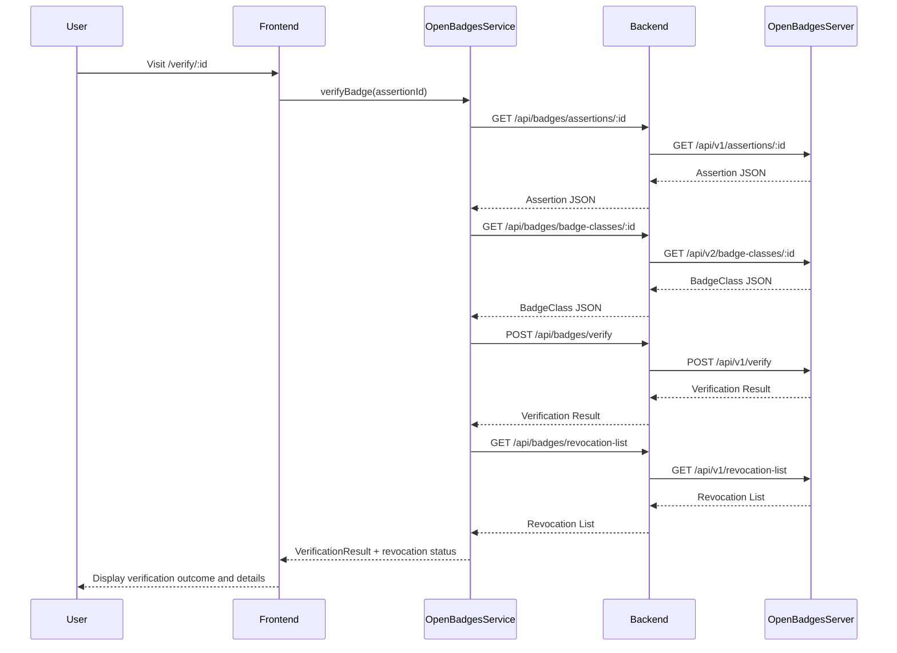

PR #20 Comments Snapshot — 2025-08-10 07:58:17Z

Repo: https://github.com/rollercoaster-dev/openbadges-system
PR:   https://github.com/rollercoaster-dev/openbadges-system/pull/20

## Issue Comments
### cursor[bot] — 2025-08-09T21:38:51Z
URL: https://github.com/rollercoaster-dev/openbadges-system/pull/20#issuecomment-3172113025

Cursor Agent can help with this pull request. Just `@cursor` in comments and I'll start working on changes in this branch.
<sub>[Learn more](https://docs.cursor.com/background-agent/web-and-mobile) about Cursor Agents</sub>

---

### coderabbitai[bot] — 2025-08-09T21:38:57Z
URL: https://github.com/rollercoaster-dev/openbadges-system/pull/20#issuecomment-3172113075

<!-- This is an auto-generated comment: summarize by coderabbit.ai -->
<!-- walkthrough_start -->

## Walkthrough

The changes introduce a comprehensive badge verification feature, spanning both frontend and backend. The frontend verification page is fully implemented with detailed UI and state management. The backend adds new public API endpoints for badge verification, assertion, badge class, and revocation list retrieval. The OpenBadges service is refactored for structured verification, error handling, and revocation checks. Extensive unit and integration tests are added for both backend endpoints and badge verification workflows.

## Changes

| Cohort / File(s)                                                                 | Change Summary |
|----------------------------------------------------------------------------------|---------------|
| **Frontend Verification Page Implementation**<br>`src/client/pages/verify/[id].vue` | Rewrites the badge verification page to provide a full user interface, including navigation, loading, error, verification result, badge and issuer info, revocation status, and share functionality. Implements all logic for fetching and displaying verification results and managing state. |
| **OpenBadges Service Enhancements**<br>`src/client/services/openbadges.ts`        | Adds structured verification and revocation checking methods, new interfaces, unified public API request handling, improved error parsing, and refactors badge class and assertion retrieval. |
| **Frontend Service Tests Update**<br>`src/client/services/__tests__/openbadges.test.ts` | Updates tests to mock error responses with specific messages, adjusts fetch call expectations, and aligns error handling with new service logic. |
| **Backend Badge API Endpoints**<br>`src/server/routes/badges.ts`                  | Adds new public endpoints for badge verification, assertion retrieval, badge class retrieval, and revocation list. Implements proxy logic, error handling, and response forwarding to OpenBadges server. |
| **Backend Endpoint Tests**<br>`src/server/__tests__/endpoints.test.ts`            | Adds extensive tests for new badge verification endpoints, covering successful responses, error scenarios, and malformed requests. |
| **Integration Tests for Badge Verification**<br>`src/test/integration/verification.test.ts` | Adds a new test suite covering end-to-end badge verification, assertion/class retrieval, revocation status checks, error handling, and integration scenarios. |

## Sequence Diagram(s)



## Estimated code review effort

🎯 4 (Complex) | ⏱️ ~45 minutes

## Poem

> 🥕 A rabbit hopped to verify,  
> With badges shining, oh so spry!  
> Through endpoints new and backend trails,  
> With tests to catch the smallest fails.  
> Now users see the truth revealed—  
> A badge's fate, no longer sealed.  
> 🐇✨ Hooray for code that never lies!

<!-- walkthrough_end -->

<!-- announcements_start -->

> [!NOTE]
> <details open="true">
> <summary>🔌 MCP (Model Context Protocol) integration is now available in Early Access!</summary>
> 
> Pro users can now connect to remote MCP servers under the Integrations page to get reviews and chat conversations that understand additional development context.
> 
> </details>

<!-- announcements_end -->
<!-- internal state start -->


<!-- DwQgtGAEAqAWCWBnSTIEMB26CuAXA9mAOYCmGJATmriQCaQDG+Ats2bgFyQAOFk+AIwBWJBrngA3EsgEBPRvlqU0AgfFwA6NPEgQAfACgjoCEYDEZyAAUASpETZWaCrKNxU3bABsvkCiQBHbGlcSHFcLzpIACIAYX9qEnQMekQAd3UGWDD8SHI0yAEqDCzowvlsREpIIXxRAC9nSAAKW0gzACYABgBKFGZuSLYMXGRcWCTPAS94BkK0WlJIKQp4ADNZ6nh8LDWvfAK1/D5xpIB5bjIAIQXSZERZRBpmABp0GaIMeAwiRhn2ZKpSgrSAXa63aSQDoaLqQMi0bj4b6jDSQACSoWRFEU2AYkLQkCUtE2NHoK3WJO2WG4aCW1EgAAMAPTktayJkAbXgtAAugywrB6cTEIM0I95oskhI0DNibhZG8kA5qt8jhRmFsdm9EPBPtRsP57LhEm9MPRBSlIshKNiKMgmAN/BMMDqpF5ZBojABpEjyNYkfX+ZDfBhebBKDhGKCxf4jezA2ZJbDcWiJYNYBmICgMJmh+DsJlVCgSROIJn4S4YAQQxAaUb8giQC20SJGii43AGqI245+aSIl3SN5MF1IGhxnt8RCCy6IU0pPIkAqsyk7SBscaKe647JoZAM1myG6S5o9BlvBlZUQAaxsJAk+AYmowAGVjZ3EKfz4zSLhj6QYz3T8z3negGV/ABBRAi3EHYv09KAX2BSgwB1JQ4QwC08WGUYUAzLMcyLFYmWxPBpCZatJVret0FoYkfh4bBplmDCESREZkDVCUlhXJ9YOpbEAA8FXQaDKH4vtcFWe8ZTeSillDIDJOk6UvFAvsHz4qlIBmJ5lPzVTTR8SAMnGPxBEqUJJybM0Zh+BDIAghRHRIZ1XSlSgKS0tcaQUlgBwBZpM2zXNY1wJlfPIw9OW5HkNAkYIGT6cZ6V4fASyUZACSUY14EiegAFU0XsWADm+X55KlGVuXUESlWCPgcu0Lw53sXUMEDDzVg2byMDkiF1xIY1U2NN5/AYeBuHzONVWODV+LG+9H2fI19VaycmTSZwvgYthoNpIcSucANpiSAqbAAGVas0+xFHZ3MJaR2sgSpypgZqMgXWIXxfByAFFBPHB6aCeN6QzDejfgARgAdkXApkRIIgqAkkHcKYckGNU7kmW+bH6Eq5ZPJ6583nIXA0mOa84QoW1roXfxNJWp41qMnZflM7IyCwqIiOqNGsoXDZBMhRsSEEsc3rzAEiMTMIQlrAxENEA1asGvcu23LJRLwzxQnx0meGxS4+DQPBnXEXqmTNzdVkaBbGBcbgCGRtBuAQOYBBCI20DEUt1IwXJ8mWbxyCoNQZnESEsRxPFaAc2JFCSIJqvlfo0qkHDkE52iJn8EokkbJ5ZFbIhsG5Eg7MOqovDWMBGfzNJhxYLP+CwB1BnFnT8CIWY3ms5s7KIdToFkS4XwYVZnbCMekiUDYvn4xWoAAOVyEaVD3JJeyUQZ8FkHDGAtO50ENfwgngfx46VyAAFlvngDVfBNtUNQL9PfdCWhghyeHWMRZEgt6DSxGKhCufYUieXskYCCxlfZ4mdpgPEjt1CeQJP4LwiR6CNjBBgf8kJoSwg7pEcc0ggFE26quXY+wCiCikIUEgZBBq4DeDnGUvgBY8CAm9G6gc+zIzIVSWsMAJjWDsBqZE2gXSgkrPg5A0JBLORpOICOasbpHB8Ace4lwJokwkufcu/gs79xdKrBi6CLJ6RupUFCaxpKWnkITXiK1xYm2mniT0SswCGAMCYKA8J+BrBwAQYgZBlCkmcjhLgvB+DCFEOIKQMh5BMCUOHNQmhtC6G8b48AUB3DBkFsEwgpAw5YMiewLgVACgOCcC4coChUkqHSVoHQ+gjA5NMAYAioVprhUimWaKXJeTxWCJGaI4yDAWEcmiUJpSIk1I1HU/AQSsiYDuG4UR7BL5JCccTKhXClhbW3AIFmIx4DsPkP4NIqxcDjkBHCQSNJIHxxEZMBu+BKjrgfk/HgmC8SlS8KkyARUTJ7j7KKOOJl1C7kgGsbw7p05DHYFEZxElEYUDWL7QugpMQlAhtISMN8nLVgYNTDqJYiArTstTRspU2AOScvsBYb0RTfDDvcvaiADolQOFgNICBWyou0qgb4Rse5BmXo5LA1lhSinkFUP2a5pxlSxns3qsLmpdkGvtO4DLHq5XyhQryK0gzeFCAq1GOKFApHUFSC5EDUkyC3vQNcpwjV6O0h83ADoSDalKp9IgkZIC6EgPg5Y1U5TyvfJ8nOsx7r3KFa6x+IQ0ADE9MGqAF0xzIGWe6/Zk5yFbQoDtIgwYgm8GkOwdNIaw2zXVCtcG4YwYalIGTVNvrHqIEnpNB2aIAAi6ljSlurVANE0EGp4VfitHOiasAsw/Pc+q1R+0jsgAANTVStJqeV0yhibQxYkvdjS+B1HqTshp8a1W1O1TqM9LimjEhQCS/b1KM2WhJedMboV9j3DsVdd4JpTQBHW+awq8X7t+Eu+gI0O2uMvvIGDbbaZbCkOpe8Fd37UpzY1aQ3bnZCNXU5acx14yKr5d+gkAg8AECwI2Jg3B5BuoYAafO+tN0SXOhdX+eZuACHwM4egN0CQjg2PWiSnKDqeLgEkLtU9zXxO0kcxFJAcJRAIISqAAMpKfwFDsgaQFxLaX7bC7EzBdPmTIlwqgG5KCStvpgblCQ/b0PnUkLiTLIb91pscN4s7bpmtam+9Vn76aFUugoBj1rROgb/TfAAYnNIUaZYU7yQHKhyZx27+R2ACZgHyRgPtkCUWA2JA6VARYeczhMbpXlJRpd92kQvLHOeZhkFZwRUSQsWRMDIHJoiCW6wmqA33XiiFR0IFaSwfMQBViNbxFnU3UHhfG9y3aVkE/V9Vk4HJWGxBlJIBINylWwbkejjHRHMdpgCSKwLwuNiYzMXj/GKD0BzjYvg/o6AkuvJ4s4Kx2FvCY8fSE/gIWTD+a5fAgLbNQrMsJ/yToyDuTeO9sAdjpotkcQNPzIKbqP07ofN1cLjJ+f2L3OYN1XPrgc6QHCnjzCWFgTQFGQjf5uqUIpFn8bc2uOOBE3sUwZhzC2VHRAUZHJ0SiE5hJMn3xVVWCoK0XAGQefKt+Bkk51ezrvA4LwuB1dBefG+Na6uDReETkB2g/JRVutkz2+MnZuCBMZN0kBfSDoDOJuyIZcUEokF60SyXwD/JkXoGlE2ovlcGafVSNEVuLxTtuXQDdlDep9sSOrxPpIx3KloOnmgmfEtJ9oADKaLh8/+7wuZu308qiO+d8FHMbuIoe5ZF7mKwy/cB6gBBIPOl1iiFkKGJIpV8DUzaxgW++XST8jYQ8YrpXpvcS6saiSN1DcfujfaCYdWycsVFY3npBZ+lt+6t72KIz/cMr70dxQjIzsp9X1SAqFAvANlOxWc7SRLusdu1xujj2fGAmVeh+zeJ+gyF+Xenif0oM80UQKSSQDcS4cIawaonAkAAAErqLAAYOMtEFGJ0q7mFIWAmHiGWAAPrkECyUHliViVTUQhB1iIBjITJTIQQzIlLhK8yOCLLyC5qrI/DSAbKFzexPhVCcS9jgRDRnAQTmzQBj5kD8g3QMj+B2LSCwAyFyEKEYCz6UBJgphlKNh5Z1ZuoABSL4ZwK8t0A4VQhQigySOwuUJayQNMto2qXKSwQUAA3q4ccFwAAORogjCUAdQnrIR8CTj+GQAAC+SUJkzo5m/o3q2QQYNhSQqAgcoQZwXosO2QTWAArF0F0KiInFdndDaj8O6IDpso8vEmpiVryr4XwBJocmCgIaQPQHYiwJAJwasHMJinlFqi0ZCM0NEHFs1GprkL+KCLIWZAQKNrsL2ITHzBQGUDdGMRMSdn2GodODMebDkAsdEMlLkLbjol5E0e4dytEEEczqEfGMWNUJOGUOLNpmIFEF0WZm6sYaNvQOYZYdYfdCQJ4kEa1r+PgoBGJIgA2N7FxNgB1ObFsnxFLoEMEE8K1G6q4nUZ0UNNrE+MZEpu0e8aZugG1AMK2Jxm2G9I2MJuwrkeZhScyG7PACyB0BRBCGAIpJCUoQuJgPwPhtznEmINak4W9BMAsDDjnAyP4YnMEaAqPJcP4QEWtkLs+EyEIIgDsP4b1hLnKHaj4CJBid5s0WQtypiW8a9gkYNgNJyeIX2EEDCc1NnG0cDp0cSdECvENJTBQNTNttYJEFvEfDeJALIB8nwCOOQGRvclJPILSFIhoGUI2NEGGisU0aiFYP6bYdGegJSqKpgszvGcIbYYScgKoZEEKXloaBWhNLYd8W9DzkaQCYOOQgsEIJZK3GLLUeabCjidkHic/M4O2szuQtZMMemOZgLPTpMoznruEqzvdqIhzpglztIjzo8nzlEALkxELhhOEPmGLgYGvOQKiNJkfGsviIaDMMwKglsWjA0gdguLQEHPgKEHlsSGyMkPILzk+huXwILixCLghqIEuc+IrAYDAeIHAcHuhEgQUCQKgXzlwLfHQPAI4LgRMl4mAEYEQb0iQd1mQbQWQPQUwSwfgWwRwWEijNwbUnwSssDvuSecWXhFJLHEkMHOipimQSllOFJB2F2GSOxtpKanrsgEFI/h6jsDrmanEZTsaCkAJvAPUFEBBFYMVNZKkYCSJQyBBFNH9EaTrmkUlMeaIrLMgjaYyLgnIl1iWHiPyIHAUDYllH/AyKKLgK/NpfAC/m/vMLYcotkFxC5a/I5CpYwOwoFiQBCqKQJggWBNbFNPyL5WOZoXMdoXaaiSiJALpW4YPG9FxEldkPMUwkkVkDwgzHBUGAgAxKgNzEgmNvIDSHaG9Gpf2BpUxbkE8O2GIHxRcYICIGIOQq9AxKcJfJcbqjAn/LwJIIkMwsdoyPVVUJlccPpYCdbllH3nRvdGOOwAinNUkE1eUbaR8dXuEW8BnDVAxJij4N9hcaOVGcmizAMKBU5MHH+XMLfmBBqKNlYFubMHePaU8CtUxdiN/JCrSrZEmPCacGckifQMpcVAYgrM1gSAFXNP/OxLhDnCODqE8ACAPLZCVb8RYVYSOOOKEGKY6lJqIlIX+BCBCeIfyG9SgCWXBZ/McJMS9LYQyB9SQF9cxAwL9WlfyLCRDRbCSPAaFXhNjQsM7sSONKEEVb2eLTnG/NgDKBcdldAgecgS9dNVuD+ENOCZgtBNyWBJBI+vxEoYaAsESL/PLfYGcT1Mvn8AZs2WbaznIOiH2rkV6sEiLb1J4k5B3IjqOPQgeF7vgvTUNDNagFbfUfSPLaLKItHmvguITDadUUwoiGibpp8bkASH5vCAAiMKiBiJJAaNIgSO1bxVfIyGJVQpJXrtbuBpDOGrKFeozcqHwLNNemelqtui1F5nTOpEWiWsIiXYPJCAWvUv4Oes4QSAMYan5kJaEDnCOSaaNQYE5JeDvreEtL1Mbh+BHZuPQNHWtbkLbegrvVSmOPcrVotkEgSL3FIFgEnUZp7cNktD8YtDPW9Bvo1lvotL+n1Pcr/UmntMaAMCgPfdKHlIrkCeiF/MzQFr/JkfVj8ZA+ZrfRqjur9v9j4OnaeYIatakDxZ1dXX5uvpfRJLfVLG7CoHlLaodPjntrtQ2erb8JjZtSUCJHjiMEDbiAdi9F8BsFEGttiL7H5ZubzUFXDSiQrJOWwTOcuWMCcQuUBQOUvM7l+fzr+d9cLmcqLuLr3tbexVijXQJRJdIFJZ2t2moAekNJsY7YvZY8JdfsY8ERiqY1pTpXpc1YOPyJlDYyyrJamC9tIxcepYOEdJcK41EBNdKDQDrWBDtQtRQEtYOM0BE1UFwGk1UD0FwLtiwEgCQMAO5SkzkyQHoI3U7dBOZbIjWFZT1jE2Hro4k4yFzTzULvzSEM0AXWjVwO1eVG8BWEvAAPzZOyNPBBHqB5PWCmZFPADlOVNV5mUMgWX1OkFX6B7W3a0M1U0G1ATNCVS01x79NSTlQzMFNXlVDAD7PQRLOiorNrOdYbPd46mxMtO7Om0wRUjNAv07AnOUk/AXNzPXP4JQTfM7D3PtyG37hPN3ANM2VNOMRSO7OHj4K/Ou3/O0CnOrBAv5MgvFO129T124BQvVOwt1PPN4WbM95947OR135b03h3hMz8T72VAYsQsYAAsDN4uzOFPXM+EjZ0BcB8ZQ4BgYAADcP6GpGAYzgLRA0rwrtAEEuA8rvLvw0RZLjzlL8LLzDkU+b5+Y9Anz0hsxsA8hCxzQ72XABURYwLArxTGr2rMLtTHWer1L7+7NSQzleZblU0nlxtGEPM9AuNlo5UBrigFIUQuzqh5VeVlrZA1rRYtr9r+LjrwAzrVTOr7r0gCLlejYNis1frc07lgb9y1VBcobrDeN0CUAhr0bJrDLJt+tNNML0gyblA8rdrlADrVzxTcJ14dlGAHIPILrSkqzurebLzv8RbnNaAn1ujXT/1XFgjNsvtZSfZoF4Fj8m7ScGkjcKBaBXAWBRAOBeBBBmFXSIUKxTIlB1B5BTIvTgCdYjBowJFU50ysyXBqQPBzgNFBD6yBgJ5t5DgqCq7KZz7HEoK1ogM8IUQbCf8gdrkSOkgMmQ0zunCcJQKbqSZA0RLK0f0KQhdowZQSJRAxwHorymZCNGM1QRwBo1OoqsNFmIMhKUMqIAAVJx1YGcC+NAJALFcyfQafusLINx1wNAAjZVilKELbuEQoFdmIAimqEWrQE6pKHmuqvDVnfOecFO/cApxQzPWMDUTohEk4/tXA0Y7ajsKrZwuPcthGlpyahM7hBk0NGXW9AACxFE9DzYyivxRB/FWF8bEgjHT1ecMS+ewhsLSoNnDH+f3ImVuaapBgtCRfFpvSFGxcUbxduHfDEhaQMQpdrvQOYKqLyg9CeLQiQDccADif0AnQnbJVE1smLLoTIHA3IEnMAtHOw0W+kMkvgua1WHXSSHtioTdLKuIZBiAxO3ZyREXnnWXDE3QuXcxidHXhI1AaASXbDzugcGAYA4snDoQfz0iHn390XXQ3ndJvJq9OqJASXFDf1uEVzOo5iz923xmV3UXvwvn3n1XRgAAzFx5x41810ya13cDDyQBye22WN17QL11J1nQbAk9PSpKraN9aa633RNy+nhHus3Q4AwHNwt5kyMet3Sanfj7t30DdAd7migwxwuGISMYD/d/l72Il54t5+D5D4J9DyJyA8d7pLgKj9J17kN6pJh6ImL/3k8FNyTzN+T2Qgt/HSJTT4hxL87sq6JFy4gPt7W78LmqV3CWgOV3Q5HPIH96t78Dr3l3CAMGnBLy9wuK7HiAt8z0EuTF6T6UaSJTKBqaXQ71CEUdzy787PIO7/7cZJwt8YkT2SFT4Mo+ZnC5CCsQ+t8wxEwEp6EDp3LccGp4M42bYWw2hg2V2mQM4NsMIiecHJwkjlqvJw8REcR2jTIK5Fb9/scLLQith9UNKKsEvmT3N/cvPVqiOLqfGlxLsqns+PXJXGUnCiUPxKnB6O0p+0zrOfGnp49JziBZo2ud+S6jo1IyLnueLmvIB6LLkFoz+ci9uQBYf8BRo2kHodTkoNKzsAik36IS3jZwv+MdV7NChtw1FJYg1b2GBxoDQFYCe7aCuhmQJwVj2d8ZCqhQvYYUsKN7cIiRC9TkQiK77NCqRUZzkU5kVFXgs7mLLCE7+6YZisDSSDMAzUk0VsM9RaYscoOuEA/gyHoI2ACBUJVjvzCtSPk8gz5VKtsh9qIlnwRlStKjUAToAhSYKNKBLEhCqd5KDEIvun15KZ9DO7fVhKVFsLVhbCFJVACJl1AGhYGiNVrGcCsB/QV4VwCCH2ka4vhyCL4P6DYDXQeDyCnGfkGQBLClZD4I/c5KdBaDzwzYeuKkrkAZCwBbk3ADgEyCZD7A8ShgzgCDyKJdBDKRgDjnVx458cBOzIQ8AyF64QR1ezsRyiFzsK0ARIGPaOCwkn4l8BMwYc7o5V478dUq3sA/roMZAtcJAUMUTmyD8Gd9kQxdQvit2kRmFCa5fbeHwCqTyxAYdJN1McF1DfBVaTWBAqiEyyQBKhc1OsnwH95UwmirUJbJl3LqQAcu0w+7m2CrrdgGyPVeJHhCK5bBVUi/D9BszK7NQbetUGroLya49CLuSPbkMUM47jMzm94fEN9y5b1JjMh1boYySmgsh+hAIrrkCNGEt1uQyWN1BWiqDvxc0bqYzPVUHKUA3g49ZAFzxujPk84mBaANACsBHCHkgwWYOoCqLANxhyASob2DmE0AFh8CY4JDHdCbCeedoRUGMJM7oBuA4eBXAk0e4eEIRxDNaHeVApg9chQvZkJVAR7O0URVuXrneDBGJISSdPJSO7RhHEk4RvQ1kuqJtLkRke2pF8I/BgZ8AMeVIAer2Er6sirOXFUvuYlM4HZxu8goukYAF4qi/hzIMXmAAl7AjQRKkBOogUobaQ9esIgzv8IRF9CSIcYnYOGLHDal+s5mIvlgxaj8BZhbIsQcd0qHE12AIosPuXWlSu9Y+19b4JLRdT30hR/cVAgpjdB+hmodZSsPH18DBwuByAIthiQligwGImYNAP6FMKytym/ICYF4BNi/wdq2wqYVT3uATjK4MZBcGTisyfdfgBaWQQ8igG/B120giJCoMuQEC+wEiaRHCUJLXwd+ijY/gf0XLqNWcq5REGf0LHP9/y+ja/lsyiDsCpGpEBJuPTtC/xeBNYfgWRChJBoQ0DINoc1yKGQBAAKATfi5g+dYYXGHUEvYohMiXNvuF6H9Cihq6BkEL3a5G8tR/IVCdrQu6y9VaXAz0RoN+A4Ikx8I5kqmORE2iSJZEy0Yj0okoS0JjtMyljwMj0TMJxfCgF6OYm5AzR0PCQBaPZJWjARVubiX8LTGssqQmYldtRJaaK89eIk4bv6IklSTf4sklMf0LDERjPEt/Rih2SPEMj1ynRW8Ro17DyhZw8AiCogNjElgUB8FJ9IhQwHMASBl7HATmDRi4xgirsfiAMKoSvsngxFYKWRW/aUVf21FagXRTGrBxkObkNDkxSRjLl5YekWAW5iWLY5zGuwZyXqTVhKZQBIBbpOFMRhRSqQMUv2mjCYLakQO/XEEETnhQucJIAfPYAcGdy4JQ0NYFXhDByo9keEfom6IaMhInVKAr8N6E4ze6hZAypKH+umLnRb4DxxU9cI+GvDIADh3pRbriXFpFxH43gKasELH54gOoo/ZguLhfCzcNe3gPqZ6iCQrYxuRvOkvn1lpCTEeCacqdMOOHTcGIvvUFA70lQYFTezuPGM52+mGZ40K9BsjdGHqbSrOkqFJiFVtJk9dwR0jMad2xpxgARX4uabaWaBc9VxSXSDkHxaAXDqZAcT0ocKn5BgHILLBrEqi3zrTDpq7eguNIgz6oFMa4XNAb3oL3IvecFN6RDMV6ldWZ0gdmUNGx4jcgk5MuUYbyRnSJjRA6OkmGxbA5VeeSoDGaGTII7ZnAu453JXVIYiMFwT8ILtWzcKriTM3RK0ppxS59ZIpBU28oeCpJWpKMA0B+OIHtQrgRGyAFbE+CwBexqc3pZEg+DQbJg1wss7mbfQpoiEs6SdDBv33iTkAameIhXuMJRTAyl6oM1XljAjRqw9gtIY4eOmH7lTu6HUc9FVFbrygXRwoyGSPVfRbT9UjpWQTGRai5AZOVqYceZyUrBUBxp8b/OwgQ4UYJRxsKUZMAHI2YwJN0DAjSLpFvUG+xlcuAkwcrrpUEekLiLWS+6CZxu6kE4ZWne4HTu+aoXauI0KlycH+piQ0EgChwyDt+CjZnE+JUZzw1GSjE/h+O0aCSr+QhG+B6QKCgdt5B2IPMrgCarAvYzQfwmGgI7PpPZK0NHqMH8JvBTwkAAALx6BIAPhDQEQpiJng6pIUBqaguimzo4pmgGiMTSkRvRmBkQzuIyHUDQk9IHPCQnwAX5P4tQm2FaNQx+BV8sqpvDybuwiQIED2vktAae3PboU2kHSfxAuFzQ2xikFFPdqwAqR+A0A1SP9nUndoIE0k6gFpFkkMB+JIk6gcgtyEQDkEYKdAcgizCfSmLjAuSSAAAA58i3nfIoUXyJuK3FCwAAJwg8AAbL4rcXBKGAbi7zgwC6AwwYYHOLoGgGCUdBvOaARhFDA6AdAQezixRRYtwBWL1Oti5AZ/1oDkEAkbScxcwAYDcByC5YwGA4uNBOKFFDIFpQYC8IGBg00QBsdgVI5cBR2LwDpTEHRk/BEA0QPpTyAMDREDALShkC4ogDrhqltSxwi8TKULh9AQAA -->

<!-- internal state end -->
<!-- finishing_touch_checkbox_start -->

<details>
<summary>✨ Finishing Touches</summary>

- [ ] <!-- {"checkboxId": "7962f53c-55bc-4827-bfbf-6a18da830691"} --> 📝 Generate Docstrings
<details>
<summary>🧪 Generate unit tests</summary>

- [ ] <!-- {"checkboxId": "f47ac10b-58cc-4372-a567-0e02b2c3d479", "radioGroupId": "utg-output-choice-group-unknown_comment_id"} -->   Create PR with unit tests
- [ ] <!-- {"checkboxId": "07f1e7d6-8a8e-4e23-9900-8731c2c87f58", "radioGroupId": "utg-output-choice-group-unknown_comment_id"} -->   Post copyable unit tests in a comment
- [ ] <!-- {"checkboxId": "6ba7b810-9dad-11d1-80b4-00c04fd430c8", "radioGroupId": "utg-output-choice-group-unknown_comment_id"} -->   Commit unit tests in branch `cursor/create-and-switch-to-new-branch-46e6`

</details>

</details>

<!-- finishing_touch_checkbox_end -->
<!-- tips_start -->

---

Thanks for using CodeRabbit! It's free for OSS, and your support helps us grow. If you like it, consider giving us a shout-out.

<details>
<summary>❤️ Share</summary>

- [X](https://twitter.com/intent/tweet?text=I%20just%20used%20%40coderabbitai%20for%20my%20code%20review%2C%20and%20it%27s%20fantastic%21%20It%27s%20free%20for%20OSS%20and%20offers%20a%20free%20trial%20for%20the%20proprietary%20code.%20Check%20it%20out%3A&url=https%3A//coderabbit.ai)
- [Mastodon](https://mastodon.social/share?text=I%20just%20used%20%40coderabbitai%20for%20my%20code%20review%2C%20and%20it%27s%20fantastic%21%20It%27s%20free%20for%20OSS%20and%20offers%20a%20free%20trial%20for%20the%20proprietary%20code.%20Check%20it%20out%3A%20https%3A%2F%2Fcoderabbit.ai)
- [Reddit](https://www.reddit.com/submit?title=Great%20tool%20for%20code%20review%20-%20CodeRabbit&text=I%20just%20used%20CodeRabbit%20for%20my%20code%20review%2C%20and%20it%27s%20fantastic%21%20It%27s%20free%20for%20OSS%20and%20offers%20a%20free%20trial%20for%20proprietary%20code.%20Check%20it%20out%3A%20https%3A//coderabbit.ai)
- [LinkedIn](https://www.linkedin.com/sharing/share-offsite/?url=https%3A%2F%2Fcoderabbit.ai&mini=true&title=Great%20tool%20for%20code%20review%20-%20CodeRabbit&summary=I%20just%20used%20CodeRabbit%20for%20my%20code%20review%2C%20and%20it%27s%20fantastic%21%20It%27s%20free%20for%20OSS%20and%20offers%20a%20free%20trial%20for%20proprietary%20code)

</details>

<details>
<summary>🪧 Tips</summary>

### Chat

There are 3 ways to chat with [CodeRabbit](https://coderabbit.ai?utm_source=oss&utm_medium=github&utm_campaign=rollercoaster-dev/openbadges-system&utm_content=20):

- Review comments: Directly reply to a review comment made by CodeRabbit. Example:
  - `I pushed a fix in commit <commit_id>, please review it.`
  - `Explain this complex logic.`
  - `Open a follow-up GitHub issue for this discussion.`
- Files and specific lines of code (under the "Files changed" tab): Tag `@coderabbitai` in a new review comment at the desired location with your query. Examples:
  - `@coderabbitai explain this code block.`
- PR comments: Tag `@coderabbitai` in a new PR comment to ask questions about the PR branch. For the best results, please provide a very specific query, as very limited context is provided in this mode. Examples:
  - `@coderabbitai gather interesting stats about this repository and render them as a table. Additionally, render a pie chart showing the language distribution in the codebase.`
  - `@coderabbitai read src/utils.ts and explain its main purpose.`
  - `@coderabbitai read the files in the src/scheduler package and generate a class diagram using mermaid and a README in the markdown format.`

### Support

Need help? Create a ticket on our [support page](https://www.coderabbit.ai/contact-us/support) for assistance with any issues or questions.

### CodeRabbit Commands (Invoked using PR comments)

- `@coderabbitai pause` to pause the reviews on a PR.
- `@coderabbitai resume` to resume the paused reviews.
- `@coderabbitai review` to trigger an incremental review. This is useful when automatic reviews are disabled for the repository.
- `@coderabbitai full review` to do a full review from scratch and review all the files again.
- `@coderabbitai summary` to regenerate the summary of the PR.
- `@coderabbitai generate docstrings` to [generate docstrings](https://docs.coderabbit.ai/finishing-touches/docstrings) for this PR.
- `@coderabbitai generate sequence diagram` to generate a sequence diagram of the changes in this PR.
- `@coderabbitai generate unit tests` to generate unit tests for this PR.
- `@coderabbitai resolve` resolve all the CodeRabbit review comments.
- `@coderabbitai configuration` to show the current CodeRabbit configuration for the repository.
- `@coderabbitai help` to get help.

### Other keywords and placeholders

- Add `@coderabbitai ignore` anywhere in the PR description to prevent this PR from being reviewed.
- Add `@coderabbitai summary` to generate the high-level summary at a specific location in the PR description.
- Add `@coderabbitai` anywhere in the PR title to generate the title automatically.

### CodeRabbit Configuration File (`.coderabbit.yaml`)

- You can programmatically configure CodeRabbit by adding a `.coderabbit.yaml` file to the root of your repository.
- Please see the [configuration documentation](https://docs.coderabbit.ai/guides/configure-coderabbit) for more information.
- If your editor has YAML language server enabled, you can add the path at the top of this file to enable auto-completion and validation: `# yaml-language-server: $schema=https://coderabbit.ai/integrations/schema.v2.json`

### Documentation and Community

- Visit our [Documentation](https://docs.coderabbit.ai) for detailed information on how to use CodeRabbit.
- Join our [Discord Community](http://discord.gg/coderabbit) to get help, request features, and share feedback.
- Follow us on [X/Twitter](https://twitter.com/coderabbitai) for updates and announcements.

</details>

<!-- tips_end -->

---

### joeczar — 2025-08-10T07:32:40Z
URL: https://github.com/rollercoaster-dev/openbadges-system/pull/20#issuecomment-3172437360


CI failure summary + next steps

Failing checks
- CI: Lint and Type Check — FAILURE
- CI: Build — FAILURE
- PR Validation: validate — FAILURE
- PR Validation: pr-title-check — FAILURE

Key errors
- TypeScript (examples):
  - src/client/pages/verify/[id].vue: TS2322: IRI | {…} not assignable to string | undefined.
  - src/client/services/openbadges.ts: TS2339: Property "name"/"id" does not exist on type "IRI | Profile".
  - src/server/routes/badges.ts: TS2769: JSON response overload mismatch — passing a number for status; use ResponseInit (e.g., `{ status: 400 }`).
  - tests: multiple TS2322 errors for branded types (IRI, DateTime) in integration tests.
- Build:
  - @heroicons/vue/24/outline does not export `ExternalLinkIcon` (import error at verify/[id].vue line ~110).

PR title policy
- Title "Create and switch to new branch" fails conventional commit format. Example: chore(repo): create and switch to new branch

Suggested actions
- Replace or remove `ExternalLinkIcon` (pick any available icon from @heroicons/vue 24/outline).
- Tighten types in verify/[id].vue; avoid accessing `.id` on unions that include `Record<never, never>`; introduce guards or narrow types.
- In server/routes/badges.ts, respond with `c.json(obj, { status: 400 })` (Hono 4), not a raw number.
- In tests, construct branded values via helpers (e.g., factory for IRI/DateTime) or cast carefully where appropriate.
- Update PR title to conventional commit format.

Context links
- Lint/Type: https://github.com/rollercoaster-dev/openbadges-system/actions/runs/16853978561/job/47744278160
- Build: https://github.com/rollercoaster-dev/openbadges-system/actions/runs/16853978561/job/47744278164
- Validate: https://github.com/rollercoaster-dev/openbadges-system/actions/runs/16853994101/job/47744310496
- Title check: https://github.com/rollercoaster-dev/openbadges-system/actions/runs/16853994101/job/47744310502


---


## Review Comments
### coderabbitai[bot] — 2025-08-09T21:45:38Z
URL: https://github.com/rollercoaster-dev/openbadges-system/pull/20#discussion_r2264993855
Path: src/client/pages/verify/[id].vue
Line: 89

_⚠️ Potential issue_

**Handle BadgeClass.image union type (string | Image).**

image can be IRI or Image object. Use a safe src expression.

Apply this diff:

```diff
-              
```

<details>
<summary>🧰 Tools</summary>

<details>
<summary>🪛 GitHub Check: Lint and Type Check</summary>

[failure] 87-87: 
Type 'IRI | { id?: IRI | undefined; type?: string | undefined; caption?: string | undefined; author?: string | undefined; imageData?: string | undefined; }' is not assignable to type 'string | undefined'.

</details>
<details>
<summary>🪛 GitHub Actions: CI</summary>

[error] 87-87: TypeScript error TS2322: Type 'IRI | { id?: IRI | undefined; type?: string | undefined; caption?: string | undefined; author?: string | undefined; imageData?: string | undefined; }' is not assignable to type 'string | undefined'.

</details>
<details>
<summary>🪛 GitHub Actions: PR Validation</summary>

[error] 87-87: TypeScript error TS2322: Type 'IRI | { id?: IRI | undefined; type?: string | undefined; caption?: string | undefined; author?: string | undefined; imageData?: string | undefined; }' is not assignable to type 'string | undefined'.

</details>

</details>

<details>
<summary>🤖 Prompt for AI Agents</summary>

```
In the src/client/pages/verify/[id].vue file around lines 87 to 89, the code is
using the verificationResult.badgeClass.image property directly as the src
attribute of an image element. However, the comment indicates that the
badgeClass.image property can be either a string (IRI) or an Image object. To
handle this union type safely, use a conditional expression to check the type of
the image property and use the appropriate value for the src attribute. For
example, you could use the following expression: `:src="typeof
verificationResult.badgeClass.image === 'string' ?
verificationResult.badgeClass.image : verificationResult.badgeClass.image.src"`.
```

</details>

<!-- fingerprinting:phantom:medusa:capybara -->

<!-- This is an auto-generated comment by CodeRabbit -->

---

### coderabbitai[bot] — 2025-08-09T21:45:38Z
URL: https://github.com/rollercoaster-dev/openbadges-system/pull/20#discussion_r2264993858
Path: src/client/pages/verify/[id].vue
Line: 254

_🛠️ Refactor suggestion_

**Update template to use the correct external-link icon.**

Replace ExternalLinkIcon usages.

Apply this diff:

```diff
-                  View Evidence
-                  <ExternalLinkIcon class="w-4 h-4 inline ml-1" />
+                  View Evidence
+                  <ArrowTopRightOnSquareIcon class="w-4 h-4 inline ml-1" />
```

```diff
-                      Evidence {{ index + 1 }}
-                      <ExternalLinkIcon class="w-4 h-4 inline ml-1" />
+                      Evidence {{ index + 1 }}
+                      <ArrowTopRightOnSquareIcon class="w-4 h-4 inline ml-1" />
```


Also applies to: 271-273

<details>
<summary>🤖 Prompt for AI Agents</summary>

```
In src/client/pages/verify/[id].vue around lines 252 to 254 and also 271 to 273,
the template uses the wrong external-link icon component named ExternalLinkIcon.
Replace all instances of ExternalLinkIcon with the correct icon component as
specified by the project icon set to ensure consistent and accurate icon usage.
```

</details>

<!-- fingerprinting:phantom:medusa:capybara -->

<!-- This is an auto-generated comment by CodeRabbit -->

---

### coderabbitai[bot] — 2025-08-09T21:45:38Z
URL: https://github.com/rollercoaster-dev/openbadges-system/pull/20#discussion_r2264993859
Path: src/client/pages/verify/[id].vue
Line: 319

_⚠️ Potential issue_

**Replace non-existent ExternalLinkIcon with ArrowTopRightOnSquareIcon.**

@heroicons/vue/24/outline does not export ExternalLinkIcon.

Apply this diff:

```diff
 import {
@@
-  ExternalLinkIcon,
+  ArrowTopRightOnSquareIcon,
 } from '@heroicons/vue/24/outline'
```

<!-- suggestion_start -->

<details>
<summary>📝 Committable suggestion</summary>

> ‼️ **IMPORTANT**
> Carefully review the code before committing. Ensure that it accurately replaces the highlighted code, contains no missing lines, and has no issues with indentation. Thoroughly test & benchmark the code to ensure it meets the requirements.

```suggestion
import {
  ChevronLeftIcon,
  CheckCircleIcon,
  XCircleIcon,
  ExclamationTriangleIcon,
  BuildingOfficeIcon,
  CheckBadgeIcon,
  CalendarDaysIcon,
  LinkIcon,
  ArrowTopRightOnSquareIcon,
} from '@heroicons/vue/24/outline'
```

</details>

<!-- suggestion_end -->

<details>
<summary>🧰 Tools</summary>

<details>
<summary>🪛 GitHub Check: Lint and Type Check</summary>

[failure] 318-318: 
Module '"@heroicons/vue/24/outline"' has no exported member 'ExternalLinkIcon'.

</details>
<details>
<summary>🪛 GitHub Actions: PR Validation</summary>

[error] 318-318: TypeScript error TS2305: Module '@heroicons/vue/24/outline' has no exported member 'ExternalLinkIcon'.

</details>

</details>

<details>
<summary>🤖 Prompt for AI Agents</summary>

```
In src/client/pages/verify/[id].vue around lines 310 to 319, the import
statement includes ExternalLinkIcon which does not exist in
@heroicons/vue/24/outline. Replace ExternalLinkIcon with
ArrowTopRightOnSquareIcon in the import list to fix the import error.
```

</details>

<!-- fingerprinting:phantom:medusa:capybara -->

<!-- This is an auto-generated comment by CodeRabbit -->

---

### coderabbitai[bot] — 2025-08-09T21:45:38Z
URL: https://github.com/rollercoaster-dev/openbadges-system/pull/20#discussion_r2264993862
Path: src/client/pages/verify/[id].vue
Line: 335

_⚠️ Potential issue_

**Fix route params typing for id.**

Avoid TS error by asserting params shape.

Apply this diff:

```diff
-const assertionId = computed(() => route.params.id as string)
+const assertionId = computed(() => (route.params as Record<string, string>).id || '')
```

<!-- suggestion_start -->

<details>
<summary>📝 Committable suggestion</summary>

> ‼️ **IMPORTANT**
> Carefully review the code before committing. Ensure that it accurately replaces the highlighted code, contains no missing lines, and has no issues with indentation. Thoroughly test & benchmark the code to ensure it meets the requirements.

```suggestion
- const assertionId = computed(() => route.params.id as string)
+ const assertionId = computed(() => (route.params as Record<string, string>).id || '')
```

</details>

<!-- suggestion_end -->

<details>
<summary>🧰 Tools</summary>

<details>
<summary>🪛 GitHub Check: Lint and Type Check</summary>

[failure] 334-334: 
Property 'id' does not exist on type 'Record<never, never> | { id: string; } | { id: string; } | { id: string; } | { id: string; } | { id: string; } | { id: string; } | { id: string; } | { id: string; }'.

</details>
<details>
<summary>🪛 GitHub Actions: PR Validation</summary>

[error] 334-334: TypeScript error TS2339: Property 'id' does not exist on type 'Record<never, never> | { id: string; } | ...'.

</details>

</details>

<details>
<summary>🤖 Prompt for AI Agents</summary>

```
In src/client/pages/verify/[id].vue at lines 334 to 335, the route.params.id is
currently asserted as a string without proper typing, which can cause TypeScript
errors. To fix this, define the type of route.params explicitly to include an id
of type string, ensuring TypeScript recognizes the shape of params correctly and
avoids errors.
```

</details>

<!-- fingerprinting:phantom:medusa:capybara -->

<!-- This is an auto-generated comment by CodeRabbit -->

---

### coderabbitai[bot] — 2025-08-09T21:45:39Z
URL: https://github.com/rollercoaster-dev/openbadges-system/pull/20#discussion_r2264993863
Path: src/client/services/openbadges.ts
Line: 365

_🛠️ Refactor suggestion_

**Be robust to '@id' variants when extracting badgeClassId**

Some OB2 payloads use '@id'. Handle both to avoid failures.


```diff
-      const badgeClassId =
-        typeof assertion.badge === 'string' ? assertion.badge : assertion.badge.id
+      const badgeClassId =
+        typeof assertion.badge === 'string'
+          ? assertion.badge
+          : ('id' in assertion.badge
+              ? (assertion.badge as { id: string }).id
+              : (assertion.badge as Record<string, unknown>)['@id'] as string)
```

<!-- suggestion_start -->

<details>
<summary>📝 Committable suggestion</summary>

> ‼️ **IMPORTANT**
> Carefully review the code before committing. Ensure that it accurately replaces the highlighted code, contains no missing lines, and has no issues with indentation. Thoroughly test & benchmark the code to ensure it meets the requirements.

```suggestion
      const badgeClassId =
        typeof assertion.badge === 'string'
          ? assertion.badge
          : ('id' in assertion.badge
              ? (assertion.badge as { id: string }).id
              : (assertion.badge as Record<string, unknown>)['@id'] as string)
      const badgeClass = await this.getBadgeClass(badgeClassId)
```

</details>

<!-- suggestion_end -->

<details>
<summary>🤖 Prompt for AI Agents</summary>

```
In src/client/services/openbadges.ts around lines 362 to 365, the code extracts
badgeClassId assuming the badge object uses 'id', but some OB2 payloads use
'@id'. Update the extraction logic to check if assertion.badge is a string; if
not, check for both 'id' and '@id' properties on assertion.badge and use
whichever is present to assign badgeClassId. This ensures robustness against
different payload variants.
```

</details>

<!-- fingerprinting:phantom:medusa:capybara -->

<!-- This is an auto-generated comment by CodeRabbit -->

---

### coderabbitai[bot] — 2025-08-09T21:45:39Z
URL: https://github.com/rollercoaster-dev/openbadges-system/pull/20#discussion_r2264993864
Path: src/client/services/openbadges.ts
Line: 389

_⚠️ Potential issue_

**Fix TS errors: issuer.name and issuer.id access on 'IRI | Profile' union**

Pipeline errors:
- Line 382: Property 'name' does not exist on type 'IRI | Profile'.
- Line 383: Property 'id' does not exist on type 'IRI | Profile'.

Narrow the union and support '@id'.


Apply this diff to use narrowed variables in the return:

```diff
-        issuer: {
-          name: badgeClass.issuer?.name || 'Unknown Issuer',
-          id: badgeClass.issuer?.id || '',
-          verified: verificationData.issuerVerified || false,
-        },
+        issuer: {
+          name: issuerName,
+          id: issuerId,
+          verified: verificationData.issuerVerified || false,
+        },
```

Add the following just above the return (after `const verificationData = await response.json()`):

```ts
// Narrow issuer: OB2 issuer is IRI | Profile; support both 'id' and '@id'
const issuerField = badgeClass.issuer as unknown
let issuerName = 'Unknown Issuer'
let issuerId = ''
if (typeof issuerField === 'string') {
  issuerId = issuerField
} else if (issuerField && typeof issuerField === 'object') {
  if ('name' in issuerField && typeof (issuerField as any).name === 'string') {
    issuerName = (issuerField as any).name
  }
  if ('id' in issuerField && typeof (issuerField as any).id === 'string') {
    issuerId = (issuerField as any).id
  } else if ('@id' in issuerField && typeof (issuerField as any)['@id'] === 'string') {
    issuerId = (issuerField as any)['@id']
  }
}
```

<details>
<summary>🧰 Tools</summary>

<details>
<summary>🪛 GitHub Check: Lint and Type Check</summary>

[failure] 383-383: 
Property 'id' does not exist on type 'IRI | Profile'.

---

[failure] 382-382: 
Property 'name' does not exist on type 'IRI | Profile'.

</details>
<details>
<summary>🪛 GitHub Actions: PR Validation</summary>

[error] 382-382: TypeScript error TS2339: Property 'name' does not exist on type 'IRI | Profile'.

---

[error] 383-383: TypeScript error TS2339: Property 'id' does not exist on type 'IRI | Profile'.

</details>

</details>

<details>
<summary>🤖 Prompt for AI Agents</summary>

```
In src/client/services/openbadges.ts around lines 381 to 389, the code accesses
'name' and 'id' properties on badgeClass.issuer which is a union type 'IRI |
Profile', causing TypeScript errors. To fix this, narrow the type of
badgeClass.issuer before the return by checking if it is a string or an object,
then safely extract 'name' and 'id' or '@id' properties accordingly. Assign
these extracted values to local variables (e.g., issuerName and issuerId) and
use these variables in the returned object instead of directly accessing
badgeClass.issuer properties.
```

</details>

<!-- fingerprinting:phantom:medusa:capybara -->

<!-- This is an auto-generated comment by CodeRabbit -->

---

### coderabbitai[bot] — 2025-08-09T21:45:39Z
URL: https://github.com/rollercoaster-dev/openbadges-system/pull/20#discussion_r2264993866
Path: src/client/services/openbadges.ts
Line: 436

_🛠️ Refactor suggestion_

**Harden revocation-list parsing and handle non-array shapes**

Guard against non-array payloads and keep type-safe property checks.


```diff
-      const revocationList = await response.json()
-
-      // Check if the assertion is in the revocation list
-      const revokedAssertion = revocationList.find(
+      const revocationList = await response.json()
+      const list: unknown[] = Array.isArray(revocationList)
+        ? revocationList
+        // Common alternate shapes: { revokedAssertions: [...] } or { items: [...] }
+        : Array.isArray((revocationList as any)?.revokedAssertions)
+        ? (revocationList as any).revokedAssertions
+        : Array.isArray((revocationList as any)?.items)
+        ? (revocationList as any).items
+        : []
+
+      // Check if the assertion is in the revocation list
+      const revokedAssertion = list.find(
         (item: unknown) =>
           typeof item === 'object' &&
           item !== null &&
           'id' in item &&
           (item as { id: string }).id === assertionId
       )
```


Also applies to: 438-449

<details>
<summary>🤖 Prompt for AI Agents</summary>

```
In src/client/services/openbadges.ts around lines 425 to 436 and 438 to 449, the
code assumes the revocation list response is always an array, which can cause
runtime errors if the payload shape changes. Add a check to verify that
revocationList is an array before calling find on it. Also, improve type safety
by refining property checks to ensure each item is an object with a string 'id'
property before comparing it to assertionId. If the payload is not an array,
handle it gracefully, for example by returning early or treating it as an empty
list.
```

</details>

<!-- fingerprinting:phantom:medusa:capybara -->

<!-- This is an auto-generated comment by CodeRabbit -->

---

### coderabbitai[bot] — 2025-08-09T21:45:39Z
URL: https://github.com/rollercoaster-dev/openbadges-system/pull/20#discussion_r2264993867
Path: src/server/routes/badges.ts
Line: 99

_🛠️ Refactor suggestion_

**Support IDs containing slashes (IRI) and decode before proxying.**

Current routes won’t match IRIs in path params. Use a greedy param with regex and decodeURIComponent before forwarding.

Apply this diff:

```diff
-// Public assertion retrieval endpoint (no authentication required)
-badgesRoutes.get('/assertions/:id', async c => {
+// Public assertion retrieval endpoint (no authentication required)
+badgesRoutes.get('/assertions/:id{.+}', async c => {
   const openbadgesUrl = process.env.OPENBADGES_SERVER_URL || 'http://localhost:3000'
-  const assertionId = c.req.param('id')
+  const rawId = c.req.param('id')
+  const assertionId = rawId ? decodeURIComponent(rawId) : rawId
@@
-    const response = await fetch(`${openbadgesUrl}/api/v1/assertions/${assertionId}`, {
+    const response = await fetch(`${openbadgesUrl}/api/v1/assertions/${assertionId}`, {
       method: 'GET',
       headers: {
         'Content-Type': 'application/json',
       },
     })
```

```diff
-// Public badge class retrieval endpoint (no authentication required)
-badgesRoutes.get('/badge-classes/:id', async c => {
+// Public badge class retrieval endpoint (no authentication required)
+badgesRoutes.get('/badge-classes/:id{.+}', async c => {
   const openbadgesUrl = process.env.OPENBADGES_SERVER_URL || 'http://localhost:3000'
-  const badgeClassId = c.req.param('id')
+  const rawId = c.req.param('id')
+  const badgeClassId = rawId ? decodeURIComponent(rawId) : rawId
@@
-    const response = await fetch(`${openbadgesUrl}/api/v2/badge-classes/${badgeClassId}`, {
+    const response = await fetch(`${openbadgesUrl}/api/v2/badge-classes/${badgeClassId}`, {
       method: 'GET',
       headers: {
         'Content-Type': 'application/json',
       },
     })
```


Also applies to: 123-137

<details>
<summary>🤖 Prompt for AI Agents</summary>

```
In src/server/routes/badges.ts around lines 85 to 99 and also lines 123 to 137,
the route parameter for assertion ID does not support IDs containing slashes
(IRIs). Change the route parameter to a greedy regex pattern that captures the
entire ID including slashes, then decode the captured parameter using
decodeURIComponent before using it in the fetch request. This will ensure the
route matches IRIs correctly and forwards the decoded ID.
```

</details>

<!-- fingerprinting:phantom:medusa:capybara -->

<!-- This is an auto-generated comment by CodeRabbit -->

---

### coderabbitai[bot] — 2025-08-09T21:45:39Z
URL: https://github.com/rollercoaster-dev/openbadges-system/pull/20#discussion_r2264993869
Path: src/server/routes/badges.ts
Line: 106

_⚠️ Potential issue_

**Fix Hono c.json status typing.**

Passing a raw number violates ContentfulStatusCode typing. Cast to StatusCode.

Apply this diff:

```diff
+import type { StatusCode } from 'hono/utils/http-status'
@@
-      return c.json({ error: 'Failed to retrieve assertion' }, response.status)
+      return c.json({ error: 'Failed to retrieve assertion' }, response.status as StatusCode)
```

<!-- suggestion_start -->

<details>
<summary>📝 Committable suggestion</summary>

> ‼️ **IMPORTANT**
> Carefully review the code before committing. Ensure that it accurately replaces the highlighted code, contains no missing lines, and has no issues with indentation. Thoroughly test & benchmark the code to ensure it meets the requirements.

```suggestion
// at the top of src/server/routes/badges.ts
import type { StatusCode } from 'hono/utils/http-status'

    if (!response.ok) {
      if (response.status === 404) {
        return c.json({ error: 'Assertion not found' }, 404)
      }
      return c.json(
        { error: 'Failed to retrieve assertion' },
        response.status as StatusCode,
      )
    }
```

</details>

<!-- suggestion_end -->

<details>
<summary>🧰 Tools</summary>

<details>
<summary>🪛 GitHub Check: Lint and Type Check</summary>

[failure] 105-105: 
No overload matches this call.

</details>
<details>
<summary>🪛 GitHub Actions: PR Validation</summary>

[error] 105-105: TypeScript error TS2769: No overload matches this call. Argument of type 'number' is not assignable to parameter of type 'ContentfulStatusCode | undefined'.

</details>

</details>

<details>
<summary>🤖 Prompt for AI Agents</summary>

```
In src/server/routes/badges.ts around lines 101 to 106, the status code passed
to c.json is a raw number, which violates the expected ContentfulStatusCode
typing. To fix this, cast the numeric status codes (like 404 and
response.status) to the appropriate StatusCode type before passing them to
c.json, ensuring type compatibility.
```

</details>

<!-- fingerprinting:phantom:medusa:capybara -->

<!-- This is an auto-generated comment by CodeRabbit -->

---

### coderabbitai[bot] — 2025-08-09T21:45:39Z
URL: https://github.com/rollercoaster-dev/openbadges-system/pull/20#discussion_r2264993870
Path: src/server/routes/badges.ts
Line: 144

_⚠️ Potential issue_

**Same typing fix for badge class error path.**

Cast response.status to StatusCode.

Apply this diff:

```diff
-      return c.json({ error: 'Failed to retrieve badge class' }, response.status)
+      return c.json({ error: 'Failed to retrieve badge class' }, response.status as StatusCode)
```

<!-- suggestion_start -->

<details>
<summary>📝 Committable suggestion</summary>

> ‼️ **IMPORTANT**
> Carefully review the code before committing. Ensure that it accurately replaces the highlighted code, contains no missing lines, and has no issues with indentation. Thoroughly test & benchmark the code to ensure it meets the requirements.

```suggestion
    if (!response.ok) {
      if (response.status === 404) {
        return c.json({ error: 'Badge class not found' }, 404)
      }
-      return c.json({ error: 'Failed to retrieve badge class' }, response.status)
+      return c.json({ error: 'Failed to retrieve badge class' }, response.status as StatusCode)
    }
```

</details>

<!-- suggestion_end -->

<details>
<summary>🧰 Tools</summary>

<details>
<summary>🪛 GitHub Check: Lint and Type Check</summary>

[failure] 143-143: 
No overload matches this call.

</details>
<details>
<summary>🪛 GitHub Actions: PR Validation</summary>

[error] 143-143: TypeScript error TS2769: No overload matches this call. Argument of type 'number' is not assignable to parameter of type 'ContentfulStatusCode | undefined'.

</details>

</details>

<details>
<summary>🤖 Prompt for AI Agents</summary>

```
In src/server/routes/badges.ts around lines 139 to 144, the response.status used
in the error JSON response should be explicitly cast to the StatusCode type to
ensure proper typing. Update the return statements to cast response.status as
StatusCode when passing it as the HTTP status code in c.json calls.
```

</details>

<!-- fingerprinting:phantom:medusa:capybara -->

<!-- This is an auto-generated comment by CodeRabbit -->

---

### coderabbitai[bot] — 2025-08-09T21:45:39Z
URL: https://github.com/rollercoaster-dev/openbadges-system/pull/20#discussion_r2264993872
Path: src/test/integration/verification.test.ts
Line: 26

_⚠️ Potential issue_

**Fix OpenBadges type mismatches (IRI, DateTime, Evidence).**

openbadges-types brands IRI/DateTime and expects Evidence arrays. Cast string IRIs and DateTimes, and use an array for evidence to satisfy types.

Apply this diff to correct the mock data types:

```diff
-  const mockValidAssertion: OB2.Assertion = {
+  const mockValidAssertion: OB2.Assertion = {
     '@context': 'https://w3id.org/openbadges/v2',
-    id: 'https://example.org/assertions/12345',
+    id: 'https://example.org/assertions/12345' as OB2.IRI,
     type: 'Assertion',
     recipient: {
       type: 'email',
       identity: 'test@example.com',
       hashed: false,
     },
-    badge: 'https://example.org/badges/test-badge',
+    badge: 'https://example.org/badges/test-badge' as OB2.IRI,
     verification: {
       type: 'hosted',
     },
-    issuedOn: '2024-01-15T10:00:00Z',
-    expires: '2025-01-15T10:00:00Z',
+    issuedOn: '2024-01-15T10:00:00Z' as OB2.DateTime,
+    expires: '2025-01-15T10:00:00Z' as OB2.DateTime,
     narrative: 'Completed the test course successfully',
-    evidence: 'https://example.org/evidence/12345',
+    evidence: ['https://example.org/evidence/12345' as OB2.IRI],
   }
@@
-  const mockBadgeClass: OB2.BadgeClass = {
+  const mockBadgeClass: OB2.BadgeClass = {
     '@context': 'https://w3id.org/openbadges/v2',
-    id: 'https://example.org/badges/test-badge',
+    id: 'https://example.org/badges/test-badge' as OB2.IRI,
     type: 'BadgeClass',
     name: 'Test Badge',
     description: 'A badge for testing purposes',
-    image: 'https://example.org/images/test-badge.png',
-    criteria: 'https://example.org/criteria/test-badge',
+    image: 'https://example.org/images/test-badge.png' as OB2.IRI,
+    criteria: 'https://example.org/criteria/test-badge' as OB2.IRI,
     issuer: {
-      id: 'https://example.org/issuers/test-issuer',
+      id: 'https://example.org/issuers/test-issuer' as OB2.IRI,
       type: 'Profile',
       name: 'Test Issuer',
-      url: 'https://example.org',
-      email: 'issuer@example.org',
+      url: 'https://example.org' as OB2.IRI,
+      email: 'issuer@example.org',
     },
     tags: ['test', 'verification'],
   }
```


Also applies to: 28-44

<details>
<summary>🧰 Tools</summary>

<details>
<summary>🪛 GitHub Check: Lint and Type Check</summary>

[failure] 22-22: 
Type 'string' is not assignable to type 'DateTime'.

---

[failure] 18-18: 
Type 'string' is not assignable to type 'BadgeClass | IRI'.

---

[failure] 11-11: 
Type 'string' is not assignable to type 'IRI'.

</details>
<details>
<summary>🪛 GitHub Actions: PR Validation</summary>

[error] 11-11: TypeScript error TS2322: Type 'string' is not assignable to type 'IRI'.

---

[error] 18-18: TypeScript error TS2322: Type 'string' is not assignable to type 'BadgeClass | IRI'.

---

[error] 22-22: TypeScript error TS2322: Type 'string' is not assignable to type 'DateTime'.

---

[error] 23-23: TypeScript error TS2322: Type 'string' is not assignable to type 'DateTime'.

---

[error] 25-25: TypeScript error TS2322: Type 'string' is not assignable to type 'JsonLdArray<IRI | Evidence$1> | undefined'.

</details>

</details>

<details>
<summary>🤖 Prompt for AI Agents</summary>

```
In src/test/integration/verification.test.ts around lines 9 to 26, the
mockValidAssertion object has type mismatches with OpenBadges types: IRIs and
DateTimes should be properly branded, and evidence should be an array instead of
a string. Fix this by casting string values for id, badge, issuedOn, and expires
to the appropriate branded IRI and DateTime types, and change the evidence
property to be an array of strings to match the expected Evidence type. Apply
the same fixes to lines 28 to 44 as well.
```

</details>

<!-- fingerprinting:phantom:medusa:capybara -->

<!-- This is an auto-generated comment by CodeRabbit -->

---

### coderabbitai[bot] — 2025-08-09T21:45:39Z
URL: https://github.com/rollercoaster-dev/openbadges-system/pull/20#discussion_r2264993874
Path: src/test/integration/verification.test.ts
Line: 119

_💡 Verification agent_

<details>
<summary>🧩 Analysis chain</summary>

**Encode IRI in path when calling badge-classes endpoint.**

Using a raw IRI in the path will break routing due to slashes. The client should encodeURIComponent the ID; tests should expect the encoded URL.

Apply this diff to the expectation:

```diff
-      expect(mockFetch).toHaveBeenNthCalledWith(
-        2,
-        '/api/badges/badge-classes/https://example.org/badges/test-badge',
-        expect.any(Object)
-      )
+      expect(mockFetch).toHaveBeenNthCalledWith(
+        2,
+        '/api/badges/badge-classes/https%3A%2F%2Fexample.org%2Fbadges%2Ftest-badge',
+        expect.any(Object)
+      )
```

And ensure openBadgesService encodes the ID before building the URL:

```diff
- const res = await fetch(`/api/badges/badge-classes/${id}`, ...)
+ const res = await fetch(`/api/badges/badge-classes/${encodeURIComponent(id)}`, ...)
```

Run to find places needing encoding:

---

🏁 Script executed:

```shell
#!/bin/bash
rg -n --fixed-strings "/api/badges/badge-classes/" -A 2
```

Length of output: 1662

---


</details>

**Ensure IRI is URL-encoded when requesting badge-classes**

Please encode the badge class ID before constructing the URL in the client service and update the integration test to expect the encoded value.

• In **src/client/services/openbadges.ts** (around line 305), wrap the ID in `encodeURIComponent`:
```diff
- const response = await this.makePublicRequest(`/api/badges/badge-classes/${badgeClassId}`)
+ const response = await this.makePublicRequest(
+   `/api/badges/badge-classes/${encodeURIComponent(badgeClassId)}`
+ )
```

• In **src/test/integration/verification.test.ts** (lines 116–119), update the expected path for the IRI-based badge:
```diff
-      expect(mockFetch).toHaveBeenNthCalledWith(
-        2,
-        '/api/badges/badge-classes/https://example.org/badges/test-badge',
-        expect.any(Object)
-      )
+      expect(mockFetch).toHaveBeenNthCalledWith(
+        2,
+        '/api/badges/badge-classes/https%3A%2F%2Fexample.org%2Fbadges%2Ftest-badge',
+        expect.any(Object)
+      )
```

Note: Tests that use simple IDs (e.g. `test-badge-id`) don’t need changes, since `encodeURIComponent('test-badge-id') === 'test-badge-id'`.

<!-- suggestion_start -->

<details>
<summary>📝 Committable suggestion</summary>

> ‼️ **IMPORTANT**
> Carefully review the code before committing. Ensure that it accurately replaces the highlighted code, contains no missing lines, and has no issues with indentation. Thoroughly test & benchmark the code to ensure it meets the requirements.

```suggestion
      expect(mockFetch).toHaveBeenNthCalledWith(
        2,
        '/api/badges/badge-classes/https%3A%2F%2Fexample.org%2Fbadges%2Ftest-badge',
        expect.any(Object)
      )
```

</details>

<!-- suggestion_end -->

<details>
<summary>🤖 Prompt for AI Agents</summary>

```
In src/test/integration/verification.test.ts around lines 116 to 119, the test
expects a raw IRI in the URL path, but the badge class ID should be URL-encoded.
Update the expected URL path to use the encoded form of the IRI by applying
encodeURIComponent to the badge class ID in the test assertion. Also, ensure
that in src/client/services/openbadges.ts around line 305, the badge class ID is
wrapped with encodeURIComponent when constructing the URL.
```

</details>

<!-- fingerprinting:phantom:medusa:capybara -->

<!-- This is an auto-generated comment by CodeRabbit -->

---


## Reviews
### coderabbitai[bot] — 2025-08-09T21:45:40Z
State: COMMENTED
URL: https://github.com/rollercoaster-dev/openbadges-system/pull/20#pullrequestreview-3103290215

**Actionable comments posted: 12**

<details>
<summary>🔭 Outside diff range comments (3)</summary><blockquote>

<details>
<summary>src/client/services/openbadges.ts (3)</summary><blockquote>

`60-67`: **Avoid sending "Bearer null" when platform auth token is missing**

If localStorage has no token, the header becomes `Authorization: Bearer null`. Send the header only when present.


```diff
-    const response = await fetch(`${this.platformApiUrl}/auth/oauth-token`, {
-      method: 'POST',
-      headers: {
-        'Content-Type': 'application/json',
-        Authorization: `Bearer ${localStorage.getItem('auth_token')}`,
-      },
-      body: JSON.stringify({ userId: user.id }),
-    })
+    const authToken = localStorage.getItem('auth_token')
+    const headers: HeadersInit = {
+      'Content-Type': 'application/json',
+      ...(authToken ? { Authorization: `Bearer ${authToken}` } : {}),
+    }
+    const response = await fetch(`${this.platformApiUrl}/auth/oauth-token`, {
+      method: 'POST',
+      headers,
+      body: JSON.stringify({ userId: user.id }),
+    })
```

---

`85-92`: **Same issue in refresh: guard Authorization header**

Mirror the fix from getOAuthToken to prevent `Bearer null`.


```diff
-    const response = await fetch(`${this.platformApiUrl}/auth/oauth-token/refresh`, {
-      method: 'POST',
-      headers: {
-        'Content-Type': 'application/json',
-        Authorization: `Bearer ${localStorage.getItem('auth_token')}`,
-      },
-      body: JSON.stringify({ userId: user.id }),
-    })
+    const authToken = localStorage.getItem('auth_token')
+    const headers: HeadersInit = {
+      'Content-Type': 'application/json',
+      ...(authToken ? { Authorization: `Bearer ${authToken}` } : {}),
+    }
+    const response = await fetch(`${this.platformApiUrl}/auth/oauth-token/refresh`, {
+      method: 'POST',
+      headers,
+      body: JSON.stringify({ userId: user.id }),
+    })
```

---

`288-299`: **Use a strong return type and keep the existing v2 list endpoint**

The client method should return `BadgeClass[]`, but there is currently no `/api/badges/badge-classes` proxy for the list—so keep `/api/v2/badge-classes` for both branches.

• File: `src/client/services/openbadges.ts`  
  Lines: ~288–299  
• Change return type and cast JSON to `BadgeClass[]`  
• Leave both authenticated and public requests pointing at `/api/v2/badge-classes`

Suggested diff:
```diff
-  async getBadgeClasses(user?: User): Promise<unknown[]> {
+  async getBadgeClasses(user?: User): Promise<BadgeClass[]> {
     let response: Response

     if (user) {
       response = await this.makeAuthenticatedRequest(user, '/api/v2/badge-classes')
     } else {
       // Public endpoint – still uses the v2 list
-      response = await this.makePublicRequest('/api/v2/badge-classes')
+      response = await this.makePublicRequest('/api/v2/badge-classes')
     }

-    return await response.json()
+    return (await response.json()) as BadgeClass[]
   }
```

</blockquote></details>

</blockquote></details>

<details>
<summary>🧹 Nitpick comments (6)</summary><blockquote>

<details>
<summary>src/client/pages/verify/[id].vue (1)</summary><blockquote>

`243-281`: **Optional: evidence can be JsonLd array; current rendering handles string and array but not object entries with id.**

For objects, if an id IRI exists, render as link for consistency.

Example:

```diff
-                    <div v-else class="text-gray-900">
-                      {{ evidence.narrative || 'Evidence provided' }}
-                    </div>
+                    <div v-else class="text-gray-900">
+                      <template v-if="evidence.id && typeof evidence.id === 'string'">
+                        <a :href="evidence.id" target="_blank" rel="noopener noreferrer" class="text-blue-600 hover:text-blue-800">
+                          Evidence {{ index + 1 }}
+                          <ArrowTopRightOnSquareIcon class="w-4 h-4 inline ml-1" />
+                        </a>
+                      </template>
+                      <template v-else>
+                        {{ evidence.narrative || 'Evidence provided' }}
+                      </template>
+                    </div>
```

</blockquote></details>
<details>
<summary>src/client/services/openbadges.ts (5)</summary><blockquote>

`25-42`: **Consider making assertion/badgeClass optional to avoid unsafe casts on failure paths**

In the catch of verifyBadge (Lines 396-413) you return `{ } as BadgeAssertion` and `{ } as BadgeClass`. This hides real states and can cause runtime issues when consumers assume presence. Prefer optional fields for failure cases.


Apply this diff:

```diff
 export interface VerificationResult {
   valid: boolean
   verifiedAt: string
   issuer: {
     name: string
     id: string
     verified: boolean
   }
   signature: {
     valid: boolean
     type: string
   }
-  assertion: BadgeAssertion
-  badgeClass: BadgeClass
+  assertion?: BadgeAssertion
+  badgeClass?: BadgeClass
   errors?: string[]
   warnings?: string[]
 }
```

---

`44-50`: **Include HTTP status in ApiErrorResponse for better diagnostics**

Carrying the response status improves observability and downstream handling.


```diff
 export interface ApiErrorResponse {
   error: string
   details?: string
   code?: string
   timestamp?: string
+  status?: number
 }
```
And in parseErrorResponse (Lines 110-119), set `status: response.status` in both branches.

---

`204-229`: **Public request helper looks good; consider centralizing base path**

Implementation is clean. Optional: have makePublicRequest prepend `this.platformApiUrl` and pass relative endpoints (e.g., `/badges/verify`) to standardize call sites.

---

`396-413`: **Avoid `{ } as Type` in failure result**

Returning dummy objects can mislead consumers. If you keep `assertion`/`badgeClass` required, prefer `null` with nullable types, or make them optional (see Lines 25-42 suggestion) and omit them here.


```diff
-        assertion: {} as BadgeAssertion,
-        badgeClass: {} as BadgeClass,
+        // Omit these when verification fails; UI can branch on presence
+        // assertion and badgeClass are optional per the interface change
```

---

`204-229`: **Optional: make makePublicRequest generic to parse JSON directly**

Ergonomics: often you fetch then immediately `response.json()`. Consider a generic helper that returns parsed JSON with consistent error handling. Not mandatory.

</blockquote></details>

</blockquote></details>

<details>
<summary>📜 Review details</summary>

**Configuration used: CodeRabbit UI**
**Review profile: CHILL**
**Plan: Pro**


<details>
<summary>📥 Commits</summary>

Reviewing files that changed from the base of the PR and between 01a0dba202938122d495a90e47cbbd4b29f10721 and 854550588ad9365886c84c077dec0a624aee1223.

</details>

<details>
<summary>📒 Files selected for processing (6)</summary>

* `src/client/pages/verify/[id].vue` (1 hunks)
* `src/client/services/__tests__/openbadges.test.ts` (4 hunks)
* `src/client/services/openbadges.ts` (7 hunks)
* `src/server/__tests__/endpoints.test.ts` (1 hunks)
* `src/server/routes/badges.ts` (1 hunks)
* `src/test/integration/verification.test.ts` (1 hunks)

</details>

<details>
<summary>🧰 Additional context used</summary>

<details>
<summary>🧠 Learnings (2)</summary>

<details>
<summary>📚 Learning: 2025-08-08T08:52:35.961Z</summary>

```
Learnt from: joeczar
PR: rollercoaster-dev/openbadges-system#0
File: :0-0
Timestamp: 2025-08-08T08:52:35.961Z
Learning: Validation approach: Prefer Zod for input validation; express-validator is not used in this repo. If types/express-validator appears, it should be removed.
```

**Applied to files:**
- `src/server/__tests__/endpoints.test.ts`
- `src/server/routes/badges.ts`

</details>
<details>
<summary>📚 Learning: 2025-08-08T08:52:35.961Z</summary>

```
Learnt from: joeczar
PR: rollercoaster-dev/openbadges-system#0
File: :0-0
Timestamp: 2025-08-08T08:52:35.961Z
Learning: API (Hono): Always wrap c.req.json() in try/catch and return HTTP 400 for malformed JSON in route handlers (e.g., src/server/routes/auth.ts, src/server/routes/users.ts).
```

**Applied to files:**
- `src/server/routes/badges.ts`

</details>

</details><details>
<summary>🧬 Code Graph Analysis (1)</summary>

<details>
<summary>src/client/services/openbadges.ts (3)</summary><blockquote>

<details>
<summary>src/client/composables/useBadges.ts (1)</summary>

* `BadgeAssertion` (49-49)

</details>
<details>
<summary>src/client/auto-imports.d.ts (2)</summary>

* `BadgeAssertion` (334-334)
* `User` (326-326)

</details>
<details>
<summary>src/client/composables/useAuth.ts (1)</summary>

* `User` (9-19)

</details>

</blockquote></details>

</details><details>
<summary>🪛 GitHub Check: Lint and Type Check</summary>

<details>
<summary>src/test/integration/verification.test.ts</summary>

[failure] 22-22: 
Type 'string' is not assignable to type 'DateTime'.

---

[failure] 18-18: 
Type 'string' is not assignable to type 'BadgeClass | IRI'.

---

[failure] 11-11: 
Type 'string' is not assignable to type 'IRI'.

</details>
<details>
<summary>src/client/pages/verify/[id].vue</summary>

[failure] 334-334: 
Property 'id' does not exist on type 'Record<never, never> | { id: string; } | { id: string; } | { id: string; } | { id: string; } | { id: string; } | { id: string; } | { id: string; } | { id: string; }'.

---

[failure] 318-318: 
Module '"@heroicons/vue/24/outline"' has no exported member 'ExternalLinkIcon'.

---

[failure] 87-87: 
Type 'IRI | { id?: IRI | undefined; type?: string | undefined; caption?: string | undefined; author?: string | undefined; imageData?: string | undefined; }' is not assignable to type 'string | undefined'.

</details>
<details>
<summary>src/server/routes/badges.ts</summary>

[failure] 143-143: 
No overload matches this call.

---

[failure] 105-105: 
No overload matches this call.

</details>
<details>
<summary>src/client/services/openbadges.ts</summary>

[failure] 383-383: 
Property 'id' does not exist on type 'IRI | Profile'.

---

[failure] 382-382: 
Property 'name' does not exist on type 'IRI | Profile'.

</details>

</details>
<details>
<summary>🪛 GitHub Actions: PR Validation</summary>

<details>
<summary>src/test/integration/verification.test.ts</summary>

[error] 11-11: TypeScript error TS2322: Type 'string' is not assignable to type 'IRI'.

---

[error] 18-18: TypeScript error TS2322: Type 'string' is not assignable to type 'BadgeClass | IRI'.

---

[error] 22-22: TypeScript error TS2322: Type 'string' is not assignable to type 'DateTime'.

---

[error] 23-23: TypeScript error TS2322: Type 'string' is not assignable to type 'DateTime'.

---

[error] 25-25: TypeScript error TS2322: Type 'string' is not assignable to type 'JsonLdArray<IRI | Evidence$1> | undefined'.

---

[error] 30-30: TypeScript error TS2322: Type 'string' is not assignable to type 'IRI'.

---

[error] 34-34: TypeScript error TS2322: Type 'string' is not assignable to type 'IRI | Image'.

---

[error] 35-35: TypeScript error TS2322: Type 'string' is not assignable to type 'IRI | Criteria$1'.

---

[error] 37-37: TypeScript error TS2322: Type 'string' is not assignable to type 'IRI'.

---

[error] 40-40: TypeScript error TS2322: Type 'string' is not assignable to type 'IRI'.

</details>
<details>
<summary>src/client/pages/verify/[id].vue</summary>

[error] 87-87: TypeScript error TS2322: Type 'IRI | { id?: IRI | undefined; type?: string | undefined; caption?: string | undefined; author?: string | undefined; imageData?: string | undefined; }' is not assignable to type 'string | undefined'.

---

[error] 318-318: TypeScript error TS2305: Module '@heroicons/vue/24/outline' has no exported member 'ExternalLinkIcon'.

---

[error] 334-334: TypeScript error TS2339: Property 'id' does not exist on type 'Record<never, never> | { id: string; } | ...'.

</details>
<details>
<summary>src/server/routes/badges.ts</summary>

[error] 105-105: TypeScript error TS2769: No overload matches this call. Argument of type 'number' is not assignable to parameter of type 'ContentfulStatusCode | undefined'.

---

[error] 143-143: TypeScript error TS2769: No overload matches this call. Argument of type 'number' is not assignable to parameter of type 'ContentfulStatusCode | undefined'.

</details>
<details>
<summary>src/client/services/openbadges.ts</summary>

[error] 382-382: TypeScript error TS2339: Property 'name' does not exist on type 'IRI | Profile'.

---

[error] 383-383: TypeScript error TS2339: Property 'id' does not exist on type 'IRI | Profile'.

</details>

</details>
<details>
<summary>🪛 GitHub Actions: CI</summary>

<details>
<summary>src/client/pages/verify/[id].vue</summary>

[error] 87-87: TypeScript error TS2322: Type 'IRI | { id?: IRI | undefined; type?: string | undefined; caption?: string | undefined; author?: string | undefined; imageData?: string | undefined; }' is not assignable to type 'string | undefined'.

</details>

</details>

</details>

<details>
<summary>🔇 Additional comments (8)</summary><blockquote>

<details>
<summary>src/client/services/__tests__/openbadges.test.ts (4)</summary>

`63-67`: **Good: tests now assert structured error parsing for 500 responses.**

Mocking json() and asserting the concrete message aligns with the new service behavior.

---

`106-110`: **Good: refreshOAuthToken failure path matches structured error handling.**

Mirrors the getOAuthToken test; consistent and correct.

---

`376-381`: **Good: unauthenticated badge-classes request uses public endpoint and headers.**

Validates move to /api/v2/badge-classes with JSON header via makePublicRequest.

---

`391-391`: **Good: standardized error message expectation.**

Matches the service’s “Badge server error. Please try again later.” response.

</details>
<details>
<summary>src/server/__tests__/endpoints.test.ts (1)</summary>

`358-643`: **LGTM: Comprehensive coverage of new public verification endpoints.**

Tests validate happy paths, malformed JSON handling, and fail-open revocation list semantics. Forwarding assertions look correct.

</details>
<details>
<summary>src/client/services/openbadges.ts (3)</summary>

`103-121`: **parseErrorResponse is solid**

Good defensive parsing with a safe fallback if the response isn’t JSON.

---

`301-308`: **Public getBadgeClass helper LGTM**

---

`309-316`: **Public getAssertion helper LGTM**

</details>

</blockquote></details>

</details>

<!-- This is an auto-generated comment by CodeRabbit for review status -->

---

