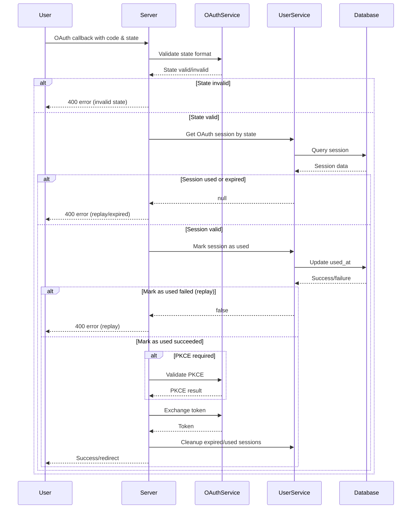

PR #21 Comments Snapshot — 2025-08-10 07:39:14Z

Repo: https://github.com/rollercoaster-dev/openbadges-system
PR:   https://github.com/rollercoaster-dev/openbadges-system/pull/21

## Issue Comments
### cursor[bot] — 2025-08-09T21:40:47Z
URL: https://github.com/rollercoaster-dev/openbadges-system/pull/21#issuecomment-3172113803

Cursor Agent can help with this pull request. Just `@cursor` in comments and I'll start working on changes in this branch.
<sub>[Learn more](https://docs.cursor.com/background-agent/web-and-mobile) about Cursor Agents</sub>

---

### coderabbitai[bot] — 2025-08-09T21:40:53Z
URL: https://github.com/rollercoaster-dev/openbadges-system/pull/21#issuecomment-3172113854

<!-- This is an auto-generated comment: summarize by coderabbit.ai -->
<!-- walkthrough_start -->

## Walkthrough

The changes introduce enhanced security and validation for the OAuth authentication flow. They add stricter state parameter validation, replay attack prevention by marking OAuth sessions as used, PKCE validation logging, and cleanup of expired or used sessions. Database schema and indexes were updated to support these security features and improve session management.

## Changes

| Cohort / File(s)                                   | Change Summary |
|----------------------------------------------------|---------------|
| **OAuth Callback Route Enhancements**<br>`src/server/routes/oauth.ts` | Added validation for the OAuth `state` parameter format, enforced replay protection by marking sessions as used, and improved PKCE validation logging. Clarified session cleanup after use. |
| **OAuth Service Security Methods**<br>`src/server/services/oauth.ts` | Introduced methods for marking sessions as used, validating PKCE code challenges, validating state format, and improved cleanup to remove used sessions. |
| **User Service & Database Schema Updates**<br>`src/server/services/user.ts` | Extended `OAuthSession` with `used_at`, updated the database schema (added `used_at`, unique constraints, indexes), implemented replay and expiration checks in session retrieval, added methods for marking sessions as used and cleaning up used sessions, and adjusted logging. |

## Sequence Diagram(s)



## Estimated code review effort

🎯 3 (Moderate) | ⏱️ ~20 minutes

## Poem

> A hop and a leap, security grows,
> With states now checked and sessions that close.
> No more replay tricks, no sneaky attacks,
> The OAuth bunny guards all the tracks.
> Databases tidy, PKCE in sight,
> Safe authentication—oh what a delight! 🐇✨

<!-- walkthrough_end -->

<!-- announcements_start -->

> [!NOTE]
> <details open="true">
> <summary>🔌 MCP (Model Context Protocol) integration is now available in Early Access!</summary>
> 
> Pro users can now connect to remote MCP servers under the Integrations page to get reviews and chat conversations that understand additional development context.
> 
> </details>

<!-- announcements_end -->
<!-- internal state start -->


<!-- DwQgtGAEAqAWCWBnSTIEMB26CuAXA9mAOYCmGJATmriQCaQDG+Ats2bgFyQAOFk+AIwBWJBrngA3EsgEBPRvlqU0AgfFwA6NPEgQAfACgjoCEYDEZyAAUASpETZWaCrKNxU3bABsvkCiQBHbGlcSHFcLzpIACIASWZefCl+NDxYSAAzL3wAdz9BbERcckREaMg5SELKSCF8UQAvZ0gACltIMwAmAEYASkz8BmrkfCwyWEwGeAwiMNgSe1FsCnV5THp/L3gVeC3ceXwMuYWAeQBBNJxceYxxBmp4UczsnOQc9QQsa9PuMgAhNC0UjIRCyIokZgaGDzSAAaxI8ngCQoSQh7GQ01wKNo2AYUWmDC82CUkDIGXwFCmM2OKFuJCIK326Aw9BIAA9uPAXPwjudLkVqAtuM40GwaBRkOtrABpADCAFEFCSGBMfGRgQAaSDva5XFgPBiLUqPMYcrlrFmMSKYbDcSBsFWYJDMRBQ2KhNBeRD4FAJSJsW7IfzcLxoNa4XBoBiwyBKGhiE0VeRYqOw6azRDSRCJwpoUhhH28EhSW5VDCpa4U+ANKL+aoaIxnWi0dQmz1eWRa77WOyA2gg+4ZcleFvU8l8ch5Pm6xISeBKCVaxC/KYZeD3HzyADi+HwREizPoABEkEwKLQtZ7RkRsySkbO0YGCzT2UhxNSt+oABLYASQafpJi9JUOIoxuqEmLYri0gFvCWD+Bk/iIOkGTYBgCajJ6qwDHwDjcNwFI0PQs7zpQyAtDue4HlKJ6IGetD9AQfh0NBNLkFE47Mb8gr0NUfD+GAFY3HcDxPFK94oskfGkhylDwGQeINgYcALI6MwwQSRIkt6bDMRkUYECsY4UlazjYVK7I0Bg2ZqHsnZVNwtCCsgTG0IMjjsKJWAtBg+CRgIHboJAk6ZLsCwAAZuQwiAAPT4EJYAogIhTFFmYASaiAa4K6zC0OFvSXpaTn+Wgmb2vADJeUGJChkRz7duF8VpAA+pmxqjIg4VhCoB5MXhBEUKE3YhRkJDUMs0hQvKGBziiGBZZAEhmT1MGccNJBThcM6SaREroP4sbuVldCFfQzDTCZvwUOOzCTAsGVSFlkoHVGCDFlE1wotgRDpCFxUqKV90suyk1uDC7S3Zi2jWRUqY5M49BMAkDy2dhOq/T6Aj+GgabUmpwKHugtDzEhz4nL8GAAkCMGdBobL2Cu8BrvcoHWVqZAOEZsxIyG2zoQs6OMC43AEJV3AIIaUpnFYsT2JGLII66kAALI2p6YQhOmhMCIC+ZSCszNeRrRRaxMyQCCQZAKH6JBEadixDIy8j+HOG3IEwGBrhQzDBT6mbWa2yT/TJBGcyQWqJFdtKeKES1bMVJr24CJMKQsTEnAA6mcADKViQEQ2CkVsJRKSc+vtl2CDIO0RT+DM3ww92QnsOuRuguCzAAOQgksTs8PgRQTZezbIFkr6o0ynHMN44ghqcW3pCRC6IPbD0wd2SUpSUIy8gvzy5BiXwwuT/y6zBIbUDdSn6MY4BQGQ9CHHqxBkModVI1lXC8PwwiiOIUgyHkEwBcKg1CaG0LoMAhgTBQHcBiSUWAKyEFIOQECUQP7sC4FQPIDgnDckqMA5Qqh1BaB0DfW+pgDCIEpDFTMFB9YxS+jQWKTVrgaGyhwAw0RuEGAsJAM4sQX6oJ4vYRwt1uRP3xtIMGCxPy4B/H+ACjB2w62jJACYLJIh8HhsgcYd16CCz7K2TCvg47ziNlKTMjtsIqlELCJWZxgobUWlhBOTxwR2h0UTJQ9AmL6yZsmGEN1qA8hpOFAUNAurCioGKGoFtxxChRHiOg6Y3RHAahEkgXVgkQUPmYi8NJ/BBBCCgaqIgxBREMZAAALAABlqaSCgKI+BSkwOgfCKJeDbBoPaLMeYSBQjOBkcUzEsTyTnNSbsSi2rZieIULWGTIyRMrgsGZiZUC+TyOI+E9BSpVEzL4wsLt2BcVDOGSM0YlaxCONshZMI1liWQNUeg+ldjkWmC2FmWs0CnLDOgCMEIRYFUKYEYIRRSnMXKXVKpdSGmUGaYTH5Z4kIERZFreFJk2ClH6YM5sxjyybi1EzGkDysAe0jNMSUkBwqEOav4tclBwqXkgNkWYWLED9IhX2D6PoPmtx6dcEJVg5SKnyUbd4Ph+AMEdrGZYdy074DgjJKRcsSDcChCpK0Y0MC2lCVMvepLtR7MJGZBlhypUyrQMMmoDhpVZlQr4es0JpCqQ0QTSCihWK13XCMsVrNCbBjOTwFE8Z/XTBpEojcXhVExiyLkbUHx8B4HQF4cU8r+Dl0leSlEvg415BMgQJV7IVWsvXEpcwlgziprfiaFyPpuxKBNSBWtoT2QDTqpdX8WxDQt3ENIgwUAAByPopFvEoAsW6JImINtEKGZtHV+C4QquWXAE0d4h0IlETtAV1ykluK2DSWBwk0LoQwph0g4pCXYZ1JS8oTa3XfooBYLt5J5BIEOQiXBlYpMcFwnhA7KHUIYLQygDDT3rgvaw2A17OHcOiLwytgiUFvyiLg8RBwjijpkf+Be2dQMQdMqUI1ui2RWR8Qm3UIUxSwEUAg1kGANF4iesxWqPKcP8izImW65ZSALUsb3VYGqYSvhNtSQ1bauRG1sWorxTambyXNb5AVExQiBr+YkUN6zkAaNoJEeg4bux8Tw/QiDgynFbNtjR+g4VtkATw+1DAZxEAAFUDldS8dy812zmTsd1IavZzyly2nbVrNT5zUzBvevusC/DqV+pILKJ9spVSRHUl1ajihiO0ixJ6vE5r6XyGFQqJUrr2zqhggQlg0TvnWxjuglL5XMgoh9kip9i05IMpaUQaG4LuxL3q2V9SWpBYYr4Dp4usxBWhFZXR0ZywYb6S9AsJ4ryiT+DMyFcK8Xs5LJIAAMQpA+9LlnMseebGxskFI8RyxWBUvgfrExP31fyXbPARSxIoFqaTuNJsqZQLkoKABmToYBHRUDuzdrWD6VTpuczYAAMmADlo1YaZgAGzVLewCigWBnlJmCpgfA84oR7emO2eyDVCTattPKM0/haD2dmdZY7lYDF7L0fzc1npvS0gkIq1S1odV2ifnj6ZnGF0GZhEZ/DeJ2bWTldSfwzAkjqyfqSlyf2zYLAtlbbZUQAsHPLQh/h1b52N3rTCRtc6qqto5Jux+fBPA7p7fuvtiAjBQG/az7xdAuDhVKrIdC9pnCwjs+LxzLmDktEyVwb1MxehcCsM1pAJBgACF3ILvQXVw0mqI+FMPJm8TZ6PUBkD9DKBl7nHiFhV7srhQHSrE7uzzu0D9wHoP8XEtKGS4N0gLRCEADUOvyQoLHsZMwvtJYa+pMfXME/WGT5mNPGftVZ9pIR5A+fcMy6yev49wHT0V/A9Xy9aRr318903n3re4uuMFDtwUB3vbUGj7t2f6Z5/p/wIL4vG/qUF6r133DX30ryPx3xrzPzryMDvXEAfXQTaxfWcXfXHE4EbxbF/Tgw90AxPVAzAMLwvT4hgz/Xgz4QESERQ3oDQ2cAw0YDdX7U1S3zSEZxNGL3FH0muy8UsgfkqQ+B83wBFjbF8HCmeWamoC6lgJCFFDtAZRHCEwWH+h1jKjonmFuhwmpSg1anD06iy1tGKjY00mJAWB+WEIOVENwC6iYCJGYAwHtkWUFAsO/0cCwC8UnQWDQngGKTkOpT4magYHpxbm53EJWnsFsVUJcMUHkzYyV1RFjHfVSFTRcSJFWhMnChTGsnbU6iXFtliP0hnkSLBTUPCnLDYC6ilFSNkF+CZQDQhBiO7H2F+FoLsQUGshTExH4CPXqKyShDw0zXM1pCUDZBghyHHWv0KJ8L8LoACK9A0D4liDyi1EaiEman6wlC6haAMNHFmFawSAHnUCBgGPaOpRWNKMtHChWOah8PnHyntkWJanVzWKeHCgkyQjMJOOsxELEN6CUgYNIFwDDwcxZysyyw5zy2fHvH9BOTC2DT8j/kTAsjpyNnG3TC4HUF9jyH8FXRx2QB1UlWJW7ENQmCpV8gwDABxKEI+PMNaD5S+WpFRI8y8GxloHkGeWBRmyCnhhxy1ieChOoBoASGyi1CUEiGYRDi5FQy0IcjEjtVKHtgxPm2xO8FzRMmePFIcwcT6Iy2s1s23wcyc1czoHcz2U82fG8x+X8yeQOXx0zAjHTRMLoFeLCCREkISC1DlM5OpB+S/0F36P5S1jxKl0ckFFETtUmPoBaFGECn9NWXDyyyU0iznCTUQECj114gOS+P4TxVZnJ2ZRCipxtDtE1OpTzKF31NoH+KZ20K8Q9RxFBNchqltmjLVLmBCS1wqEtlx0tNaQOm/wXGbKwFGAWBo2WCUmVguj4FZSIChz6XzBoFIyyykXoBxC5ljGoABjKmmFbCwiaH9VWwmi8NRCoCzVGBy1zReDULFwc1GRWGLHVk2VpEJEMOqgvgtFZARP9W+xXkJgbVXMUNWVCJ+XEmBkGLHReloCEBSjY36kImODKlGnGiQiUlINNxt2nUt1nRFFZnXTbXt0XR4C7V3V7XkndwbybHI34KzN8EjkoCZDtNoDMIAH538ZhxDeU6RroowIpyyWC99S9D8KBK8INYpCC68GwoBSKohCz/dQQg9tSmDw89So8Y9Id49E9F9U8vTV8WK/9wp9SKBjNADf8QC+KBKT9hKb0SKW9elvcpLA9DRizbRSyuKOoWh58k8WAU9gA+d5w18mJc9N9dL9KINDLeLcD+Lj8CC6Fz9RLIBnNAy6pCzswiAV0JpQkbKg9finKMBX9BQmKiBXK1LgBMrIAAAfYKRUtfHPUMPPAKnfYKnA8vMK8AmKMytYi2M2R4Q8wKEEng3UHky0Z4qTeYS5L44grAwwAwGBPdR+I4JBcgtBRGFgT+PwNAHBMRag/HQhKgYhcBMhKBCau+a2c6XAZqecRAZqRA4YuigUQaSBcaya7oBgAADloAAFYBBHq0dalaBqkGAABOAAdkB1oF+oEAyFqUBwyGqX+pepevfTRwEG6EB1qSjDR1+rQGqQWHIUmo/nUBOv7HOuLFfXtIfluv2ogHtAYG4F8OPMslakjBuvIXCiZoMAAG8DBIAYhKUKpYBspoguAABtAAXQ1HZpiA5IwHTDKAFsFoMAAF8DAmb68yaoBmBKbqa6RSNmoSb9AgA=== -->

<!-- internal state end -->
<!-- finishing_touch_checkbox_start -->

<details>
<summary>✨ Finishing Touches</summary>

- [ ] <!-- {"checkboxId": "7962f53c-55bc-4827-bfbf-6a18da830691"} --> 📝 Generate Docstrings
<details>
<summary>🧪 Generate unit tests</summary>

- [ ] <!-- {"checkboxId": "f47ac10b-58cc-4372-a567-0e02b2c3d479", "radioGroupId": "utg-output-choice-group-unknown_comment_id"} -->   Create PR with unit tests
- [ ] <!-- {"checkboxId": "07f1e7d6-8a8e-4e23-9900-8731c2c87f58", "radioGroupId": "utg-output-choice-group-unknown_comment_id"} -->   Post copyable unit tests in a comment
- [ ] <!-- {"checkboxId": "6ba7b810-9dad-11d1-80b4-00c04fd430c8", "radioGroupId": "utg-output-choice-group-unknown_comment_id"} -->   Commit unit tests in branch `cursor/improve-oauth-flow-robustness-02a2`

</details>

</details>

<!-- finishing_touch_checkbox_end -->
<!-- tips_start -->

---

Thanks for using CodeRabbit! It's free for OSS, and your support helps us grow. If you like it, consider giving us a shout-out.

<details>
<summary>❤️ Share</summary>

- [X](https://twitter.com/intent/tweet?text=I%20just%20used%20%40coderabbitai%20for%20my%20code%20review%2C%20and%20it%27s%20fantastic%21%20It%27s%20free%20for%20OSS%20and%20offers%20a%20free%20trial%20for%20the%20proprietary%20code.%20Check%20it%20out%3A&url=https%3A//coderabbit.ai)
- [Mastodon](https://mastodon.social/share?text=I%20just%20used%20%40coderabbitai%20for%20my%20code%20review%2C%20and%20it%27s%20fantastic%21%20It%27s%20free%20for%20OSS%20and%20offers%20a%20free%20trial%20for%20the%20proprietary%20code.%20Check%20it%20out%3A%20https%3A%2F%2Fcoderabbit.ai)
- [Reddit](https://www.reddit.com/submit?title=Great%20tool%20for%20code%20review%20-%20CodeRabbit&text=I%20just%20used%20CodeRabbit%20for%20my%20code%20review%2C%20and%20it%27s%20fantastic%21%20It%27s%20free%20for%20OSS%20and%20offers%20a%20free%20trial%20for%20proprietary%20code.%20Check%20it%20out%3A%20https%3A//coderabbit.ai)
- [LinkedIn](https://www.linkedin.com/sharing/share-offsite/?url=https%3A%2F%2Fcoderabbit.ai&mini=true&title=Great%20tool%20for%20code%20review%20-%20CodeRabbit&summary=I%20just%20used%20CodeRabbit%20for%20my%20code%20review%2C%20and%20it%27s%20fantastic%21%20It%27s%20free%20for%20OSS%20and%20offers%20a%20free%20trial%20for%20proprietary%20code)

</details>

<details>
<summary>🪧 Tips</summary>

### Chat

There are 3 ways to chat with [CodeRabbit](https://coderabbit.ai?utm_source=oss&utm_medium=github&utm_campaign=rollercoaster-dev/openbadges-system&utm_content=21):

- Review comments: Directly reply to a review comment made by CodeRabbit. Example:
  - `I pushed a fix in commit <commit_id>, please review it.`
  - `Explain this complex logic.`
  - `Open a follow-up GitHub issue for this discussion.`
- Files and specific lines of code (under the "Files changed" tab): Tag `@coderabbitai` in a new review comment at the desired location with your query. Examples:
  - `@coderabbitai explain this code block.`
- PR comments: Tag `@coderabbitai` in a new PR comment to ask questions about the PR branch. For the best results, please provide a very specific query, as very limited context is provided in this mode. Examples:
  - `@coderabbitai gather interesting stats about this repository and render them as a table. Additionally, render a pie chart showing the language distribution in the codebase.`
  - `@coderabbitai read src/utils.ts and explain its main purpose.`
  - `@coderabbitai read the files in the src/scheduler package and generate a class diagram using mermaid and a README in the markdown format.`

### Support

Need help? Create a ticket on our [support page](https://www.coderabbit.ai/contact-us/support) for assistance with any issues or questions.

### CodeRabbit Commands (Invoked using PR comments)

- `@coderabbitai pause` to pause the reviews on a PR.
- `@coderabbitai resume` to resume the paused reviews.
- `@coderabbitai review` to trigger an incremental review. This is useful when automatic reviews are disabled for the repository.
- `@coderabbitai full review` to do a full review from scratch and review all the files again.
- `@coderabbitai summary` to regenerate the summary of the PR.
- `@coderabbitai generate docstrings` to [generate docstrings](https://docs.coderabbit.ai/finishing-touches/docstrings) for this PR.
- `@coderabbitai generate sequence diagram` to generate a sequence diagram of the changes in this PR.
- `@coderabbitai generate unit tests` to generate unit tests for this PR.
- `@coderabbitai resolve` resolve all the CodeRabbit review comments.
- `@coderabbitai configuration` to show the current CodeRabbit configuration for the repository.
- `@coderabbitai help` to get help.

### Other keywords and placeholders

- Add `@coderabbitai ignore` anywhere in the PR description to prevent this PR from being reviewed.
- Add `@coderabbitai summary` to generate the high-level summary at a specific location in the PR description.
- Add `@coderabbitai` anywhere in the PR title to generate the title automatically.

### CodeRabbit Configuration File (`.coderabbit.yaml`)

- You can programmatically configure CodeRabbit by adding a `.coderabbit.yaml` file to the root of your repository.
- Please see the [configuration documentation](https://docs.coderabbit.ai/guides/configure-coderabbit) for more information.
- If your editor has YAML language server enabled, you can add the path at the top of this file to enable auto-completion and validation: `# yaml-language-server: $schema=https://coderabbit.ai/integrations/schema.v2.json`

### Documentation and Community

- Visit our [Documentation](https://docs.coderabbit.ai) for detailed information on how to use CodeRabbit.
- Join our [Discord Community](http://discord.gg/coderabbit) to get help, request features, and share feedback.
- Follow us on [X/Twitter](https://twitter.com/coderabbitai) for updates and announcements.

</details>

<!-- tips_end -->

---

### joeczar — 2025-08-10T07:32:29Z
URL: https://github.com/rollercoaster-dev/openbadges-system/pull/21#issuecomment-3172437267


CI failure summary + next steps

Failing checks
- CI: Lint and Type Check — FAILURE
- PR Validation: validate — FAILURE
- PR Validation: pr-title-check — FAILURE

Key error
- TypeScript: src/server/services/user.ts(627,12) TS2365: Operator ">" cannot be applied to types "void" and "number".
  - Likely comparing the result of a void-returning function to a number. Ensure the expression returns a numeric value, or refactor to check a numeric variable before comparing.

PR title policy
- Title "Improve oauth flow robustness" fails conventional commit format. Examples:
  - feat(auth): improve OAuth flow robustness
  - fix(auth): handle OAuth flow edge cases

Suggested actions
- Update PR title to conventional commit format.
- Fix the TS error in user.ts: return a number from the function being compared, or separate the comparison.
- Re-run CI.

Context links
- Lint/Type error run: https://github.com/rollercoaster-dev/openbadges-system/actions/runs/16853993597/job/47744309556
- Validate error run: https://github.com/rollercoaster-dev/openbadges-system/actions/runs/16854006328/job/47744337211
- PR title check: https://github.com/rollercoaster-dev/openbadges-system/actions/runs/16854006328/job/47744337210


---


## Review Comments
### coderabbitai[bot] — 2025-08-09T21:47:25Z
URL: https://github.com/rollercoaster-dev/openbadges-system/pull/21#discussion_r2264994644
Path: src/server/routes/oauth.ts
Line: 100

_🛠️ Refactor suggestion_

**Avoid logging full OAuth state; mask it to prevent sensitive token leakage**

Logging the raw state risks exposure in logs. Mask most of it.
[security]

```diff
-    if (!oauthService.validateStateFormat(state)) {
-      console.warn(`Invalid state format received: ${state}`)
+    if (!oauthService.validateStateFormat(state)) {
+      const maskedState = `${state.slice(0, 4)}...${state.slice(-4)}`
+      console.warn(`Invalid state format received: ${maskedState}`)
```

Optional: per team learnings, consider validating all query params with Zod for consistency.

<!-- suggestion_start -->

<details>
<summary>📝 Committable suggestion</summary>

> ‼️ **IMPORTANT**
> Carefully review the code before committing. Ensure that it accurately replaces the highlighted code, contains no missing lines, and has no issues with indentation. Thoroughly test & benchmark the code to ensure it meets the requirements.

```suggestion
    // Enhanced state validation
    if (!oauthService.validateStateFormat(state)) {
      const maskedState = `${state.slice(0, 4)}...${state.slice(-4)}`
      console.warn(`Invalid state format received: ${maskedState}`)
      return c.json(
        {
          success: false,
          error: 'Invalid state parameter format',
        },
        400
      )
    }
```

</details>

<!-- suggestion_end -->

<details>
<summary>🤖 Prompt for AI Agents</summary>

```
In src/server/routes/oauth.ts around lines 89 to 100, the current code logs the
full OAuth state parameter, which risks exposing sensitive information. Modify
the console.warn statement to mask most of the state value, showing only a small
portion (e.g., first and last few characters) to prevent sensitive token
leakage. Optionally, consider adding Zod validation for all query parameters to
ensure consistent and robust input validation.
```

</details>

<!-- fingerprinting:phantom:poseidon:capybara -->

<!-- This is an auto-generated comment by CodeRabbit -->

---

### coderabbitai[bot] — 2025-08-09T21:47:26Z
URL: https://github.com/rollercoaster-dev/openbadges-system/pull/21#discussion_r2264994651
Path: src/server/services/oauth.ts
Line: 119

_💡 Verification agent_

<details>
<summary>🧩 Analysis chain</summary>

**Is `validateCodeChallenge` used? Verify and remove if dead code**

If not referenced, consider removing or adding a unit where you compute and compare against stored challenge.

---

🏁 Script executed:

```shell
#!/bin/bash
# Find all usages of validateCodeChallenge
rg -n "validateCodeChallenge\\(" -A 2
```

Length of output: 319

---


</details>

**Remove unused `validateCodeChallenge` method**

The `validateCodeChallenge` helper isn’t referenced anywhere in the codebase and can be safely removed (or you can wire it up to your PKCE flow if it was meant to be used).

• File to update: `src/server/services/oauth.ts`  
• Lines: 109–119  

Suggested change:
```diff
-  // Validate PKCE code challenge
-  async validateCodeChallenge(codeVerifier: string, codeChallenge: string): Promise<boolean> {
-    try {
-      const computedChallenge = await this.createCodeChallenge(codeVerifier)
-      return computedChallenge === codeChallenge
-    } catch (error) {
-      console.error('PKCE validation error:', error)
-      return false
-    }
-  }
```

If this functionality is required later, add a corresponding call in your OAuth workflow and cover it with a unit test.

<!-- suggestion_start -->

<details>
<summary>📝 Committable suggestion</summary>

> ‼️ **IMPORTANT**
> Carefully review the code before committing. Ensure that it accurately replaces the highlighted code, contains no missing lines, and has no issues with indentation. Thoroughly test & benchmark the code to ensure it meets the requirements.

```suggestion

```

</details>

<!-- suggestion_end -->

<details>
<summary>🤖 Prompt for AI Agents</summary>

```
In src/server/services/oauth.ts between lines 109 and 119, the
validateCodeChallenge method is not used anywhere in the codebase. Remove this
entire method to clean up unused code. If you later need this functionality,
integrate it properly into the OAuth PKCE flow and add unit tests to cover it.
```

</details>

<!-- fingerprinting:phantom:poseidon:capybara -->

<!-- This is an auto-generated comment by CodeRabbit -->

---

### coderabbitai[bot] — 2025-08-09T21:47:26Z
URL: https://github.com/rollercoaster-dev/openbadges-system/pull/21#discussion_r2264994657
Path: src/server/services/user.ts
Line: 628

_⚠️ Potential issue_

**Fix: TypeScript error due to using return of `runQuery` (void) in a comparison**

This is the source of the pipeline failure (TS2365). Use `prepare(...).run(...)` to get `changes`.


```diff
-  async markOAuthSessionAsUsed(state: string): Promise<boolean> {
-    const now = new Date().toISOString()
-    const changes = this.runQuery('UPDATE oauth_sessions SET used_at = ? WHERE state = ? AND used_at IS NULL', [now, state])
-    return changes > 0
-  }
+  async markOAuthSessionAsUsed(state: string): Promise<boolean> {
+    const now = new Date().toISOString()
+    const stmt = this.getDb().prepare(
+      'UPDATE oauth_sessions SET used_at = ? WHERE state = ? AND used_at IS NULL'
+    )
+    const result = stmt.run(now, state) // RunResult with `changes`
+    return result.changes > 0
+  }
```

This should resolve the CI/type-check failure.

<!-- suggestion_start -->

<details>
<summary>📝 Committable suggestion</summary>

> ‼️ **IMPORTANT**
> Carefully review the code before committing. Ensure that it accurately replaces the highlighted code, contains no missing lines, and has no issues with indentation. Thoroughly test & benchmark the code to ensure it meets the requirements.

```suggestion
  async markOAuthSessionAsUsed(state: string): Promise<boolean> {
    const now = new Date().toISOString()
    const stmt = this.getDb().prepare(
      'UPDATE oauth_sessions SET used_at = ? WHERE state = ? AND used_at IS NULL'
    )
    const result = stmt.run(now, state) // RunResult with `changes`
    return result.changes > 0
  }
```

</details>

<!-- suggestion_end -->

<details>
<summary>🧰 Tools</summary>

<details>
<summary>🪛 GitHub Check: Lint and Type Check</summary>

[failure] 627-627: 
Operator '>' cannot be applied to types 'void' and 'number'.

</details>
<details>
<summary>🪛 GitHub Actions: PR Validation</summary>

[error] 627-627: TypeScript error TS2365: Operator '>' cannot be applied to types 'void' and 'number'.

</details>
<details>
<summary>🪛 GitHub Actions: CI</summary>

[error] 627-627: TypeScript error TS2365: Operator '>' cannot be applied to types 'void' and 'number'.

</details>

</details>

<details>
<summary>🤖 Prompt for AI Agents</summary>

```
In src/server/services/user.ts around lines 624 to 628, the method
markOAuthSessionAsUsed incorrectly uses the return value of runQuery, which
returns void, in a comparison causing a TypeScript error. To fix this, replace
the call to runQuery with a prepared statement using prepare(...).run(...) to
execute the update and obtain the number of changes. Then compare the changes
count to zero to return the boolean result.
```

</details>

<!-- fingerprinting:phantom:poseidon:capybara -->

<!-- This is an auto-generated comment by CodeRabbit -->

---


## Reviews
### coderabbitai[bot] — 2025-08-09T21:47:26Z
State: COMMENTED
URL: https://github.com/rollercoaster-dev/openbadges-system/pull/21#pullrequestreview-3103291761

**Actionable comments posted: 3**

<details>
<summary>🧹 Nitpick comments (4)</summary><blockquote>

<details>
<summary>src/server/routes/oauth.ts (2)</summary><blockquote>

`113-125`: **Replay protection is good; return 409 Conflict for already-used sessions**

Using 409 better conveys a state conflict than 400.


```diff
-      return c.json(
+      return c.json(
         {
           success: false,
           error: 'Session has already been used',
         },
-        400
+        409
       )
```

Note: Marking as used before token exchange is a trade-off (strong replay protection vs. retry UX). If desired, we can discuss a strategy to permit one retry window while still preventing replay.

---

`126-132`: **Lower log verbosity for PKCE note**

Reduce noise and avoid implying local validation is performed here. The provider validates PKCE during token exchange.


```diff
-      console.log('PKCE flow detected, will validate during token exchange')
+      console.debug('PKCE flow detected; provider will validate during token exchange')
```

</blockquote></details>
<details>
<summary>src/server/services/oauth.ts (1)</summary><blockquote>

`120-131`: **State format validation looks solid; tweak comment for accuracy**

Minor doc nit: 32 is not nanoid’s default; it’s an explicit choice for stronger entropy.


```diff
-    // State should be 32 characters long (nanoid default for security)
+    // State should be 32 characters long (explicitly generated via nanoid for ~192 bits of entropy)
```

</blockquote></details>
<details>
<summary>src/server/services/user.ts (1)</summary><blockquote>

`203-213`: **Index on state is redundant with UNIQUE(state)**

SQLite creates an implicit unique index. Keeping both adds write overhead. Consider dropping `idx_oauth_sessions_state`.

</blockquote></details>

</blockquote></details>

<details>
<summary>📜 Review details</summary>

**Configuration used: CodeRabbit UI**
**Review profile: CHILL**
**Plan: Pro**


<details>
<summary>📥 Commits</summary>

Reviewing files that changed from the base of the PR and between 01a0dba202938122d495a90e47cbbd4b29f10721 and 1c8d5b860d4c973d9bf03f4755ef6b130ac69a4e.

</details>

<details>
<summary>📒 Files selected for processing (3)</summary>

* `src/server/routes/oauth.ts` (3 hunks)
* `src/server/services/oauth.ts` (3 hunks)
* `src/server/services/user.ts` (5 hunks)

</details>

<details>
<summary>🧰 Additional context used</summary>

<details>
<summary>🧠 Learnings (2)</summary>

<details>
<summary>📚 Learning: 2025-08-08T08:52:35.961Z</summary>

```
Learnt from: joeczar
PR: rollercoaster-dev/openbadges-system#0
File: :0-0
Timestamp: 2025-08-08T08:52:35.961Z
Learning: Validation approach: Prefer Zod for input validation; express-validator is not used in this repo. If types/express-validator appears, it should be removed.
```

**Applied to files:**
- `src/server/routes/oauth.ts`

</details>
<details>
<summary>📚 Learning: 2025-08-08T08:52:35.961Z</summary>

```
Learnt from: joeczar
PR: rollercoaster-dev/openbadges-system#0
File: :0-0
Timestamp: 2025-08-08T08:52:35.961Z
Learning: API (Hono): Always wrap c.req.json() in try/catch and return HTTP 400 for malformed JSON in route handlers (e.g., src/server/routes/auth.ts, src/server/routes/users.ts).
```

**Applied to files:**
- `src/server/routes/oauth.ts`

</details>

</details><details>
<summary>🧬 Code Graph Analysis (1)</summary>

<details>
<summary>src/server/routes/oauth.ts (1)</summary><blockquote>

<details>
<summary>src/server/services/oauth.ts (1)</summary>

* `oauthService` (369-378)

</details>

</blockquote></details>

</details><details>
<summary>🪛 GitHub Check: Lint and Type Check</summary>

<details>
<summary>src/server/services/user.ts</summary>

[failure] 627-627: 
Operator '>' cannot be applied to types 'void' and 'number'.

</details>

</details>
<details>
<summary>🪛 GitHub Actions: PR Validation</summary>

<details>
<summary>src/server/services/user.ts</summary>

[error] 627-627: TypeScript error TS2365: Operator '>' cannot be applied to types 'void' and 'number'.

</details>

</details>
<details>
<summary>🪛 GitHub Actions: CI</summary>

<details>
<summary>src/server/services/user.ts</summary>

[error] 627-627: TypeScript error TS2365: Operator '>' cannot be applied to types 'void' and 'number'.

</details>

</details>

</details>

<details>
<summary>🔇 Additional comments (8)</summary><blockquote>

<details>
<summary>src/server/routes/oauth.ts (1)</summary>

`171-171`: **Session cleanup comment clarifies lifecycle**

Comment improves readability and intent. LGTM.

</details>
<details>
<summary>src/server/services/oauth.ts (2)</summary>

`100-108`: **Good: Dedicated replay mark method**

Encapsulates replay protection cleanly and aligns with DB logic in userService.

---

`357-357`: **Cleanup of used sessions is a good addition**

Complements expiry cleanup to prevent table growth and replay risk.

</details>
<details>
<summary>src/server/services/user.ts (5)</summary>

`153-170`: **User credentials defaults are sensible; ensure back-compat on existing rows**

NOT NULL transport/type defaults reduce null handling complexity. LGTM.

---

`189-201`: **OAuth sessions: unique state and used_at enable replay protection**

Schema changes align with the new flow. LGTM.

---

`598-622`: **Session retrieval: handles used/expired sessions and cleans up**

Good defensive checks and cleanup on access. LGTM.

---

`640-645`: **Used-session cleanup window is reasonable**

1-hour grace strikes a good balance between auditability and cleanup.

---

`624-628`: **Verified: No other `runQuery` return-value usages found**  
I searched the repo for assignments from `this.runQuery(…)` and comparisons like `> 0`; the only occurrence is in `markOAuthSessionAsUsed` (src/server/services/user.ts:624–628). No other call sites rely on the return value of `runQuery`.

</details>

</blockquote></details>

</details>

<!-- This is an auto-generated comment by CodeRabbit for review status -->

---

