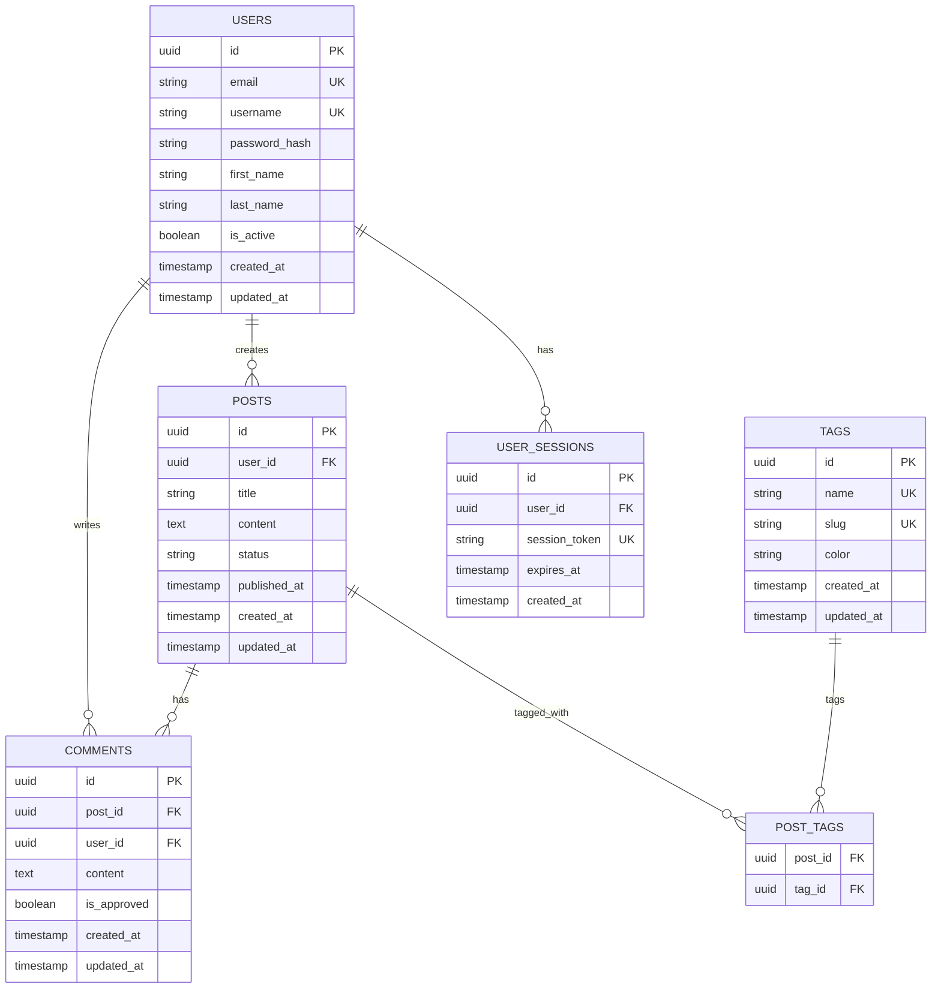

# Database Abstraction Layer

This project implements a dual-database strategy supporting both SQLite and PostgreSQL using Kysely as the query builder. The system provides environment-selectable adapters with shared migration files and full transaction support.

## Architecture Overview

The database abstraction layer consists of:
- **Database Factory**: Creates database instances based on environment configuration
- **Migration System**: Shared SQL files compatible with both engines
- **Transaction Manager**: Unified transaction handling
- **Type Safety**: Full TypeScript support with Kysely's type inference

## Environment Configuration

Set the database type using the `DB_TYPE` environment variable:

```bash
# For SQLite (default)
DB_TYPE=sqlite

# For PostgreSQL
DB_TYPE=postgres
```

## Entity Relationship Diagram



## Database Compatibility Matrix

| Feature | SQLite | PostgreSQL | Implementation Notes |
|---------|---------|------------|---------------------|
| **Data Types** | | | |
| UUID | ✅ | ✅ | SQLite uses TEXT, PostgreSQL uses UUID |
| JSON | ✅ | ✅ | Native support in both |
| Boolean | ✅ | ✅ | SQLite uses INTEGER(0,1), PostgreSQL uses BOOLEAN |
| Timestamp | ✅ | ✅ | ISO 8601 strings in SQLite, native in PostgreSQL |
| Text/VARCHAR | ✅ | ✅ | No length limits in SQLite |
| **Constraints** | | | |
| Primary Keys | ✅ | ✅ | Both support composite PKs |
| Foreign Keys | ✅ | ✅ | Enforced in both (pragma required in SQLite) |
| Unique Constraints | ✅ | ✅ | Full support |
| Check Constraints | ✅ | ✅ | Full support |
| **Indexes** | | | |
| B-Tree Indexes | ✅ | ✅ | Default index type |
| Partial Indexes | ✅ | ✅ | WHERE clause support |
| Multi-column Indexes | ✅ | ✅ | Full support |
| **Transactions** | | | |
| ACID Properties | ✅ | ✅ | Full ACID compliance |
| Isolation Levels | ⚠️ | ✅ | SQLite: Serializable only |
| Nested Transactions | ❌ | ✅ | PostgreSQL supports savepoints |
| **Advanced Features** | | | |
| Full-Text Search | ✅ | ✅ | FTS5 in SQLite, built-in in PostgreSQL |
| JSON Operations | ✅ | ✅ | JSON1 extension in SQLite |
| Window Functions | ✅ | ✅ | Both support SQL window functions |
| CTEs (WITH) | ✅ | ✅ | Recursive CTEs supported |
| **Performance** | | | |
| Concurrent Reads | ✅ | ✅ | SQLite: Multiple readers |
| Concurrent Writes | ❌ | ✅ | SQLite: Single writer |
| Connection Pooling | ❌ | ✅ | Not applicable for SQLite |
| **Deployment** | | | |
| File-based | ✅ | ❌ | SQLite is serverless |
| Network Access | ❌ | ✅ | PostgreSQL supports remote connections |
| Memory Usage | ✅ | ⚠️ | SQLite more memory efficient |
| Setup Complexity | ✅ | ⚠️ | SQLite requires no setup |

### Legend
- ✅ Full support
- ⚠️ Partial support or limitations
- ❌ Not supported

## Migration Strategy

### Shared SQL Migrations

All migrations are written in standard SQL that works on both databases:

```sql
-- migrations/001_create_users.sql
CREATE TABLE users (
    id TEXT PRIMARY KEY,
    email TEXT UNIQUE NOT NULL,
    username TEXT UNIQUE NOT NULL,
    password_hash TEXT NOT NULL,
    first_name TEXT,
    last_name TEXT,
    is_active INTEGER DEFAULT 1,
    created_at TEXT DEFAULT CURRENT_TIMESTAMP,
    updated_at TEXT DEFAULT CURRENT_TIMESTAMP
);

CREATE INDEX idx_users_email ON users(email);
CREATE INDEX idx_users_username ON users(username);
```

### Database-Specific Adaptations

Type mapping is handled transparently by the database factory:

- **SQLite**: Uses TEXT for UUIDs, INTEGER for booleans
- **PostgreSQL**: Uses native UUID and BOOLEAN types

## Usage Examples

### Basic Database Operations

```typescript
import { getDatabaseInstance } from './database/factory';

const db = getDatabaseInstance();

// Insert with type safety
const user = await db
  .insertInto('users')
  .values({
    id: crypto.randomUUID(),
    email: 'user@example.com',
    username: 'johndoe',
    password_hash: 'hashed_password',
    first_name: 'John',
    last_name: 'Doe'
  })
  .returningAll()
  .executeTakeFirstOrThrow();

// Query with joins
const postsWithAuthors = await db
  .selectFrom('posts')
  .innerJoin('users', 'users.id', 'posts.user_id')
  .select([
    'posts.id',
    'posts.title',
    'posts.content',
    'users.username',
    'users.first_name',
    'users.last_name'
  ])
  .execute();
```

### Transaction Management

```typescript
import { withTransaction } from './database/transaction';

const result = await withTransaction(async (trx) => {
  // Create user
  const user = await trx
    .insertInto('users')
    .values(userData)
    .returningAll()
    .executeTakeFirstOrThrow();

  // Create initial post
  const post = await trx
    .insertInto('posts')
    .values({
      ...postData,
      user_id: user.id
    })
    .returningAll()
    .executeTakeFirstOrThrow();

  return { user, post };
});
```

## Performance Considerations

### SQLite Optimizations
- Enable WAL mode for better concurrent access
- Use connection pooling with a single connection
- Regular VACUUM operations for maintenance

### PostgreSQL Optimizations
- Connection pooling with appropriate pool size
- Index optimization for query patterns
- Regular ANALYZE for query planner statistics

## Development vs Production

### Development (SQLite)
- Zero configuration
- File-based database
- Perfect for local development
- Easy to reset and seed

### Production (PostgreSQL)
- Robust concurrent access
- Advanced features and performance
- Backup and replication support
- Monitoring and administration tools

## Testing Strategy

Both databases are tested with the same test suite to ensure compatibility:

```typescript
// Tests run against both SQLite and PostgreSQL
describe.each(['sqlite', 'postgres'])('Database Tests - %s', (dbType) => {
  beforeEach(async () => {
    process.env.DB_TYPE = dbType;
    await setupTestDatabase();
  });

  test('should create and retrieve users', async () => {
    // Test implementation
  });
});
```
