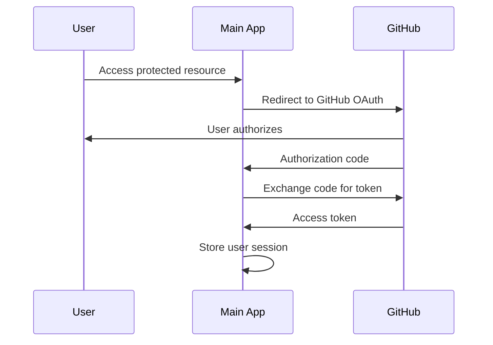
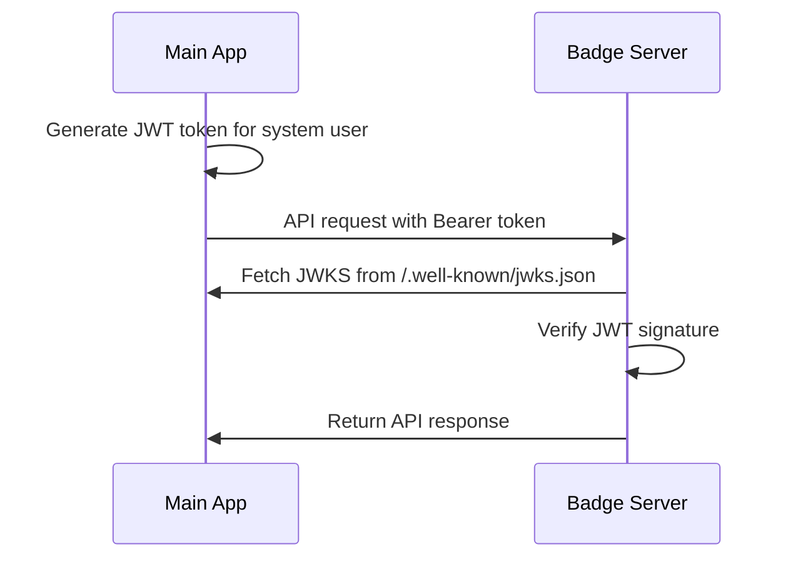

# OAuth Integration Guide

This guide explains how OAuth authentication is configured between the OpenBadges main application and the OpenBadges modular server for secure service-to-service communication.

## Overview

The OpenBadges system uses a hybrid OAuth approach:

1. **User Authentication**: Users authenticate via GitHub OAuth to access the main application
2. **Service-to-Service Authentication**: The main application uses JWT tokens to authenticate with the badge server
3. **Token Verification**: The badge server verifies JWT tokens using JWKS (JSON Web Key Set) from the main application

## Architecture

```
┌─────────────────┐    GitHub OAuth    ┌─────────────────┐
│     User        │ ──────────────────► │  Main App       │
│                 │                     │  (Port 8888)    │
└─────────────────┘                     └─────────────────┘
                                                │
                                                │ JWT Tokens
                                                │ (Service-to-Service)
                                                ▼
                                        ┌─────────────────┐
                                        │  Badge Server   │
                                        │  (Port 3000)    │
                                        │  (Docker)       │
                                        └─────────────────┘
```

## Configuration

### Main Application (.env)

```bash
# OAuth GitHub Configuration (for users)
OAUTH_GITHUB_CLIENT_ID=your_github_client_id
OAUTH_GITHUB_CLIENT_SECRET=your_github_client_secret
OAUTH_GITHUB_CALLBACK_URL=http://localhost:8888/api/oauth/github/callback

# OpenBadges Server Integration
OPENBADGES_SERVER_URL=http://localhost:3000
OPENBADGES_AUTH_ENABLED=true
OPENBADGES_AUTH_MODE=oauth  # Use 'oauth' for JWT tokens
OPENBADGES_API_KEY=test-api-key-123

# JWT Configuration
JWT_SECRET=your-jwt-secret
PLATFORM_ID=urn:uuid:a504d862-bd64-4e0d-acff-db7955955bc1
PLATFORM_CLIENT_ID=openbadges-demo-main-app
PLATFORM_JWT_ISSUER=openbadges-demo-main-app
```

### Badge Server (docker-compose.yml)

```yaml
services:
  openbadges-server:
    environment:
      # Basic Authentication
      - AUTH_ENABLED=true
      - JWT_SECRET=${JWT_SECRET:-dev-secret-please-change}

      # OAuth2 Configuration
      - OAUTH_ENABLED=true
      - AUTH_OAUTH2_ENABLED=true
      - AUTH_OAUTH2_JWKS_URI=http://host.docker.internal:8888/.well-known/jwks.json
      - AUTH_OAUTH2_ISSUER=openbadges-demo-main-app

      # Platform Configuration
      - PLATFORM_ID=${PLATFORM_ID:-urn:uuid:a504d862-bd64-4e0d-acff-db7955955bc1}
      - PLATFORM_CLIENT_ID=${PLATFORM_CLIENT_ID:-openbadges-demo-main-app}
      - PLATFORM_JWT_ISSUER=${PLATFORM_JWT_ISSUER:-openbadges-demo-main-app}

    volumes:
      - ./keys:/app/keys:ro # Mount JWT keys for verification
```

## JWT Key Setup

The system uses RSA keys for JWT signing and verification:

1. **Private Key** (`keys/platform-private.pem`): Used by main app to sign JWT tokens
2. **Public Key** (`keys/platform-public.pem`): Used by badge server to verify JWT tokens
3. **JWKS Endpoint** (`/.well-known/jwks.json`): Provides public key in JWK format

### Generating Keys

```bash
# Generate private key
openssl genrsa -out keys/platform-private.pem 2048

# Generate public key
openssl rsa -in keys/platform-private.pem -pubout -out keys/platform-public.pem
```

## Authentication Flow

### 1. User Authentication (GitHub OAuth)



### 2. Service-to-Service Authentication (JWT)



## API Usage Examples

### Making Authenticated Requests

The main application automatically handles authentication when making requests to the badge server:

```javascript
// This request will automatically include JWT authentication
const response = await fetch('/api/bs/badge-classes')
const badgeClasses = await response.json()
```

### Direct Badge Server Access

For direct access to the badge server (testing purposes):

```bash
# Generate a JWT token (requires private key access)
JWT_TOKEN=$(node -e "
const jwt = require('jsonwebtoken');
const fs = require('fs');
const privateKey = fs.readFileSync('./keys/platform-private.pem', 'utf8');
const payload = {
  sub: 'system-service',
  platformId: 'urn:uuid:a504d862-bd64-4e0d-acff-db7955955bc1',
  displayName: 'System Service',
  email: 'system@openbadges.local'
};
const token = jwt.sign(payload, privateKey, {
  algorithm: 'RS256',
  issuer: 'openbadges-demo-main-app',
  expiresIn: '1h'
});
console.log(token);
")

# Use the token to make requests
curl -H "Authorization: Bearer $JWT_TOKEN" http://localhost:3000/badge-classes
```

## Troubleshooting

### Common Issues

1. **401 Unauthorized from Badge Server**
   - Check that `OAUTH_ENABLED=true` in badge server environment
   - Verify JWKS endpoint is accessible: `curl http://localhost:8888/.well-known/jwks.json`
   - Ensure JWT keys are properly mounted in Docker container

2. **JWT Verification Errors**
   - Check that issuer matches between main app and badge server
   - Verify JWT keys are valid and accessible
   - Check system clock synchronization (JWT exp/iat claims)

3. **JWKS Fetch Errors**
   - Ensure main application is running and accessible from badge server
   - Check Docker networking configuration
   - Verify `host.docker.internal` resolves correctly

### Debug Commands

```bash
# Check badge server logs
docker-compose logs openbadges-server --tail=50

# Test JWKS endpoint
curl -s http://localhost:8888/.well-known/jwks.json | jq

# Test badge server health
curl -s http://localhost:3000/health

# Test authenticated endpoint
curl -s http://localhost:8888/api/bs/badge-classes
```

## Security Considerations

1. **JWT Token Expiration**: Tokens expire after 1 hour by default
2. **Key Rotation**: Private keys should be rotated periodically
3. **HTTPS in Production**: Use HTTPS for all communications in production
4. **Environment Variables**: Keep secrets secure and never commit them to version control
5. **Token Scope**: JWT tokens are scoped to system-level operations only

## Testing

Run the integration tests to verify OAuth setup:

```bash
npm test -- src/test/integration/auth-flow.test.ts
```

The tests verify:

- User authentication flow
- Service-to-service communication
- JWT token generation and verification
- Error handling scenarios
