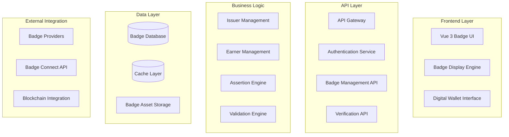

# OpenBadges Architecture Guidelines

## Agent-Requested Rule

This rule is applied when working on OpenBadges system architecture, design decisions, or specification compliance matters.

## System Architecture Principles

### OpenBadges Compliance First
- **Specification Adherence**: All components must comply with OpenBadges 2.x and 3.0 specifications
- **Interoperability**: Ensure compatibility with other OpenBadges implementations
- **Future-Proofing**: Design for evolution with OpenBadges specification updates
- **Standards-Based**: Use established web standards (JSON-LD, HTTP, OAuth 2.0)

### Security by Design
- **Cryptographic Integrity**: All badges must support cryptographic verification
- **Key Management**: Secure generation, storage, and rotation of cryptographic keys
- **Data Protection**: Implement privacy-preserving badge handling
- **Threat Modeling**: Consider and mitigate OpenBadges-specific threats

## Component Architecture

### Core Components



### Authentication Component
```typescript
interface AuthenticationService {
  // OAuth 2.0 for badge provider integration
  authenticateProvider(providerId: string): Promise<OAuthTokens>;
  
  // User authentication for badge management
  authenticateUser(credentials: UserCredentials): Promise<AuthResult>;
  
  // JWT token management
  generateToken(user: User): Promise<JWTToken>;
  validateToken(token: string): Promise<TokenValidation>;
  
  // WebAuthn for passwordless authentication
  initiateWebAuthn(userId: string): Promise<WebAuthnChallenge>;
  verifyWebAuthn(response: WebAuthnResponse): Promise<AuthResult>;
}
```

### Badge Management Component
```typescript
interface BadgeManagementService {
  // Badge Class operations
  createBadgeClass(badgeClass: BadgeClassInput): Promise<BadgeClass>;
  updateBadgeClass(id: string, updates: Partial<BadgeClass>): Promise<BadgeClass>;
  getBadgeClass(id: string): Promise<BadgeClass | null>;
  
  // Badge Assertion operations
  issueAssertion(assertion: AssertionInput): Promise<BadgeAssertion>;
  revokeAssertion(id: string, reason: string): Promise<RevocationResult>;
  getAssertion(id: string): Promise<BadgeAssertion | null>;
  
  // Batch operations
  batchIssue(assertions: AssertionInput[]): Promise<BatchResult>;
  
  // OpenBadges compliance
  validateBadgeClass(badgeClass: BadgeClass): Promise<ValidationResult>;
  exportBadge(id: string, format: 'OB2' | 'OB3'): Promise<ExportResult>;
}
```

### Verification Component
```typescript
interface VerificationService {
  // Cryptographic verification
  verifySignature(badge: BadgeAssertion, publicKey: string): Promise<VerificationResult>;
  verifyProof(badge: BadgeAssertion): Promise<ProofVerificationResult>;
  
  // Issuer verification
  verifyIssuer(issuerId: string): Promise<IssuerVerificationResult>;
  
  // Revocation checking
  checkRevocationStatus(assertionId: string): Promise<RevocationStatus>;
  
  // Comprehensive verification
  verifyBadge(badge: BadgeAssertion): Promise<ComprehensiveVerificationResult>;
  
  // Batch verification
  verifyBadges(badges: BadgeAssertion[]): Promise<BatchVerificationResult>;
}
```

## Data Architecture

### OpenBadges Data Model

```typescript
// OpenBadges 2.x/3.0 compatible data structures
interface BadgeClass {
  '@context': string | string[];
  id: string;
  type: string | string[];
  name: string;
  description: string;
  image: string;
  criteria: string | Criteria;
  issuer: string | Profile;
  tags?: string[];
  alignment?: Alignment[];
  
  // OpenBadges 3.0 extensions
  achievementType?: string;
  creditsAvailable?: number;
  fieldOfStudy?: string;
  humanCode?: string;
  specialization?: string;
}

interface BadgeAssertion {
  '@context': string | string[];
  id: string;
  type: string | string[];
  recipient: IdentityObject;
  badge: string | BadgeClass;
  verification: VerificationObject;
  issuedOn: string;
  expires?: string;
  image?: string;
  narrative?: string;
  evidence?: Evidence[];
  
  // OpenBadges 3.0 extensions
  creditsEarned?: number;
  term?: string;
  source?: Profile;
}
```

### Database Schema Design

```sql
-- Badge Classes table
CREATE TABLE badge_classes (
    id UUID PRIMARY KEY,
    context JSONB NOT NULL,
    type TEXT[] NOT NULL,
    name VARCHAR(255) NOT NULL,
    description TEXT NOT NULL,
    image_url TEXT NOT NULL,
    criteria JSONB NOT NULL,
    issuer_id UUID NOT NULL REFERENCES issuers(id),
    tags TEXT[],
    alignment JSONB,
    created_at TIMESTAMP WITH TIME ZONE DEFAULT NOW(),
    updated_at TIMESTAMP WITH TIME ZONE DEFAULT NOW(),
    
    -- OpenBadges 3.0 fields
    achievement_type VARCHAR(100),
    credits_available DECIMAL(10,2),
    field_of_study VARCHAR(255),
    human_code VARCHAR(50),
    specialization VARCHAR(255)
);

-- Badge Assertions table
CREATE TABLE badge_assertions (
    id UUID PRIMARY KEY,
    context JSONB NOT NULL,
    type TEXT[] NOT NULL,
    recipient JSONB NOT NULL,
    badge_class_id UUID NOT NULL REFERENCES badge_classes(id),
    verification JSONB NOT NULL,
    issued_on TIMESTAMP WITH TIME ZONE NOT NULL,
    expires_on TIMESTAMP WITH TIME ZONE,
    image_url TEXT,
    narrative TEXT,
    evidence JSONB,
    revoked BOOLEAN DEFAULT FALSE,
    revocation_reason TEXT,
    created_at TIMESTAMP WITH TIME ZONE DEFAULT NOW(),
    
    -- OpenBadges 3.0 fields
    credits_earned DECIMAL(10,2),
    term VARCHAR(100),
    source_id UUID REFERENCES profiles(id)
);
```

## API Architecture

### OpenBadges-Compliant Endpoints

```typescript
// Badge Class endpoints
app.get('/badges/:id', getBadgeClass);           // OpenBadges 2.x/3.0
app.post('/badges', createBadgeClass);           // Issuer API
app.put('/badges/:id', updateBadgeClass);        // Issuer API

// Badge Assertion endpoints
app.get('/assertions/:id', getAssertion);       // OpenBadges 2.x/3.0
app.post('/assertions', issueAssertion);        // Issuer API
app.delete('/assertions/:id', revokeAssertion); // Revocation API

// Verification endpoints
app.post('/verify', verifyBadge);               // Verification API
app.get('/revocation-list', getRevocationList); // Revocation checking

// Badge Connect API endpoints
app.get('/connect/badges', getConnectBadges);   // Badge Connect
app.post('/connect/import', importBadges);      // Badge Connect
```

### Content Negotiation
```typescript
// Support multiple OpenBadges formats
app.get('/badges/:id', (c) => {
  const accept = c.req.header('Accept');
  const format = c.req.query('format');
  
  if (format === 'ob3' || accept?.includes('application/vc+ld+json')) {
    return serializeAsOpenBadges3(badge);
  } else {
    return serializeAsOpenBadges2(badge);
  }
});
```

## Security Architecture

### Cryptographic Design

```typescript
interface CryptographicService {
  // Key management
  generateKeyPair(algorithm: 'RSA' | 'ECDSA'): Promise<KeyPair>;
  storePrivateKey(key: PrivateKey, keyId: string): Promise<void>;
  retrievePublicKey(keyId: string): Promise<PublicKey>;
  
  // Signing operations
  signBadge(badge: BadgeAssertion, privateKey: PrivateKey): Promise<Signature>;
  createProof(badge: BadgeAssertion, suite: string): Promise<Proof>;
  
  // Verification operations
  verifySignature(badge: BadgeAssertion, signature: Signature, publicKey: PublicKey): Promise<boolean>;
  verifyProof(badge: BadgeAssertion, proof: Proof): Promise<boolean>;
}
```

### Security Layers
1. **Transport Security**: TLS 1.3 for all communications
2. **Authentication**: OAuth 2.0, JWT, WebAuthn
3. **Authorization**: Role-based access control (RBAC)
4. **Data Integrity**: Cryptographic signatures and proofs
5. **Privacy**: Minimal data collection, encryption at rest
6. **Audit**: Comprehensive logging of security events

## Integration Architecture

### Badge Provider Integration
```typescript
interface BadgeProviderIntegration {
  // OAuth 2.0 integration
  authenticateWithProvider(providerId: string): Promise<OAuthTokens>;
  
  // Badge Connect API
  fetchBadges(tokens: OAuthTokens): Promise<BadgeClass[]>;
  fetchAssertions(tokens: OAuthTokens): Promise<BadgeAssertion[]>;
  
  // Synchronization
  syncBadges(providerId: string): Promise<SyncResult>;
  scheduledSync(providerId: string, interval: string): Promise<void>;
}
```

### Blockchain Integration (Optional)
```typescript
interface BlockchainIntegration {
  // Immutable badge recording
  recordBadgeOnChain(assertion: BadgeAssertion): Promise<TransactionHash>;
  
  // Verification via blockchain
  verifyBadgeOnChain(assertionId: string): Promise<BlockchainVerificationResult>;
  
  // Revocation handling
  recordRevocationOnChain(assertionId: string, reason: string): Promise<TransactionHash>;
}
```

## Performance Architecture

### Caching Strategy
```typescript
interface CacheStrategy {
  // Badge metadata caching
  badgeClasses: CacheLayer<BadgeClass>;     // TTL: 1 hour
  assertions: CacheLayer<BadgeAssertion>;   // TTL: 30 minutes
  
  // Verification result caching
  verificationResults: CacheLayer<VerificationResult>; // TTL: 15 minutes
  
  // Public key caching
  publicKeys: CacheLayer<PublicKey>;        // TTL: 24 hours
  
  // Revocation list caching
  revocationLists: CacheLayer<RevocationList>; // TTL: 5 minutes
}
```

### Scalability Considerations
- **Horizontal Scaling**: Stateless services for easy scaling
- **Database Optimization**: Indexed queries for badge retrieval
- **CDN Integration**: Static badge assets served via CDN
- **Async Processing**: Background jobs for batch operations
- **Load Balancing**: Distribute verification workload

This architecture ensures a robust, scalable, and compliant OpenBadges implementation that can handle enterprise-scale badge issuance and verification while maintaining security and interoperability standards.
