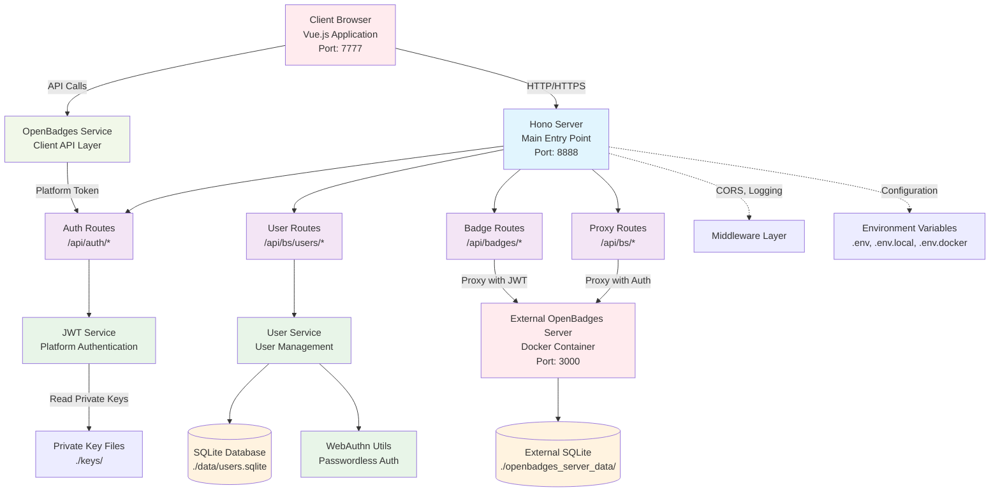

# Backend Architecture Inventory

## Overview
This document provides a comprehensive inventory of the OpenBadges System backend architecture, mapping all entry points, routes, services, utilities, and data flow patterns.

## Architecture Diagram



## Backend Entry Points

### 1. Main Server Entry Point
- **File**: `src/server/index.ts`
- **Framework**: Hono.js
- **Port**: 8888 (configurable via `PORT` environment variable)
- **Runtime**: Bun
- **Features**:
  - CORS middleware for cross-origin requests
  - Request logging middleware
  - Health check endpoint (`/api/health`)
  - Route mounting and organization
  - OpenBadges server proxy functionality

### 2. Development Entry Points
- **Scripts**: 
  - `scripts/dev-local.sh` - Local development with standalone OpenBadges server
  - `scripts/dev-docker.sh` - Docker-based development environment
- **Commands**:
  - `pnpm dev` - Concurrent client and server development
  - `pnpm server` - Server-only development with hot reload
  - `bun run --hot src/server/index.ts` - Direct server execution

## Route Modules

### 1. Authentication Routes (`/api/auth/*`)
**File**: `src/server/routes/auth.ts`

| Method | Endpoint | Description | Request Body | Response |
|--------|----------|-------------|--------------|----------|
| POST | `/api/auth/platform-token` | Generate JWT platform token for OpenBadges API | `{ user: User }` | `{ success: boolean, token: string, platformId: string }` |

### 2. User Management Routes (`/api/bs/users/*`)
**File**: `src/server/routes/users.ts`

| Method | Endpoint | Description | Query Parameters | Request Body | Response |
|--------|----------|-------------|------------------|--------------|----------|
| GET | `/api/bs/users` | Get all users with pagination | `page`, `limit`, `search`, `role`, `status`, `dateFrom`, `dateTo` | - | `{ users: User[], total: number }` |
| POST | `/api/bs/users` | Create new user | - | `CreateUserData` | `User` |
| GET | `/api/bs/users/:id` | Get user by ID | - | - | `User` |
| PUT | `/api/bs/users/:id` | Update user | - | `UpdateUserData` | `User` |
| DELETE | `/api/bs/users/:id` | Delete user | - | - | `{ success: boolean }` |
| POST | `/api/bs/users/:id/credentials` | Add user credential | - | `UserCredential` | `{ success: boolean }` |
| GET | `/api/bs/users/:id/credentials` | Get user credentials | - | - | `UserCredential[]` |
| DELETE | `/api/bs/users/:id/credentials/:credentialId` | Remove user credential | - | - | `{ success: boolean }` |

### 3. Badge Routes (`/api/badges/*`)
**File**: `src/server/routes/badges.ts`

| Method | Endpoint | Description | Headers | Purpose |
|--------|----------|-------------|---------|---------|
| ALL | `/api/badges/*` | Proxy all requests to OpenBadges server | `Authorization: Bearer <platform_token>` | Authenticated proxy to external OpenBadges API |

### 4. Proxy Routes (`/api/bs/*`)
**File**: `src/server/index.ts` (lines 69-131)

| Method | Endpoint | Description | Authentication | Purpose |
|--------|----------|-------------|----------------|---------|
| ALL | `/api/bs/*` | Proxy to OpenBadges server (except `/users`) | Basic Auth or API Key | Direct proxy to OpenBadges API with server authentication |

## Service Layer

### 1. JWT Service
**File**: `src/server/services/jwt.ts`

**Purpose**: Platform authentication for OpenBadges API integration

**Key Methods**:
- `generatePlatformToken(user: PlatformUser): string` - Generate JWT for platform authentication
- `verifyToken(token: string): JWTPayload | null` - Verify JWT tokens
- `createOpenBadgesApiClient(user: PlatformUser)` - Create authenticated API client

**Dependencies**:
- Private key file: `./keys/platform-private.pem`
- JWT library: `jsonwebtoken`

**Configuration**:
- Platform ID: `urn:uuid:a504d862-bd64-4e0d-acff-db7955955bc1`
- Client ID: `openbadges-demo-main-app`
- Algorithm: RS256
- Token expiration: 1 hour

### 2. User Service
**File**: `src/server/services/user.ts`

**Purpose**: User management and SQLite database operations

**Key Methods**:
- `createUser(userData: CreateUserData): Promise<User>`
- `getUserById(id: string): Promise<User | null>`
- `getUsers(page, limit, search, filters): Promise<{users: User[], total: number}>`
- `updateUser(id: string, userData: UpdateUserData): Promise<User | null>`
- `deleteUser(id: string): Promise<boolean>`
- `addUserCredential(userId: string, credential): Promise<void>`
- `getUserCredentials(userId: string): Promise<UserCredential[]>`
- `removeUserCredential(userId: string, credentialId: string): Promise<boolean>`

**Database Schema**:
```sql
-- Users table
CREATE TABLE users (
  id TEXT PRIMARY KEY,
  username TEXT UNIQUE NOT NULL,
  email TEXT UNIQUE NOT NULL,
  firstName TEXT NOT NULL,
  lastName TEXT NOT NULL,
  avatar TEXT,
  isActive BOOLEAN NOT NULL DEFAULT 1,
  roles TEXT NOT NULL DEFAULT '["USER"]',
  createdAt TEXT NOT NULL DEFAULT CURRENT_TIMESTAMP,
  updatedAt TEXT NOT NULL DEFAULT CURRENT_TIMESTAMP
);

-- User credentials table (WebAuthn)
CREATE TABLE user_credentials (
  id TEXT PRIMARY KEY,
  userId TEXT NOT NULL,
  publicKey TEXT NOT NULL,
  transports TEXT NOT NULL DEFAULT '[]',
  counter INTEGER NOT NULL DEFAULT 0,
  createdAt TEXT NOT NULL DEFAULT CURRENT_TIMESTAMP,
  lastUsed TEXT NOT NULL DEFAULT CURRENT_TIMESTAMP,
  name TEXT NOT NULL,
  type TEXT NOT NULL CHECK (type IN ('platform', 'cross-platform')),
  FOREIGN KEY (userId) REFERENCES users (id) ON DELETE CASCADE
);
```

## Client-Side Services

### 1. OpenBadges Service
**File**: `src/client/services/openbadges.ts`

**Purpose**: Client-side API integration with OpenBadges system

**Key Methods**:
- `getPlatformToken(user: User): Promise<string>`
- `createApiClient(user: User): Promise<OpenBadgesApiClient>`
- `getUserBackpack(user: User): Promise<UserBackpack>`
- `addBadgeToBackpack(user: User, badgeClassId: string): Promise<BadgeAssertion>`
- `removeBadgeFromBackpack(user: User, assertionId: string): Promise<void>`
- `getBadgeClasses(): Promise<any[]>`
- `createBadgeClass(user: User, badgeClass: any): Promise<any>`
- `issueBadge(issuerUser: User, badgeClassId: string, recipientEmail: string): Promise<BadgeAssertion>`

## Utilities

### 1. WebAuthn Utils
**File**: `src/client/utils/webauthn.ts`

**Purpose**: Passwordless authentication using WebAuthn/FIDO2

**Key Features**:
- Browser compatibility checking
- Platform authenticator detection
- Credential registration and authentication
- Challenge generation and validation
- Base64URL encoding/decoding
- Error handling with user-friendly messages
- Authenticator name and icon mapping

**Key Methods**:
- `isSupported(): boolean`
- `isPlatformAuthenticatorAvailable(): Promise<boolean>`
- `register(options: RegistrationOptions): Promise<Credential>`
- `authenticate(options: AuthenticationOptions): Promise<AuthResult>`
- `createRegistrationOptions(userId, username, displayName): RegistrationOptions`
- `createAuthenticationOptions(credentials): AuthenticationOptions`

## Database Layer

### 1. Local SQLite Database
**File**: `./data/users.sqlite`
**Purpose**: Local user management and WebAuthn credentials

**Tables**:
- `users` - User accounts and profiles
- `user_credentials` - WebAuthn credentials for passwordless auth

**Indexes**:
- `idx_users_username` - Username lookup
- `idx_users_email` - Email lookup  
- `idx_credentials_userId` - User credential lookup

### 2. External OpenBadges Database
**File**: `./openbadges_server_data/openbadges.sqlite`
**Purpose**: OpenBadges server data (managed by external container)

**Note**: This database is managed by the external OpenBadges server container and contains badge classes, assertions, and issuer data.

## Environment Variables

### Core Configuration
| Variable | Default | Description |
|----------|---------|-------------|
| `PORT` | 8888 | Backend server port |
| `VITE_PORT` | 7777 | Frontend development server port |
| `OPENBADGES_SERVER_URL` | http://localhost:3000 | External OpenBadges server URL |

### Authentication Configuration
| Variable | Default | Description |
|----------|---------|-------------|
| `OPENBADGES_AUTH_ENABLED` | true | Enable authentication for OpenBadges API |
| `OPENBADGES_AUTH_MODE` | docker | Authentication mode (docker/local) |
| `OPENBADGES_API_KEY` | test-api-key-123 | API key for OpenBadges server |
| `OPENBADGES_BASIC_AUTH_USER` | admin | Basic auth username |
| `OPENBADGES_BASIC_AUTH_PASS` | admin-user | Basic auth password |

### Environment Files
- `.env` - Base configuration
- `.env.local` - Local development overrides
- `.env.docker` - Docker development configuration

## Build Scripts

### Package.json Scripts
| Script | Command | Description |
|--------|---------|-------------|
| `dev` | `concurrently "pnpm run server" "pnpm run client"` | Start both frontend and backend in development |
| `dev:local` | `./scripts/dev-local.sh` | Local development with standalone OpenBadges server |
| `dev:docker` | `./scripts/dev-docker.sh` | Docker-based development environment |
| `server` | `bun run --hot src/server/index.ts` | Start backend server with hot reload |
| `client` | `vite` | Start frontend development server |
| `build` | `vite build` | Build frontend for production |
| `start` | `bun run src/server/index.ts` | Start production server |
| `test` | `vitest` | Run tests in watch mode |
| `test:run` | `vitest run` | Run tests once |
| `test:coverage` | `vitest run --coverage` | Run tests with coverage |

### Development Scripts
| Script | Purpose |
|--------|---------|
| `scripts/dev-local.sh` | Local development setup and validation |
| `scripts/dev-docker.sh` | Docker development setup and container management |

## Data Flow Patterns

### 1. Authentication Flow
```
Client → /api/auth/platform-token → JWT Service → Platform Token → OpenBadges API
```

### 2. User Management Flow
```
Client → /api/bs/users/* → User Service → SQLite Database → Response
```

### 3. Badge Operations Flow
```
Client → Platform Token → /api/badges/* → OpenBadges Server → Response
```

### 4. Proxy Flow
```
Client → /api/bs/* → Authentication → OpenBadges Server → Response
```

### 5. WebAuthn Flow
```
Client → WebAuthn Utils → User Service → SQLite Credentials → Authentication Result
```

## Key Features

- **Microservice Architecture**: Separation of concerns with dedicated services
- **Proxy Pattern**: Seamless integration with external OpenBadges server
- **JWT Authentication**: Platform-level authentication for API access
- **WebAuthn Support**: Passwordless authentication with FIDO2/WebAuthn
- **SQLite Database**: Lightweight, file-based data persistence
- **Hot Reload**: Development-friendly with automatic code reloading
- **Environment-based Configuration**: Flexible deployment across environments
- **CORS Support**: Cross-origin resource sharing for web applications
- **Error Handling**: Comprehensive error handling with user-friendly messages
- **Type Safety**: TypeScript throughout for better development experience

This architecture provides a robust foundation for badge management with modern authentication, seamless API integration, and developer-friendly tooling.
