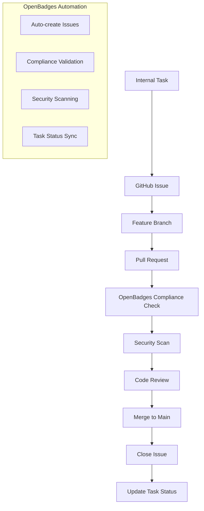

# GitHub Workflow & Task Integration - OpenBadges System

## Overview

This document defines our automated development workflow that integrates GitHub Issues, Pull Requests, and our internal task management system specifically for OpenBadges digital credential development.

## Workflow Architecture for OpenBadges

### 1. OpenBadges Task Lifecycle Integration



### 2. OpenBadges Branch Strategy

```
main
├── feature/badge-management-api
├── feature/verification-engine
├── feature/oauth-integration
├── compliance/openbadges-3-support
├── security/cryptographic-validation
└── hotfix/verification-security-patch
```

## GitHub Issue Templates for OpenBadges

### Feature Issue Template

Our feature template includes OpenBadges-specific fields:

```yaml
# .github/ISSUE_TEMPLATE/feature.yml
name: Feature Request
description: Create a new feature implementation for OpenBadges system
body:
  - type: dropdown
    id: component
    attributes:
      label: Component
      options:
        - Authentication
        - Badge Management
        - Verification
        - User Management
        - API
        - Frontend
        - Compliance
        - Security
        - Documentation
        
  - type: dropdown
    id: openbadges-version
    attributes:
      label: OpenBadges Version
      options:
        - OpenBadges 2.x
        - OpenBadges 3.0
        - Both
        - Not Applicable
        
  - type: checkboxes
    id: compliance-checklist
    attributes:
      label: Compliance Considerations
      options:
        - label: Requires OpenBadges specification compliance review
        - label: Involves cryptographic operations
        - label: Handles user personal data
        - label: Affects badge verification process
        - label: Changes API endpoints
        - label: Requires security audit
```

### Bug Report Template

Specialized for OpenBadges credential issues:

```yaml
# .github/ISSUE_TEMPLATE/bug.yml
name: Bug Report
description: Report a bug or issue in the OpenBadges system
body:
  - type: dropdown
    id: openbadges-compliance
    attributes:
      label: OpenBadges Compliance Impact
      options:
        - "Yes - Breaks compliance"
        - "Yes - Affects compliance"
        - "No - Internal issue only"
        - "Unknown"
        
  - type: checkboxes
    id: security-impact
    attributes:
      label: Security Impact
      options:
        - label: This bug may have security implications
        - label: This bug affects credential verification
        - label: This bug involves user data handling
```

## Pull Request Template for OpenBadges

```markdown
# .github/pull_request_template.md

## OpenBadges Compliance
- [ ] Maintains OpenBadges 2.x compatibility
- [ ] Supports OpenBadges 3.0 features (if applicable)
- [ ] Follows OpenBadges specification requirements
- [ ] Badge verification functionality tested
- [ ] Cryptographic operations reviewed
- [ ] API endpoints follow OpenBadges standards

## Security Review
- [ ] No sensitive data exposed in logs or responses
- [ ] Input validation implemented
- [ ] Authentication/authorization properly handled
- [ ] Cryptographic operations follow best practices
- [ ] No new security vulnerabilities introduced
- [ ] OWASP guidelines followed

## Component Areas
- [ ] Authentication (OAuth, JWT, user auth)
- [ ] Badge Management (CRUD, metadata, storage)
- [ ] Verification (cryptographic validation, badge verification)
- [ ] User Management (issuers, earners, profiles)
- [ ] API (REST endpoints, OpenBadges compliance)
- [ ] Frontend (Vue components, UI/UX)
- [ ] Compliance (OpenBadges 2.x/3.0 specification)
- [ ] Security (cryptography, data protection)
```

## GitHub Actions Workflows for OpenBadges

### 1. Issue Management with OpenBadges Context

```yaml
# .github/workflows/issue-management.yml
name: Issue Management

on:
  issues:
    types: [opened, closed, labeled, assigned]

jobs:
  auto-label:
    runs-on: ubuntu-latest
    steps:
      - name: Auto-assign OpenBadges labels
        uses: actions/github-script@v7
        with:
          script: |
            const issue = context.payload.issue;
            const body = issue.body || '';
            
            // Extract component and add appropriate labels
            const componentMap = {
              'badge management': 'component: badge-management',
              'verification': 'component: verification',
              'authentication': 'component: authentication'
            };
            
            // Add OpenBadges compliance label if mentioned
            if (body.toLowerCase().includes('openbadges') || 
                body.toLowerCase().includes('compliance')) {
              await github.rest.issues.addLabels({
                owner: context.repo.owner,
                repo: context.repo.repo,
                issue_number: issue.number,
                labels: ['openbadges-compliance']
              });
            }
```

### 2. PR Validation with OpenBadges Compliance

```yaml
# .github/workflows/pr-validation.yml
name: PR Validation

on:
  pull_request:
    types: [opened, synchronize, reopened]

jobs:
  validate-openbadges-compliance:
    runs-on: ubuntu-latest
    steps:
      - name: OpenBadges Compliance Check
        uses: ./.github/actions/validate-openbadges-compliance
        with:
          pr-files: ${{ github.event.pull_request.changed_files }}
          
  security-scan:
    runs-on: ubuntu-latest
    steps:
      - name: Check for sensitive data
        # Scan for hardcoded keys, passwords, etc.
      - name: Cryptographic security validation
        # Validate cryptographic operations
```

### 3. Security Scanning for OpenBadges

```yaml
# .github/workflows/security-scan.yml
name: Security Scan

on:
  push:
    branches: [ main, develop ]
  pull_request:
    branches: [ main, develop ]

jobs:
  openbadges-security:
    runs-on: ubuntu-latest
    steps:
      - name: OpenBadges Security Check
        # Validate cryptographic key management
        # Check badge verification security
        # Ensure proper input validation
```

## OpenBadges Label System

### Component Labels
- `component: authentication` - OAuth, JWT, user authentication
- `component: badge-management` - Badge CRUD, metadata handling
- `component: verification` - Cryptographic validation, badge verification
- `component: user-management` - Issuers, earners, user profiles
- `component: api` - REST endpoints, OpenBadges compliance
- `component: frontend` - Vue components, UI/UX
- `component: compliance` - OpenBadges specification adherence
- `component: security` - Cryptography, data protection

### Priority Labels (Security-Focused)
- `priority: critical` - Security vulnerabilities, compliance violations
- `priority: high` - Core functionality, user-facing features
- `priority: medium` - Enhancements, performance improvements
- `priority: low` - Documentation, minor improvements

### OpenBadges-Specific Labels
- `openbadges-compliance` - Requires specification compliance review
- `security-review` - Needs cryptographic/security validation
- `openbadges-2x` - Related to OpenBadges 2.x specification
- `openbadges-3` - Related to OpenBadges 3.0 specification

## Development Workflow Rules for OpenBadges

### 1. Feature Development Flow

```bash
# 1. Create feature branch from main
git checkout main
git pull origin main
git checkout -b feature/badge-verification-api

# 2. Link to GitHub issue with OpenBadges context
git commit -m "feat(verification): implement cryptographic badge validation

Implements RSA signature verification for OpenBadges 2.x badges.
Includes comprehensive error handling and security validation.

- Add signature verification using RSA-SHA256
- Implement proof validation for OpenBadges 3.0
- Add input sanitization for badge data
- Include comprehensive test coverage

Closes #123
OpenBadges-Version: 2.x, 3.0
Security-Review: Required"

# 3. Push and create PR with compliance checklist
git push origin feature/badge-verification-api
gh pr create --title "feat(verification): OpenBadges Cryptographic Validation"
```

### 2. OpenBadges Automated Checks

- **Pre-commit hooks**: Lint, format, type-check, security scan
- **PR validation**: OpenBadges compliance, security validation, tests
- **Compliance validation**: Ensure PR follows OpenBadges specifications
- **Security scanning**: Cryptographic operation validation

This workflow creates a comprehensive integration between our internal task management and GitHub's project management features, specifically tailored for secure OpenBadges digital credential development.
