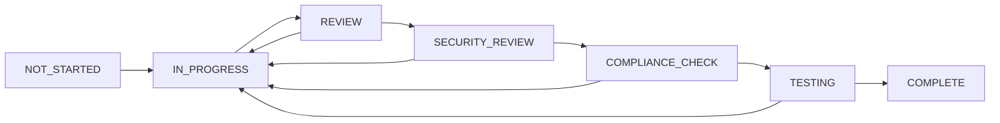

# Task Management Guide - OpenBadges System

## Overview

This guide explains how to effectively use our task management system integrated with GitHub for OpenBadges digital credential development. The system provides seamless coordination between internal task tracking and GitHub project management.

## 🎯 Task Management Philosophy

### OpenBadges-Focused Organization
- **Component-Based**: Tasks organized by OpenBadges system components
- **Compliance-Driven**: Security and specification compliance prioritized
- **Iterative Development**: Support for agile OpenBadges feature development
- **Quality Assurance**: Built-in validation for credential system requirements

### Integration Benefits
- **Bidirectional Sync**: Tasks automatically sync with GitHub issues
- **Status Automation**: Progress updates flow between systems
- **Compliance Tracking**: OpenBadges specification adherence monitoring
- **Security Oversight**: Cryptographic and security requirement tracking

## 📋 Task Structure for OpenBadges

### Task Categories

**1. Authentication Tasks**
- OAuth 2.0 integration for badge providers
- JWT token management for user sessions
- WebAuthn implementation for passwordless auth
- User permission and role management

**2. Badge Management Tasks**
- Badge CRUD operations and metadata handling
- Badge class definition and management
- Badge assertion creation and storage
- Badge collection and organization features

**3. Verification Tasks**
- Cryptographic signature verification
- Badge authenticity validation
- Proof verification for OpenBadges 3.0
- Verification result caching and optimization

**4. User Management Tasks**
- Issuer profile management and verification
- Earner profile and badge collection
- User authentication and authorization
- Privacy and data protection compliance

**5. API Development Tasks**
- OpenBadges-compliant REST endpoints
- Badge Connect API integration
- API documentation and testing
- Rate limiting and security measures

**6. Frontend Tasks**
- Vue.js component development
- Badge display and visualization
- User interface for credential management
- Responsive design and accessibility

**7. Compliance Tasks**
- OpenBadges 2.x specification adherence
- OpenBadges 3.0 feature implementation
- JSON-LD context and schema validation
- Specification compliance testing

**8. Security Tasks**
- Cryptographic key management
- Security vulnerability assessment
- Data encryption and protection
- Security audit and penetration testing

## 🔄 Task Lifecycle

### 1. Task Creation

```markdown
## Task Template

**Task ID**: [UUID]
**Title**: Implement Badge Verification API
**Component**: Verification
**Priority**: High
**OpenBadges Version**: 2.x, 3.0
**Estimate**: 1 week

### Description
Implement cryptographic verification for OpenBadges assertions including RSA signature validation and proof verification.

### Acceptance Criteria
- [ ] RSA signature verification for OpenBadges 2.x
- [ ] Proof verification for OpenBadges 3.0
- [ ] Comprehensive error handling
- [ ] Security validation and testing
- [ ] API documentation updated
- [ ] Compliance testing completed

### Security Requirements
- [ ] Cryptographic operations reviewed
- [ ] Input validation implemented
- [ ] No hardcoded keys or secrets
- [ ] Security audit completed

### Compliance Requirements
- [ ] OpenBadges 2.x specification followed
- [ ] OpenBadges 3.0 compatibility ensured
- [ ] JSON-LD context validation
- [ ] Required fields validation
```

### 2. Task Status Flow



### 3. Status Definitions

- **NOT_STARTED**: Task created but work not begun
- **IN_PROGRESS**: Active development in progress
- **REVIEW**: Code review and peer validation
- **SECURITY_REVIEW**: Cryptographic and security validation
- **COMPLIANCE_CHECK**: OpenBadges specification compliance validation
- **TESTING**: Integration and compliance testing
- **COMPLETE**: All requirements met and deployed

## 🔗 GitHub Integration

### Automatic Issue Creation

Tasks can automatically create GitHub issues:

```bash
# Create issues from tasks
gh workflow run task-sync.yml \
  --field action=create-issues-from-tasks \
  --field milestone="OpenBadges Sprint 1" \
  --field dry-run=false
```

### Task-Issue Linking

Issues are automatically linked to tasks through:
- **Task ID in issue body**: Extracted and tracked
- **Component labels**: Auto-assigned based on task component
- **Priority labels**: Synced with task priority
- **Compliance labels**: Added for OpenBadges-related tasks

### Status Synchronization

Task status automatically updates based on:
- **Issue assignment**: Task moves to IN_PROGRESS
- **PR creation**: Task status reflects development progress
- **PR merge**: Task moves to COMPLETE
- **Issue closure**: Task marked as COMPLETE

## 📊 Task Metrics and Reporting

### Development Velocity
- **Tasks completed per sprint**
- **Average task completion time**
- **Component-specific velocity**
- **Compliance task resolution rate**

### Quality Metrics
- **Security review pass rate**
- **Compliance validation success rate**
- **Bug rate per component**
- **Test coverage per task**

### OpenBadges-Specific Metrics
- **Specification compliance rate**
- **Security vulnerability resolution time**
- **Cryptographic operation test coverage**
- **Badge verification accuracy**

## 🛠️ Task Management Operations

### Creating Tasks

```javascript
// Example task creation
const task = {
  id: generateUUID(),
  title: "Implement OAuth 2.0 Badge Provider Integration",
  component: "Authentication",
  priority: "High",
  openBadgesVersion: ["2.x", "3.0"],
  estimate: "1 week",
  description: "Integrate OAuth 2.0 for badge provider authentication...",
  acceptanceCriteria: [
    "OAuth 2.0 flow implemented",
    "Provider registration system",
    "Token management and refresh",
    "Security audit completed"
  ],
  securityRequirements: [
    "PKCE implementation",
    "State parameter validation",
    "Token encryption",
    "Audit logging"
  ],
  complianceRequirements: [
    "OpenBadges Connect API compatibility",
    "Standard OAuth 2.0 compliance",
    "Privacy policy adherence"
  ]
};
```

### Updating Task Status

```bash
# Manual status update
gh workflow run task-sync.yml \
  --field action=sync-task-status \
  --field dry-run=false
```

### Exporting to GitHub Projects

```bash
# Export task hierarchy to GitHub Projects
gh workflow run task-sync.yml \
  --field action=export-tasks-to-project \
  --field dry-run=false
```

## 🔍 Task Monitoring

### Dashboard Views
- **Sprint Board**: Current sprint tasks by status
- **Component View**: Tasks organized by OpenBadges component
- **Priority Matrix**: Tasks by priority and urgency
- **Compliance Tracker**: OpenBadges specification compliance status

### Automated Alerts
- **Overdue Tasks**: Tasks past estimated completion
- **Security Reviews**: Tasks requiring security validation
- **Compliance Issues**: Tasks with specification compliance problems
- **Blocked Tasks**: Tasks waiting on dependencies

## 📈 Best Practices

### Task Creation
1. **Clear Titles**: Use descriptive, component-specific titles
2. **Detailed Descriptions**: Include OpenBadges context and requirements
3. **Specific Acceptance Criteria**: Measurable, testable criteria
4. **Security Considerations**: Always include security requirements
5. **Compliance Mapping**: Map to OpenBadges specification sections

### Task Management
1. **Regular Updates**: Keep task status current
2. **Dependency Tracking**: Identify and manage task dependencies
3. **Component Ownership**: Assign component experts to relevant tasks
4. **Security Reviews**: Schedule security reviews for cryptographic tasks
5. **Compliance Validation**: Validate OpenBadges specification adherence

### Integration Usage
1. **Link Everything**: Connect tasks to issues and PRs
2. **Use Automation**: Leverage automated status updates
3. **Monitor Metrics**: Track velocity and quality metrics
4. **Review Regularly**: Conduct regular task and process reviews

This task management system ensures efficient coordination of OpenBadges development while maintaining high standards for security, compliance, and quality.
