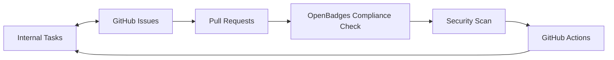

# Workflow Integration Guide - OpenBadges System

## Overview

This guide explains how to use our integrated development workflow that seamlessly connects internal task management with GitHub Issues, Pull Requests, and project management features specifically for the OpenBadges system.

## 🎯 Integration Benefits

### Automated Workflow
- **Bidirectional Sync**: Tasks and GitHub issues stay synchronized automatically
- **Status Updates**: Progress updates flow between systems seamlessly  
- **Label Management**: Automatic labeling based on component, priority, and OpenBadges compliance
- **Project Tracking**: GitHub Projects automatically reflect task progress

### OpenBadges Quality Assurance
- **Compliance Validation**: Automated OpenBadges 2.x/3.0 specification compliance checking
- **Security Scanning**: Automatic security vulnerability detection for credential systems
- **Cryptographic Validation**: Verification of cryptographic operations and key management
- **Template Enforcement**: Issue and PR templates ensure OpenBadges context is captured

### Developer Experience
- **Clear Guidelines**: Augment rules provide consistent OpenBadges development standards
- **Automated Checks**: Pre-commit hooks and CI/CD validation
- **Documentation**: Comprehensive OpenBadges-specific documentation and examples
- **Error Prevention**: Catch compliance and security issues early

## 🚀 Getting Started

### 1. Understanding the OpenBadges Workflow

Our workflow integrates three main components with OpenBadges-specific enhancements:



### 2. OpenBadges Component Structure

The system includes specialized components for digital credential management:

- **Authentication**: OAuth, JWT, user authentication systems
- **Badge Management**: Badge CRUD operations, metadata handling, storage
- **Verification**: Cryptographic validation, badge verification processes
- **User Management**: Issuers, earners, user profiles and permissions
- **API**: REST endpoints, OpenBadges-compliant API design
- **Frontend**: Vue components, UI/UX for credential interfaces
- **Compliance**: OpenBadges 2.x/3.0 specification adherence
- **Security**: Cryptography, data protection, key management

### 3. GitHub Templates for OpenBadges

Three specialized issue templates are available:
- **Feature Request** (`.github/ISSUE_TEMPLATE/feature.yml`) - OpenBadges feature development
- **Bug Report** (`.github/ISSUE_TEMPLATE/bug.yml`) - Credential/badge-related bugs
- **Task Implementation** (`.github/ISSUE_TEMPLATE/task.yml`) - Implementation tasks with compliance tracking

## 📋 OpenBadges Development Workflow

### Step 1: Task Creation and Planning

1. **Create Internal Tasks** using our task management system
2. **Define OpenBadges Context** - specify which OpenBadges version (2.x/3.0)
3. **Identify Compliance Requirements** - mark security and compliance needs
4. **Assign Components** (Authentication, Badge Management, Verification, etc.)

### Step 2: GitHub Issue Creation

**Option A: Automatic Creation**
```bash
# Use the task sync workflow
gh workflow run task-sync.yml \
  --field action=create-issues-from-tasks \
  --field milestone="OpenBadges Sprint 1" \
  --field dry-run=false
```

**Option B: Manual Creation**
1. Go to GitHub Issues → New Issue
2. Select appropriate template (Feature/Bug/Task)
3. Fill in OpenBadges-specific fields:
   - Component (Authentication, Badge Management, etc.)
   - OpenBadges Version (2.x, 3.0, Both)
   - Compliance Considerations checkboxes
4. Include Task ID if linking to existing task

### Step 3: Development Process

1. **Create Feature Branch**
   ```bash
   git checkout -b feature/123-badge-verification-api
   ```

2. **Follow OpenBadges Naming Convention**
   - `feature/123-badge-management` - Links to issue #123
   - `bugfix/456-verification-fix` - Links to issue #456
   - `compliance/789-openbadges-3-support` - Compliance-related work

3. **Make Commits with OpenBadges Context**
   ```bash
   git commit -m "feat(verification): implement cryptographic badge validation
   
   - Add RSA signature verification for OpenBadges 2.x
   - Implement proof validation for OpenBadges 3.0
   - Add comprehensive error handling for invalid badges
   
   Closes #123
   Task: badge-verification-001"
   ```

### Step 4: Pull Request Creation

1. **Push Branch and Create PR**
   ```bash
   git push origin feature/123-badge-verification-api
   gh pr create --title "feat(verification): OpenBadges Cryptographic Validation"
   ```

2. **Fill Out OpenBadges PR Template**
   - Link to related issues: `Closes #123`
   - Include Task ID: `Task ID: badge-verification-001`
   - Complete OpenBadges compliance checklist
   - Mark security review requirements
   - Add component areas affected

3. **Automated OpenBadges Validation**
   - PR title format validation
   - OpenBadges compliance checking
   - Security scanning for credential handling
   - Cryptographic operation validation
   - Template completion verification

### Step 5: Code Review and Merge

1. **OpenBadges Review Process**
   - Automated compliance checks must pass
   - Security scan must pass
   - At least one approval required
   - OpenBadges specification adherence verified

2. **Merge Process**
   - Squash and merge preferred
   - Automated issue closure
   - Task status updates
   - Compliance validation triggers

## 🔄 OpenBadges Automation Features

### Issue Management Automation

**When OpenBadges Issue is Created:**
- Auto-assign component labels (badge-management, verification, etc.)
- Add OpenBadges compliance labels
- Add to project board with proper priority
- Sync with internal task system

**When Security Issue is Identified:**
- Auto-assign critical priority
- Add security review requirements
- Notify security team
- Track compliance impact

**When PR Affects Compliance:**
- Trigger OpenBadges compliance validation
- Run security scans
- Verify cryptographic operations
- Check specification adherence

### OpenBadges Label Synchronization

Labels automatically sync between GitHub and tasks:

| GitHub Label | Task Field | OpenBadges Context |
|--------------|------------|-------------------|
| `component: badge-management` | component | Badge CRUD operations |
| `component: verification` | component | Cryptographic validation |
| `openbadges-compliance` | compliance | Specification adherence |
| `security-review` | security | Cryptographic security |
| `priority: critical` | priority | Security/compliance issues |

### Project Board Integration for OpenBadges

Issues automatically move through specialized columns:
1. **Backlog** - New OpenBadges issues
2. **Compliance Review** - Specification review needed
3. **In Progress** - Active development
4. **Security Review** - Cryptographic/security validation
5. **Testing** - OpenBadges compliance testing
6. **Done** - Deployed and verified

## 🛡️ OpenBadges Security and Compliance

### Automated Security Scanning

- **Cryptographic Key Detection**: Prevents hardcoded private keys
- **Weak Algorithm Detection**: Identifies MD5, SHA1 usage
- **Sensitive Data Scanning**: Detects potential credential leaks
- **Dependency Vulnerabilities**: Scans for known security issues

### OpenBadges Compliance Validation

- **Schema Validation**: Ensures proper OpenBadges structure
- **Required Fields**: Validates all mandatory OpenBadges fields
- **JSON-LD Context**: Verifies correct context URLs
- **API Compliance**: Checks endpoint compliance with specification
- **Verification Logic**: Validates cryptographic verification implementation

## 📊 Monitoring OpenBadges Development

### Development Velocity
- OpenBadges features completed per sprint
- Compliance issues resolved
- Security vulnerabilities fixed
- Badge verification accuracy

### Quality Metrics
- OpenBadges specification compliance rate
- Security issue resolution time
- Cryptographic operation test coverage
- Badge verification success rate

## 🔧 Troubleshooting OpenBadges Workflow

### Common Issues

**Issue: OpenBadges compliance validation fails**
- Check that badge schemas include all required fields
- Verify JSON-LD context URLs are correct
- Ensure cryptographic operations use approved algorithms

**Issue: Security scan detects vulnerabilities**
- Review cryptographic key management
- Check for hardcoded secrets or credentials
- Validate input sanitization in API endpoints

**Issue: Task sync not working**
- Check Task ID format in issue body
- Verify OpenBadges component labels are correct
- Check GitHub Actions logs for errors

### Getting Help

1. **Check Documentation** - Review OpenBadges-specific docs in `/docs/development/`
2. **Check Compliance Logs** - Review OpenBadges validation workflow logs
3. **Security Review** - Consult security team for cryptographic issues
4. **Augment Rules** - Augment will automatically apply relevant OpenBadges rules

This integrated workflow ensures seamless coordination between internal task management and GitHub project management while maintaining strict OpenBadges compliance and security standards for digital credential systems.
