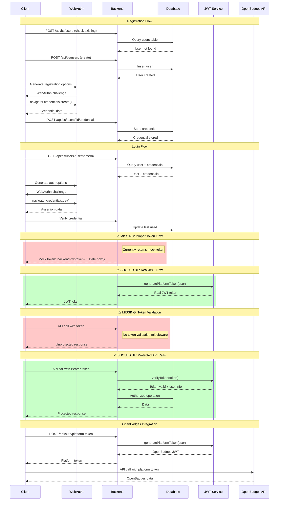

# User Management Implementation Analysis

## Overview
This document analyzes the user management implementation in the OpenBadges system, focusing on the backend user service (`/src/server/services/user.ts`) and frontend authentication composable (`/src/client/composables/useAuth.ts`).

## CRUD API Surface

### Backend User Service (`/src/server/services/user.ts`)

#### User Entity Structure
```typescript
interface User {
  id: string;
  username: string;
  email: string;
  firstName: string;
  lastName: string;
  avatar?: string;
  isActive: boolean;
  roles: string[];
  createdAt: string;
  updatedAt: string;
}
```

#### CRUD Operations

**Create User**
- Method: `createUser(userData: CreateUserData)`
- Generates unique ID using timestamp + random string
- Validates required fields (username, email, firstName, lastName)
- Stores roles as JSON string in SQLite
- Returns full user object

**Read Operations**
- `getUserById(id: string)` - Single user lookup
- `getUserByUsername(username: string)` - Username-based lookup
- `getUserByEmail(email: string)` - Email-based lookup
- `getUsers(page, limit, search, filters)` - Paginated user listing with filtering

**Update User**
- Method: `updateUser(id: string, userData: UpdateUserData)`
- Partial updates supported for all fields except username
- Automatically updates `updatedAt` timestamp
- Dynamic SQL query construction based on provided fields

**Delete User**
- Method: `deleteUser(id: string)`
- Cascade deletes credentials via foreign key constraint
- Returns boolean success indicator

### HTTP API Endpoints (`/src/server/routes/users.ts`)

| Method | Endpoint | Description |
|--------|----------|-------------|
| GET | `/users` | List users with pagination/filtering |
| POST | `/users` | Create new user |
| GET | `/users/:id` | Get user by ID |
| PUT | `/users/:id` | Update user |
| DELETE | `/users/:id` | Delete user |
| POST | `/users/:id/credentials` | Add WebAuthn credential |
| GET | `/users/:id/credentials` | List user credentials |
| DELETE | `/users/:id/credentials/:credentialId` | Remove credential |

### Frontend API Integration (`/src/client/composables/useAuth.ts`)

The frontend makes HTTP calls to backend endpoints using:
- `basicApiCall()` - For user management operations
- `apiCall()` - For OpenBadges operations

## Credential Handling (WebAuthn)

### WebAuthn Implementation

#### Credential Storage Structure
```typescript
interface UserCredential {
  id: string;
  userId: string;
  publicKey: string;
  transports: string[];
  counter: number;
  createdAt: string;
  lastUsed: string;
  name: string;
  type: 'platform' | 'cross-platform';
}
```

#### Registration Flow
1. **User Registration**:
   - Check for existing username/email
   - Create user in backend
   - Generate WebAuthn registration options
   - Call `WebAuthnUtils.register()` with challenge
   - Store credential in backend
   - Set authentication state

2. **WebAuthn Registration Options**:
   - Challenge: 32-byte random value
   - Supported algorithms: ES256, ES384, ES512, RS256
   - Authenticator selection: Platform preferred
   - User verification: Preferred
   - Excludes existing credentials

#### Authentication Flow
1. **User Lookup**: Find user by username/email
2. **Credential Check**: Verify user has registered credentials
3. **Challenge Generation**: Create authentication options
4. **WebAuthn Authentication**: Call `WebAuthnUtils.authenticate()`
5. **Credential Verification**: Match returned credential ID
6. **State Update**: Set user and token in localStorage

#### WebAuthn Utilities (`/src/client/utils/webauthn.ts`)

**Key Features**:
- Browser compatibility checking
- Platform authenticator detection
- Base64URL encoding/decoding
- Challenge generation
- Error handling with user-friendly messages
- Device-specific authenticator naming

**Error Handling**:
- `NotAllowedError` → User cancelled
- `NotSupportedError` → Feature not supported
- `SecurityError` → Insecure connection
- `InvalidStateError` → Already registered/No authenticator
- `ConstraintError` → Device security requirements not met

## JWT Generation Flow

### JWT Service (`/src/server/services/jwt.ts`)

#### Token Structure
```typescript
interface JWTPayload {
  sub: string;        // User ID
  platformId: string; // Platform identifier
  displayName: string;
  email: string;
  metadata: {
    firstName?: string;
    lastName?: string;
    isAdmin?: boolean;
  };
}
```

#### Token Generation
- **Algorithm**: RS256 (RSA with SHA-256)
- **Expiration**: 1 hour
- **Issuer**: 'openbadges-demo-main-app'
- **Private Key**: Loaded from `keys/platform-private.pem`
- **Platform ID**: Fixed UUID for this platform

#### Authentication Flow
1. User authenticates via WebAuthn
2. Backend generates JWT using `jwtService.generatePlatformToken()`
3. Token includes user metadata for OpenBadges API
4. Frontend stores token in localStorage
5. Token used for subsequent API calls

**Note**: Current implementation uses placeholder tokens (`'backend-jwt-token-' + Date.now()`) in the frontend.

## Assumptions

### LocalStorage Trust
- **Authentication State**: User data and tokens stored in localStorage
- **Persistence**: Authentication persists across browser sessions
- **Security Risk**: No token validation on page reload
- **Comment in Code**: "TODO: Validate token with backend" (line 350)

### Token Placeholders
- **Frontend Tokens**: Using mock tokens instead of real JWT
- **Backend Integration**: JWT service exists but not connected to auth flow
- **Production Risk**: No actual token validation or refresh

### Database Assumptions
- **SQLite Usage**: File-based database in `data/users.sqlite`
- **Schema**: Uses JSON strings for arrays (roles, transports)
- **Foreign Keys**: Enabled for credential cascade deletion
- **ID Generation**: Timestamp-based, not cryptographically secure

## Edge Cases and Error Handling

### Duplicate User Handling
```typescript
// Frontend checks for existing users
const existingUser = await findUser(data.username);
if (existingUser) {
  error.value = 'Username already exists';
  return false;
}
```

**Issues**:
- No atomic check-and-create operation
- Race condition possible with concurrent registrations
- Database constraints not leveraged for uniqueness

### Error Handling Patterns

#### Backend Error Handling
```typescript
try {
  // Database operation
} catch (err) {
  console.error('Error creating user:', err);
  return c.json({ error: 'Failed to create user' }, 500);
}
```

**Characteristics**:
- Generic error messages for security
- Consistent 500 status codes
- Detailed errors logged server-side

#### Frontend Error Handling
```typescript
try {
  // WebAuthn operation
} catch (err) {
  if (err instanceof WebAuthnError) {
    error.value = err.userMessage;
  } else {
    error.value = 'Registration failed. Please try again.';
  }
}
```

**Characteristics**:
- User-friendly error messages
- WebAuthn-specific error categorization
- Fallback to generic messages

### Edge Cases

#### WebAuthn Edge Cases
1. **Browser Compatibility**: Graceful degradation for unsupported browsers
2. **Platform Authenticator**: Fallback when platform auth unavailable
3. **Credential Conflicts**: Excludes existing credentials during registration
4. **Security Errors**: Handles insecure connections and invalid states

#### Database Edge Cases
1. **File System**: SQLite file creation and directory setup
2. **Connection Handling**: Proper database connection closure
3. **Transaction Safety**: No explicit transaction handling
4. **Schema Migration**: No migration system for schema changes

#### Authentication Edge Cases
1. **Token Expiration**: No automatic refresh mechanism
2. **Concurrent Sessions**: Multiple tabs/windows not synchronized
3. **Credential Removal**: Users can remove their only credential
4. **Account Lockout**: No protection against brute force attacks

### Security Considerations

#### Current Vulnerabilities
1. **No Token Validation**: Frontend trusts localStorage tokens
2. **Weak ID Generation**: Timestamp-based IDs predictable
3. **Missing Rate Limiting**: No protection against enumeration attacks
4. **No Session Management**: No proper session invalidation

#### Recommendations
1. Implement proper JWT validation on frontend initialization
2. Use cryptographically secure ID generation
3. Add rate limiting to authentication endpoints
4. Implement proper session management and logout
5. Add database transactions for atomic operations
6. Implement token refresh mechanism

## Step 4: Authentication & Authorization Flow Analysis

### Current Authentication Flow Trace

**Client → WebAuthn → Backend `/api/bs/users` → Credential Storage → Login**

#### Complete Authentication Flow

1. **Registration Flow**:
   - Client calls `registerWithWebAuthn()`
   - Check for existing user via `/api/bs/users?username=X`
   - Create user via `POST /api/bs/users`
   - Generate WebAuthn registration options
   - Call `WebAuthnUtils.register()` with challenge
   - Store credential via `POST /api/bs/users/:id/credentials`
   - Set local authentication state with mock token

2. **Login Flow**:
   - Client calls `authenticateWithWebAuthn()`
   - Find user via `/api/bs/users?username=X`
   - Retrieve user credentials from backend
   - Generate WebAuthn authentication options
   - Call `WebAuthnUtils.authenticate()` with challenge
   - Verify credential and update last used time
   - Set local authentication state with mock token

3. **Token Generation** (Currently Disconnected):
   - Backend JWT service exists (`/src/server/services/jwt.ts`)
   - Can generate real JWT tokens with RS256 algorithm
   - Platform token endpoint exists (`POST /api/auth/platform-token`)
   - **NOT INTEGRATED** with WebAuthn authentication flow

### Missing Authentication & Authorization Pieces

#### 1. Token Validation Middleware
**Status**: Missing
**Impact**: High Security Risk

```typescript
// MISSING: JWT validation middleware
const authMiddleware = async (c: Context, next: Next) => {
  const token = c.req.header('Authorization')?.replace('Bearer ', '')
  if (!token) {
    return c.json({ error: 'No token provided' }, 401)
  }
  
  try {
    const payload = jwtService.verifyToken(token)
    if (!payload) {
      return c.json({ error: 'Invalid token' }, 401)
    }
    
    // Attach user info to context
    c.set('user', payload)
    await next()
  } catch (error) {
    return c.json({ error: 'Token validation failed' }, 401)
  }
}
```

#### 2. Token Refresh Mechanism
**Status**: Missing
**Impact**: Poor User Experience

```typescript
// MISSING: Token refresh endpoint
app.post('/api/auth/refresh', async (c) => {
  const refreshToken = c.req.header('X-Refresh-Token')
  // Validate refresh token and issue new access token
})
```

#### 3. Proper Logout Implementation
**Status**: Incomplete
**Impact**: Session Security

```typescript
// MISSING: Server-side logout with token invalidation
app.post('/api/auth/logout', authMiddleware, async (c) => {
  const token = c.req.header('Authorization')?.replace('Bearer ', '')
  // Add token to blacklist or invalidate session
})
```

#### 4. Role-Based Access Control (RBAC)
**Status**: Missing
**Impact**: Authorization Security

```typescript
// MISSING: Role-based middleware
const requireRole = (roles: string[]) => {
  return async (c: Context, next: Next) => {
    const user = c.get('user')
    if (!user || !roles.some(role => user.roles?.includes(role))) {
      return c.json({ error: 'Insufficient permissions' }, 403)
    }
    await next()
  }
}

// Usage:
app.get('/api/admin/users', authMiddleware, requireRole(['ADMIN']), handler)
```

#### 5. Integration Gap: WebAuthn → JWT
**Status**: Missing
**Impact**: Authentication Flow Broken

```typescript
// MISSING: Integration in authentication flow
const authenticateWithWebAuthn = async (username: string) => {
  // ... existing WebAuthn verification ...
  
  // MISSING: Generate real JWT token
  const jwtToken = jwtService.generatePlatformToken(foundUser)
  
  // MISSING: Return proper token instead of mock
  token.value = jwtToken // Instead of 'backend-jwt-token-' + Date.now()
}
```

### Authentication & Authorization Sequence Diagram



### Security Vulnerabilities Summary

| Issue | Current State | Impact | Fix Required |
|-------|--------------|--------|-------------|
| **Token Validation** | Missing | High - No API protection | JWT middleware |
| **Token Refresh** | Missing | Medium - Poor UX | Refresh endpoint |
| **Server Logout** | Client-only | Medium - Session security | Token blacklist |
| **RBAC** | Missing | High - No authorization | Role middleware |
| **JWT Integration** | Disconnected | High - Mock tokens | Connect WebAuthn+JWT |
| **Token Expiry** | Not handled | Medium - Stale sessions | Auto-refresh logic |

### Recommended Implementation Priority

1. **High Priority**: Connect WebAuthn authentication to JWT generation
2. **High Priority**: Add JWT validation middleware to all protected routes
3. **Medium Priority**: Implement role-based access control
4. **Medium Priority**: Add token refresh mechanism
5. **Low Priority**: Implement proper logout with token invalidation

## Conclusion

The user management system provides a solid foundation with modern WebAuthn authentication, but has several areas for improvement:

1. **Security**: Bridge the gap between JWT generation and validation
2. **Reliability**: Add transaction support and better error handling
3. **User Experience**: Improve error messages and handle edge cases
4. **Scalability**: Consider database migration strategy and concurrent access patterns

The architecture separates concerns well between backend persistence, frontend state management, and WebAuthn integration, making it maintainable and extensible.
